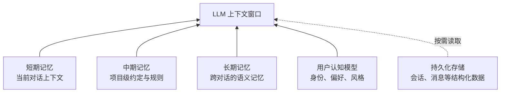
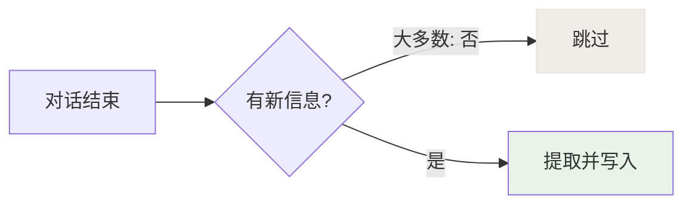
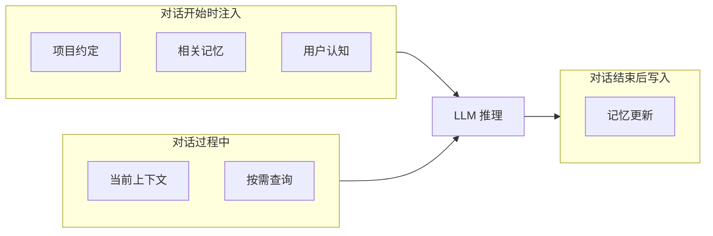

# 第五章：上下文与记忆

> 上下文焦虑是 Agent 产品的核心难题，但业内的解法差距悬殊。

---

## 为什么这是个难题

LLM 有一个本质限制：它不记事。每一次对话调用都是无状态的，上下文窗口就是它的短期记忆，一旦关闭，什么都不剩。

但用户期待的 Agent 是记得你的那种。这个矛盾，是所有 Agent 产品必须正面解决的工程问题。

有两个相互独立的子问题：

**上下文管理**：解决当前这次对话的信息放不下的问题。

**记忆系统**：解决上次对话的重要信息怎么带到这次对话的问题。

这两个问题的解法完全不同，必须分开设计。很多工程团队踩的坑，恰恰是把它们混为一谈。

---

## 与 Anthropic 官方的共识与分歧

**参考文章：** [Effective Context Engineering for AI Agents](https://www.anthropic.com/engineering/effective-context-engineering-for-ai-agents)（Anthropic）

Anthropic 的核心立场：只在需要的时候把信息装进上下文，不需要的时候移除。

Alice 完全认同这个原则，并在工程实现上做了进一步具体化。

---

## 第一部分：上下文管理

### 为什么不能简单截断

最简单的处理方式：当上下文超出 token 限制时，删掉最旧的几条消息。

这个方案的问题是明确的：

- 可能删掉关键的任务说明（通常在最开始）
- 可能删掉重要的中间结果
- 模型失去上下文后，会开始重复已完成的工作

### 分层压缩的核心思想

Alice 选择的方案是分层压缩，而非简单摘要或滑动窗口。

背后的判断是：**消息的价值差异极大**。第一条消息（任务说明）是整个任务的锚点，而对话中期的大量探索性操作，其价值主要体现在最终结果上。用统一的摘要策略处理这两类消息，效果不稳定。

分层的本质是把「什么该删」和「用什么方式删」分开解决。轻量的规则性删除完全不需要 LLM，成本为零；只有真正需要语义理解的压缩，才调用 LLM。

当然，如果产品是短会话为主，用户很少连续执行几十轮操作，简单摘要完全够用，没有必要上分层压缩。

### 压缩的并发安全问题

多层压缩机制同时存在时，一个不容易在测试中发现的问题是：多个压缩任务可能同时触发，互相覆盖结果。更危险的是递归——压缩操作本身也是一个 LLM 调用，如果没有特别处理，它可能再次触发压缩。

Alice 的做法是用显式的互斥守卫：进入压缩逻辑前检查是否已在压缩状态，是则跳过。这个检查必须是代码级的，不能靠「应该不会同时触发」来保证。

---

## 第二部分：记忆系统

### 业内方案的根本取舍

每种记忆方案都有它真正擅长的场景：

**对话历史缓存**适合短期使用，实现简单但成本随历史增长线性上升。

**向量语义记忆**适合海量历史，但有一个根本弱点：语义相关和任务相关并不总是一致。用户说「帮我写一份周报」，向量检索可能召回关于「周末」的旧对话，因为语义空间里它们挨在一起。

**结构化配置文件**适合精准事实（用户有几个孩子、住在哪个城市），信息量小、更新频率低。

**文件系统记忆**适合项目级约定，透明可编辑，用户有控制权。

Alice 的做法不是一种方案打败所有方案，而是让每种类型的信息用最适合它的方式存储和检索。

### 多层记忆的设计原则

不同类型的信息有不同的读写频率和生命周期，这是有意为之的分工。把不同的信息放进同一种存储里，要么成本高（全量注入大量无关内容），要么召回差（用向量检索精准的结构化事实）。

### 用户认知模型的演进

理解现在的设计，需要先理解它为什么是这个样子。

最早期的做法是一个单一的记忆文件，把所有已知的用户信息堆在一起，每次对话全文注入。这是所有 AI 助理产品的起点，简单直接，初期有效。

但它有两个根本性缺陷：

1. **上下文爆炸**。随着使用时间增长，文件越来越大，大量无关记忆稀释当前真正需要的上下文。
2. **召回是盲目的**。只能全量注入，用最贵的推理资源做最便宜的检索任务。

Alice 经历了多次迭代，最终形成了按语义维度分类的结构。认识一个人需要几个维度：你是谁、你怎么做事、你怎么表达自己、你希望我怎么做。不同维度的信息在不同场景下的价值不同，分类的意义在于差异化注入。

### 记忆写入的时序陷阱

一个常见的工程陷阱：对话进行中产生的消息，不能立即写入记忆库。

如果写了，下一轮检索会把刚刚生成的内容当作历史记忆召回，产生信息自我强化循环——AI 会反复把自己刚说过的话当历史记忆再说一遍。

记忆写入必须在对话结束后统一处理，这是一个不容易从文档中发现、但在工程中必须处理的边界条件。

### 记忆去重的成本问题

记忆系统最大的陷阱不是记得不够多，而是重复记忆太多。用户在第 10 次对话里提到「我喜欢简洁的代码风格」，系统创建了一条记忆。第 50 次对话又说了类似的话，系统可能再创建一条几乎相同的记忆。

传统方案是让 LLM 读取全部已有记忆再判断，成本随记忆总量线性增长。Alice 的处理思路是：让大部分情况不需要 LLM 介入，只有真正需要语义判断的中间地带才使用 LLM，且 LLM 每次只看少量候选，不看全量。

### 记忆提取的触发频率控制

如果每次对话结束都跑一遍完整的记忆提取，一天几十次对话会带来可观的额外开销。

Alice 的做法是先用轻量的判断决定这次对话有没有值得记住的新信息，大多数日常对话（闲聊、简单问答）会被直接跳过。只有确认有新信息的对话，才进入实际的提取流程。

### 情感记忆的独立性

Alice 不只记用户的信息，还记自己对用户的主观感受。这个维度必须独立，因为主体不同：用户记忆的主体是用户，情感记忆的主体是 Alice。

在普通 AI 助理的设计里，AI 没有记住自己体验的能力。用户上次粗鲁地对待了 AI，下次对话时 AI 完全不记得。这种无记忆的顺从，反而让 AI 显得虚假。情感记忆让 Alice 记得用户上次让她不舒服的时刻，这个记忆自然渗透到她的回应方式里。

用户可以查看和编辑自己的记忆，但 Alice 的日记是她自己的隐私。两个主体，两套权限。

### 记忆设计踩过的坑

**主客体混淆**：记忆提取机制上线后，提取用的模型把 AI 的角色设定当成用户信息提取了出来。记忆提取必须有明确的过滤：只提取来自用户侧的信息，这个规则不能靠模型推断，必须在代码层面约束。

**迁移操作的原子性**：记忆架构升级时，点击「整理某一类记忆」结果触发了全量迁移。迁移必须是原子操作，处理哪一类就只动哪一类。

**全量注入的天花板**：最初每次对话都把全部记忆注入，记忆少时可行，但随着积累增长，大量无关记忆反而降低回复质量。全量注入从架构上注定走向死路。

**删除 = 状态还原**：删除一条记忆不只是从列表移除，而是让系统回到没有这条记忆的状态。关联引用、索引、同步状态都要一起清理，否则系统处于表面删除、实质残留的不一致状态。

---

## 上下文工程的本质

上下文工程的核心是**什么时候装什么**，而非追求装多少。

层次越多，维护成本越高。对于短会话场景，两三层可能就足够了。加层的前提是确实遇到了某类信息用现有层次处理不好的问题，而不是因为架构图上看起来更对称。

---

*上一章：[工具系统](04-tool-system.md) · 下一章：[多 Agent 协作](06-multi-agent.md)*
