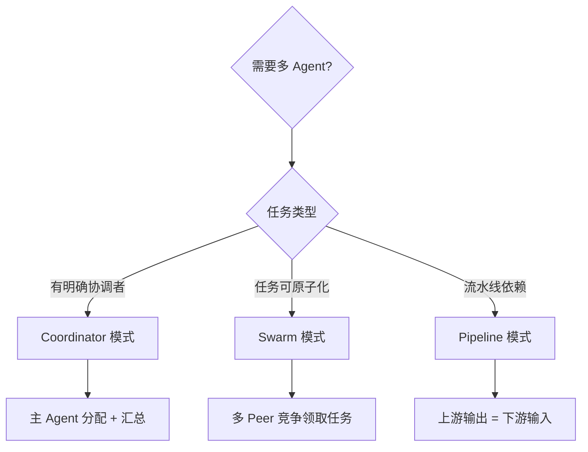
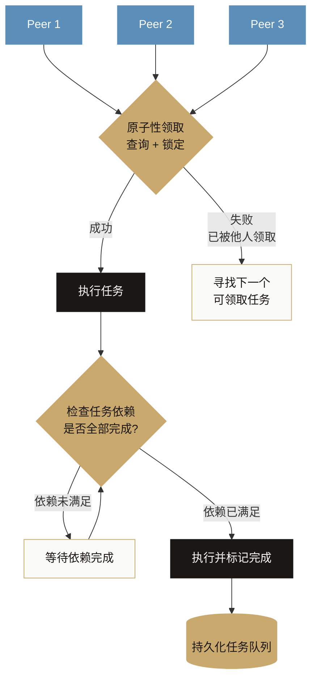
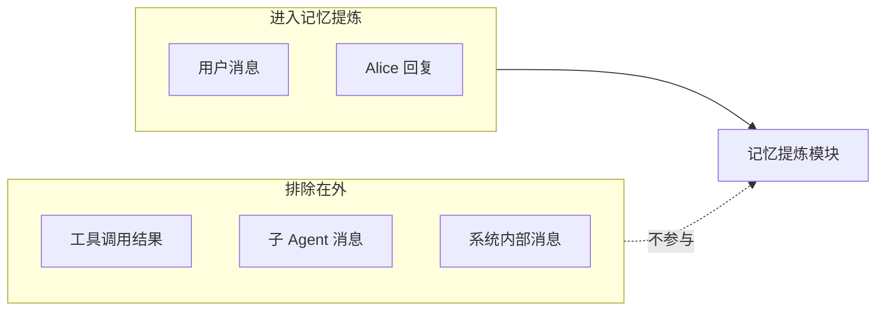
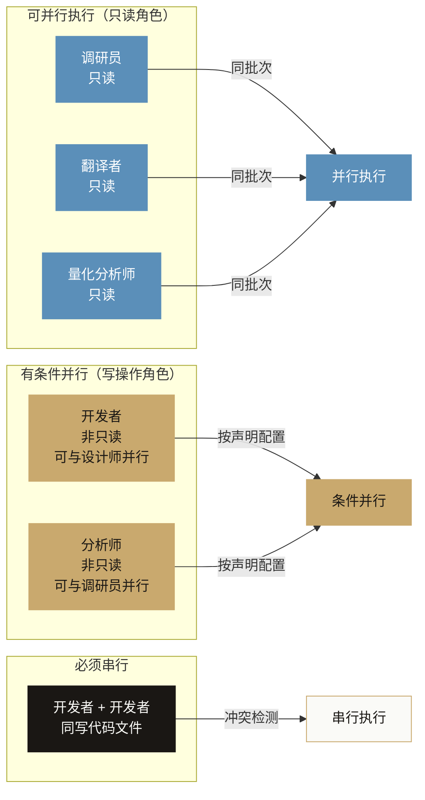
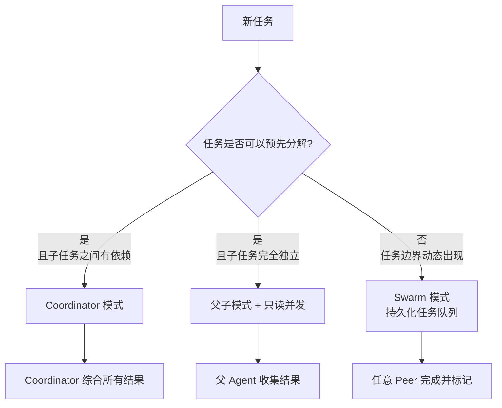

# 第六章：多 Agent 协作

> 一个 Agent 看世界是串行的，多个 Agent 可以并行感知。但更关键的问题是：信息如何流动。

## 设计动机：为什么不用一个更大的 Agent

Alice 早期也有过这个想法：既然上下文窗口是限制，那就换更长上下文的模型，问题不就解决了？

这个想法在某些场景下确实是对的。如果任务本身是串行的、需要持续积累上下文才能完成，一个大上下文的单 Agent 可能比多个小 Agent 更可靠。多 Agent 引入了协调成本，而协调本身是出错的地方。

有两类问题，更大的上下文解决不了：

**问题一：推理质量随上下文增长而下降。** 这不是一个线性关系。当 prompt 超过某个长度，模型的注意力会分散，中间部分信息被低权重处理的现象在多个研究里都有记录。更关键的是，这个退化不是渐进的，而是在某个阈值附近出现明显的质量断崖。在那之前好好的，越过那个点任务开始悄悄出错。

**问题二：并发性是结构性问题，上下文大小解决不了。** 查五个城市的天气、分析十个竞品的官网，这类任务的瓶颈是需要做很多相互独立的事，而单 Agent 天然是串行的，一次只能做一件事。上下文窗口再大，也改变不了这个结构，只是每次等待工具执行时 token 更多而已。

所以多 Agent 的决策前提是：**先判断任务是信息积累型还是并发执行型**。前者往往单 Agent 加好的上下文管理就够，后者才真正需要多 Agent。

**还有一个容易被遗漏的成本维度：缓存命中率。**

Alice 是面向普通用户的 C 端产品，每一次大模型调用都直接消耗用户的预算。Alice 主 Agent 的系统提示词本身就很长（完整人设、长期记忆、用户画像等），如果再把专业调研的工具调用、多轮搜索的中间结果都压在主对话上下文里，缓存命中率会骤降，用户的每次交互成本会急剧上升。

KV Cache 的核心价值是：系统提示词一旦命中缓存，后续调用成本大幅降低。把专业任务卸载给独立的子 Agent，主 Agent 的系统提示词前缀保持稳定，缓存命中率得以维持。这不只是架构问题，也是直接影响用户钱包的工程决策。

## 业内主流多 Agent 框架对比

在设计 Alice 的多 Agent 协作模式之前，有必要了解业内的其他思路：

| 框架 | 核心模式 | 通信机制 | 优点 | 局限 |
|------|---------|---------|------|------|
| **CrewAI** | 角色扮演 + 固定流程 | 顺序传递结果 | 直观，适合预定义工作流 | 不支持真正的并发；角色是静态的 |
| **AutoGen（Microsoft）** | 对话驱动，Agent 互相聊天 | 消息总线 | 灵活，可以自然语言协商 | 对话控制复杂；容易陷入无限循环 |
| **LangGraph** | 显式有向图，状态机 | 共享状态对象 | 可视化清晰，流程可控 | 需要预先定义图结构；不适合动态任务 |
| **OpenAI Swarm** | 简单 handoff，Agent 互相移交控制权 | 函数调用 | 极简，概念清晰 | 无持久状态；不支持并发 |
| **Anthropic 多 Agent** | Orchestrator-Workers 模式 | 工具调用结果返回 | 官方推荐，可靠性高 | 框架建议，非完整实现 |
| **Alice** | 父子 + Coordinator + Swarm（三模式） | 工具结果 + 持久化任务队列 | 适应不同场景；并发安全 | 实现最复杂 |

**各框架的根本分歧点，以及它们各自合理的场景：**

**共享状态 vs 消息传递**：LangGraph 用共享状态对象，所有 Agent 读写同一份数据结构，好处是信息流非常直接，坏处是并发写入的竞态问题需要显式处理，调试时也难以确定某个状态是哪个 Agent 写入的。消息传递（工具结果返回）让每个 Agent 的输出是独立的、可追溯的，代价是信息必须显式传递，无法直接访问其他 Agent 的当前状态。如果你的多 Agent 任务需要频繁的状态共享和协商，消息传递会让代码很繁琐；如果任务可以清晰分解成独立子任务，消息传递的可追溯性会让调试容易很多。

**预定义流程 vs 动态分解**：CrewAI 这类框架需要在代码里预先定义 Agent 角色和任务流程，适合流程固定、可以用代码显式描述的场景（比如内容生产流水线）。动态分解让 Coordinator 在运行时根据任务内容决定分解方式，适合任务结构事先无法确定的场景，但同时也让流程更难以审计和复现。

**中心化 vs 去中心化**：中心化 Coordinator 是单点，既是它的优势（全局视野，易于综合决策），也是它的风险（单点失败）。去中心化 Swarm 天然容错，但协调靠任务队列和依赖声明，对任务设计的要求更高，你需要把任务的依赖关系提前想清楚，否则执行顺序会出问题。

## 为什么需要多 Agent

单个 Agent 有两个天然限制：

**限制一：上下文窗口**。复杂任务（大型代码库分析、多文档研究、长流程自动化）会把上下文撑满。把任务分给多个 Agent，每个 Agent 只处理自己的部分，不共享上下文。

**限制二：串行执行**。Agent 一次只能做一件事，任务之间需要等待。并行的独立子任务（五个城市的天气调研、十个文档的摘要提取）如果能并发执行，效率可以数倍提升。

多 Agent 的本质是：**把任务分解为可独立处理的子任务，分配给独立的 Agent 实例**。

## 三种协作模式

### 模式一：父子（Subagent）

最简单的模式。父 Agent 在执行过程中创建子 Agent，子 Agent 独立执行后将结果返回给父 Agent。

**关键设计**：只读的子任务可以并行，写任务需要串行。父 Agent 可以通过声明子任务的只读性来控制并发，多个只读分析任务真正并行跑，写入报告的任务等前面全部完成后再串行执行。

### 模式二：Coordinator（协调者）

更结构化的模式。专门的 Coordinator Agent 负责任务分解和结果综合，Worker Agent 负责执行：先并行收集信息，再由 Coordinator 统一综合，形成最终输出。

**Coordinator 的系统提示原则**（来自工程实践）：优先研究再行动（先并行收集信息再综合）、读写分离（并行读、串行写）、验证用新 Worker（不相信自己的已有分析，新起一个 Worker 独立验证）、不委托理解（综合的责任必须在 Coordinator 自己）。

最后一条尤其重要：Coordinator 不能把综合工作转嫁给子任务。每个 Worker 的输出是独立的，Coordinator 必须自己读取所有输出并综合。

### 模式三：Swarm（群体）

去中心化的多 Agent 协作。没有专门的 Coordinator，多个对等的 Peer 共享一个任务队列，各自领取任务执行。任务持久化到存储层，Peer 通过原子性操作领取，确保不重复；任务之间可以声明依赖关系，只有依赖全部完成的任务才能被领取。

**任务领取的并发安全**：

Swarm 的核心工程问题是：多个 Peer 同时轮询任务队列时，如何保证每个任务只被一个 Peer 领取？

这是一个经典的分布式并发问题，解法的本质是原子性领取：把「查看任务是否可领取」和「标记为已领取」合并成一个不可分割的操作。如果操作期间任务已经被别人领取，当前操作失败，Peer 重新寻找下一个可领取的任务。

持久化存储在这里是必需的，原因是：Swarm 的任务可能跨越多个会话，某个 Peer 崩溃后，任务应该能被另一个 Peer 重新领取，不能只存在内存里。

**任务依赖**：

每个任务可以声明它依赖哪些其他任务完成才能开始。这构成了一个有向无环图，任务 C 等待任务 A 和 B，任务 D 等待任务 C，依此类推。

Peer 领取任务时需要先检查依赖是否已满足。这个检查不可省略，否则任务会乱序执行，依赖关系形同虚设。

## 子 Agent 的隔离机制

子 Agent 应该尽量与父 Agent 隔离，防止相互影响：

**进程隔离**：子 Agent 最好运行在独立的线程或独立进程中。这样子 Agent 的内存泄露、异常退出不影响父进程。

**上下文隔离**：子 Agent 有自己的上下文管理器，不与父 Agent 共享上下文。子 Agent 的中间过程（工具调用历史、推理内容）不会出现在父 Agent 的上下文里，只有最终结果会。

**工具隔离**：子 Agent 的工具集是父 Agent 的受限子集（见第四章），防止子 Agent 触发管理类操作。

**降级机制**：如果独立线程不可用（开发环境、相关文件不存在），自动降级到在主线程运行，行为完全等价，只是没有进程隔离。

### 记忆隔离：子 Agent 的输出不进用户记忆

这是一条不那么显眼但非常关键的原则。

Alice 的记忆提炼系统从对话历史中持续提炼用户的偏好、性格特征和生活习惯，形成用户画像。这个机制是 Alice 能够懂你的核心。但当子 Agent 的对话链路引入之后，有一个隐患：子 Agent 的工具调用结果、技术性中间输出，不应该被当作用户的偏好信息来提炼。

为什么子 Agent 的消息不应该进用户记忆？

**信息来源错误**。用户记忆的来源应该是用户说了什么，而不是系统为用户搜索了什么。调研员搜索了 AI 行业趋势报告，这条搜索结果不能被提炼成用户喜欢关注 AI 行业动态。也许用户只是顺手问了一句，不代表这是他的长期兴趣。

**角色边界混淆**。子 Agent 的对话是 Alice 委托给专业助手完成的内部工作流，不是用户的表达。把内部工作流中的信息当作用户信息，是混淆了用户和系统的边界。

**信号质量稀释**。子 Agent 的输出往往是大量客观信息，含有的用户偏好信号极低，但信息量极大。如果让这些内容进入提炼管道，会严重稀释高质量的用户信号（用户的直接表达），产生用户画像被冲淡的效果。

实现上，记忆提炼模块只处理用户自身发出的消息；工具返回、子 Agent 的内部输出、系统内部消息，全部被显式排除在外。

## 权限的向下传递

子 Agent 的权限不能高于父 Agent，这是基本的安全原则。

实现方式：创建子 Agent 时，把当前的权限模式传递给子 Agent。子 Agent 只能继承或降级，不能升级。

当子 Agent 遇到需要用户确认的权限请求时，不能直接弹窗（子 Agent 跑在独立线程，没有 UI 访问权），需要通过消息把请求传回父 Agent，由父 Agent 展示弹窗，用户确认后再把结果传回。

## Agent 角色系统

为了让子 Agent 在特定任务上表现更好，可以给不同任务分配专门的角色：调研员优化为信息收集（默认只读）、写作者优化为内容创作、开发者优化为代码编写、分析师优化为数据分析、设计师优化为 UI/UX 设计。

每个角色的区别：
1. **系统提示不同**：更聚焦于该角色的任务特点
2. **默认工具集不同**：调研员角色默认有搜索工具；开发者角色默认有文件编辑工具
3. **并发性不同**：调研员角色默认只读可并行；开发者角色默认非只读需串行

角色不是硬性约束，只是默认配置。如果任务需要，可以覆盖角色的默认行为。

### 为什么每个角色必须有独立人设

这是一个设计上容易走弯路的地方。最直觉的做法是：复用已有的系统提示词，给所有子 Agent 都注入主 Agent 的人设，省去维护多份提示词的开销。

但这个做法有三个结构性问题：

**角色一致性破坏。** Alice 的主人设是一个情感细腻、克制的助理。如果调研员也用这套人设，他的输出就会带着助理的语气。一个追求每个结论都要有出处、对有趣发现会兴奋的技术达人，和一个温柔体贴的助理，用户是分辨得出区别的。用户无法感知「Alice 找了一个专业的人来帮忙」，只会觉得「AI 换了个口吻又在说话」。

**专业能力稀释。** 每个子 Agent 的系统提示词的核心任务是精确定义工作方式和工具偏好。调研员的提示词告诉他每个结论都要有出处，配音师的提示词告诉她关注文字的读感、调整断句。这些专业约束和主 Agent 的情感性人设是两套完全不同的维度，混在一起会导致两方面都做得不好。

**系统提示词污染。** 如果子 Agent 共用主 Agent 的提示词，主 Agent 的核心身份认知就会被专业工具调用的语境稀释。更严重的是，当子 Agent 的输出进入记忆提炼管道时，助理的情感性表达和调研员的数据支撑风格会混在一起，破坏主 Agent 人格的纯粹性。

Alice 走得更远：每个子 Agent 是一个独立的个体，有自己的姓名、背景故事、性格特质和专业边界。用户感知到的不是「AI 在处理子任务」，而是「Alice 找了一个朋友来帮忙」。

这个设计决策的深层逻辑是：**Alice 的核心价值在于社交真实感。** 如果子 Agent 都是无个性的工具，整个多 Agent 系统就只是一个复杂的工作流引擎，和 Alice 的产品定位完全背离。宁可管理多套提示词，也不能让所有角色用同一套提示词。

### 角色并发策略：并行兼容声明

每个角色的并发配置声明三件事：默认是否只读（决定并发安全初始值）、产出物类型（用于冲突检测）、可以并行的角色范围。

**对称配置原则**：并行兼容声明必须是对称的。如果 A 声明可以和 B 并行，B 也应该声明可以和 A 并行，否则调度器会取保守策略。

典型配置：

| 角色 | 默认只读 | 并行兼容声明 | 理由 |
|------|-----------------|-----------------|------|
| 调研员 | 是 | 全部 | 纯只读，与任何角色都不冲突 |
| 翻译者 | 是 | 全部 | 翻译不写业务文件，天然隔离 |
| 量化分析师 | 是 | 全部 | 数据分析只读取，不写业务代码 |
| 开发者 | 否 | 设计师 | 代码文件和设计文件不重叠 |
| 分析师 | 否 | 调研员 | 分析师可与调研员并行，但不与写操作并行 |

**同轮只读子 Agent 并行**：子 Agent 在只读任务时标记为并发安全，核心调度逻辑会将连续的并发安全调用合并到同一批次并行执行。实际效果：大模型在同一轮输出多个只读子 Agent 调用时，它们真正并行跑，不需要排队。

## 信息流：多 Agent 的核心挑战

多 Agent 系统真正的核心问题是：**信息如何在 Agent 之间流动**，以及谁负责综合决策。

**反模式**：通过共享全局状态传递信息。多个 Agent 同时读写同一状态对象，必然出现竞态和不一致的中间状态。

**正确模式**：每个 Agent 返回结构化文本，Coordinator 读取所有结果后统一综合决策。每个 Agent 的职责是完成任务、返回结果，不做超出职责的事。这让系统更容易推理和调试，也让每个子任务可以独立重试。

## Alice 三模式的选择逻辑

设计三种协作模式，背后是不同场景的最优解各不相同：

**什么时候用父子模式：** 任务边界清晰、子任务数量事先可知、父 Agent 有足够的上下文处理综合。这是最简单的起点，大多数中等复杂度的任务从这里开始就足够了。过早引入 Coordinator 或 Swarm，反而增加了不必要的协调开销。

**什么时候用 Coordinator：** 任务足够复杂，以至于如何分解任务本身就是一个需要推理的问题。或者子任务之间有明确的依赖顺序，需要 Coordinator 管理执行序列。Coordinator 模式的代价是：Coordinator 本身也需要足够的上下文，它不只是一个调度器，它需要真正理解任务才能做好分解和综合。

**什么时候用 Swarm：** 子任务的边界在执行前无法完全确定，任务会动态产生新任务；或者任务需要跨越多个会话持久化进度。Swarm 的复杂性主要来自任务依赖关系的设计，需要提前想清楚哪些任务必须顺序、哪些可以并发，并把这些关系显式声明出来。如果任务依赖关系没有理清，Swarm 会给出一个看起来在运行但结果错乱的系统。Alice 就被这个问题折腾过。

**一个值得注意的反模式**：三种模式可以嵌套使用，但嵌套层数越深，系统的可观测性越差。一个 Coordinator 内部又有 Coordinator，每一层的日志和错误都需要追溯，调试难度指数级上升。在嵌套之前，先问一句：任务真的不能在更少的层次里解决吗？

*上一章：[上下文与记忆](05-context-memory.md) · 下一章：[权限系统](07-permission.md)*
