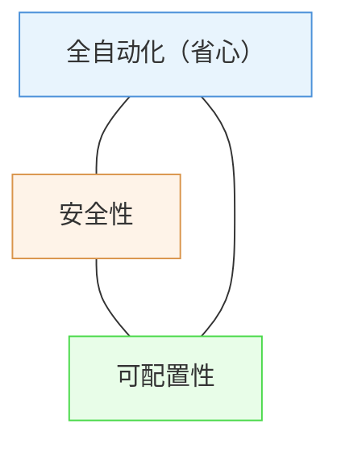
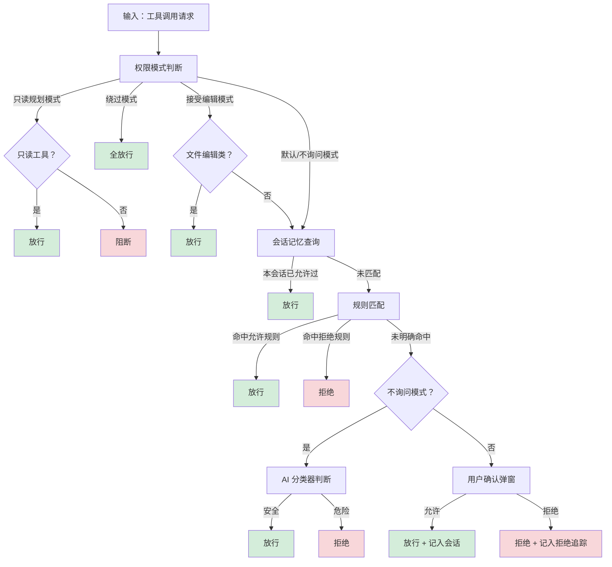
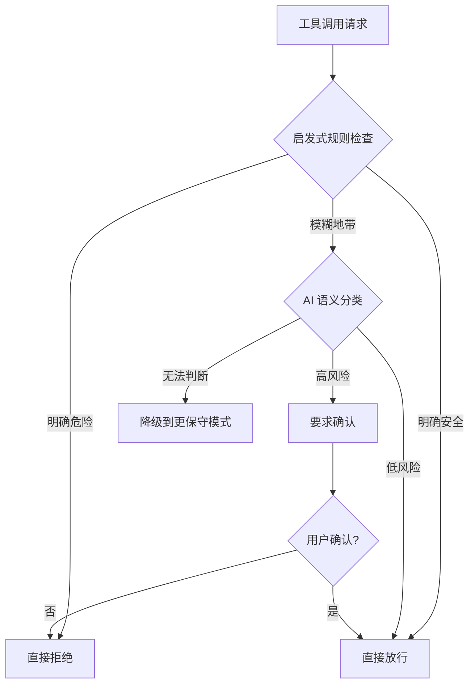
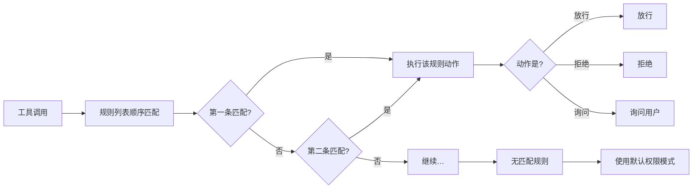

# 第七章：权限系统

> 默认保守，显式放行。这是权限设计的最小原则，但落地的方式千差万别。

## 设计动机：一个不可能三角

Agent 的权限问题，本质上是一个不可能三角：全自动化、安全性、可配置性，三个角没有办法同时最大化。

要完全安全，就必须每个操作都问用户，但用户体验极差。要完全自动，就必须放开权限，但误操作和安全风险剧增。要完全可配置，规则系统会变得极其复杂，大多数用户根本不会用。

传统软件的解法是固定权限列表（读、写、执行），但大模型 Agent 的操作是语义化的。用户说帮我清理项目，可能意味着删文件；说帮我重构代码，可能意味着修改几十个文件。没有办法用固定列表预先定义所有可能的操作语义。

这就是 Agent 权限和传统 RBAC 权限的根本区别：传统权限控制的是资源，Agent 权限控制的是意图。

## 四种权限哲学：从全自动到全确认

在动手设计之前，需要先理解行业里的四条根本不同的路径，以及每条路径为什么走到了它现在的位置。

### 路径一：全自动模式

代表实现是早期的 AutoGPT、大多数 LangChain Agent。用户下达目标，Agent 自主调用工具，直到任务完成或陷入死循环。

优点显而易见：用户体验最流畅，Agent 效率最高，适合探索性任务（你也不知道要几步才能完成）。

代价同样明显：一次错误的强制删除命令不可逆转。AutoGPT 早期的用户报告里，最常见的灾难场景是 Agent 在循环中反复执行同一个错误操作，用户看到时已经晚了。2023 年初 AutoGPT 热潮退去的一个重要原因就是：全自动模式在 demo 里看着惊艳，在真实工作流里让人恐惧。

条件边界：当且仅当操作全部可逆（比如纯读取、纯分析、沙箱内执行），全自动模式才是安全的。

### 路径二：全确认模式

代表实现是 Claude Code 的默认模式、Cursor 的 Ask Mode。每个危险操作都弹窗让用户确认。

安全性无可挑剔。但用户的耐心是有限资源。一个长流程的任务，确认弹窗可能频繁出现。用户最终会陷入两种状态之一：要么机械地点确认（安全机制形同虚设），要么烦躁到切换为全自动模式（直接放弃安全性）。

Claude Code 的使用数据说明了这一点：大量用户在熟悉系统后，会把默认模式切换为 Auto Accept。全确认模式的悖论在于，它设计的目标是保护用户，但过度打断最终会把用户推向完全不设防的状态。

条件边界：适合短任务、不确定性高的任务、用户初次使用 Agent 的信任建立期。

### 路径三：分级确认模式

代表实现是 Cursor 的 Agent Mode。根据操作的风险等级，高风险确认，低风险放行。

核心难题在于风险分级。谁来定义什么是高风险？如果是预设的白名单（读文件放行，写文件确认），那么 Agent 在白名单之外的操作要么被拦住（能力受限），要么全部弹窗（回到路径二）。如果是动态判断，那么判断逻辑本身就成了新的风险点。

Cursor 的做法是把操作分为读类和写类，读类自动放行，写类中的文件编辑自动接受但终端命令需要确认。这在 IDE 场景下是合理的（文件编辑可以用版本管理工具回退），但迁移到通用 Agent 场景就不够了：Agent 可能需要发邮件、调 API、修改数据库，这些操作的风险维度完全不同于文件编辑。

条件边界：适合操作类型可预期的垂直场景。通用 Agent 需要更灵活的分级机制。

### 路径四：只读规划模式

代表实现是 Claude Code 的 Plan Mode。Agent 只能输出文字和规划，所有工具调用被阻断。

这条路径常被低估。它的本质是改变了人机协作的模式：从 Agent 执行、用户确认，变成 Agent 规划、用户理解、用户决定是否执行。

规划模式的价值在不确定性极高的场景下最明显。用户说帮我重构这个模块，Agent 不确定用户想要什么程度的重构。在其他模式下，Agent 会按自己的理解动手，改完了用户才发现不是想要的。在规划模式下，Agent 先输出完整的重构计划，用户看完后提出修改意见，然后切换到执行模式。

代价：Agent 在规划模式下能力受限。它不能读文件、不能搜索代码，只能基于已有上下文进行推理。这意味着规划模式下的规划质量取决于上下文里有多少信息。Claude Code 对这个问题的解决方案是：部分只读工具（如文件读取、代码搜索）在规划模式下仍然放行，只阻断写操作。

条件边界：适合任务目标不明确、需要先对齐理解再动手的场景。不适合用户已经明确知道要做什么的场景。

## Alice 的选择：五种模式覆盖完整需求谱

Alice 没有选以上四条路径中的任何一条，而是把它们全部纳入，让用户自己选择信任等级。

| 模式 | 行为 | 适用场景 |
|------|------|---------|
| 只读规划模式 | 只读工具放行，写操作全部阻断 | 不确定的任务，先看计划 |
| 默认模式 | 危险操作弹窗确认 | 日常使用，安全与效率的平衡点 |
| 接受编辑模式 | 文件编辑自动放行，命令仍需确认 | 代码开发场景 |
| 不询问模式 | 全自动，但 AI 分类器兜底 | 信任度高的重复性任务 |
| 绕过权限模式 | 完全绕过权限检查 | CI/CD 自动化场景 |

**为什么是五种？**

初期设计只有三种：只读规划、默认、绕过权限。但在实际使用中发现了两个空白地带。

第一个空白地带在默认模式和绕过权限模式之间。用户经常处于这样一种状态：信任 Agent 做文件编辑（因为有版本管理），但不信任它执行任意终端命令。接受编辑模式填补了这个空白。

第二个空白地带在接受编辑和绕过权限之间。有些用户希望 Agent 完全自主，但又不想关掉所有安全机制。不询问模式的思路是：不问用户，但 AI 自己会判断。对于明确危险的操作（强制递归删除、强制推送等），AI 分类器拒绝；对于明确安全的操作，自动放行；对于不确定的，走规则匹配。

五种模式的排列是沿着一个连续谱从最保守到最激进的渐变：只读规划 → 默认 → 接受编辑 → 不询问 → 绕过权限。用户可以根据自己对当前任务的信任程度，选择最合适的位置。

  
权限模式光谱

  

  

    

      

      
规划模式

    

    

      

      
默认模式

    

    

      

      
接受编辑

    

    

      

      
全自动

    

    

      

      
绕过权限

    

  

  

    ← 最保守
    最激进 →
  

  

    
规划模式（只读规划）

    
只读工具放行，所有写操作全部阻断。Agent 只能输出规划文字，不能实际修改任何内容，适合先看计划再决定是否执行。

    
典型用户：任务目标不明确，需要先对齐理解的场景

  

  

    
默认模式

    
危险操作弹窗确认，常规操作自动放行。安全与效率的平衡点，适合日常使用，对不熟悉 Agent 行为的用户友好。

    
典型用户：初次上手或任务不确定性较高的用户

  

  

    
接受编辑模式

    
文件编辑操作自动放行（可通过版本管理回滚），终端命令仍需确认。专为代码开发场景设计，信任文件修改但谨慎对待系统命令。

    
典型用户：开发者，信任编辑但警惕任意命令执行

  

  

    
全自动（不询问模式）

    
所有操作自动执行，不弹窗询问用户。但 AI 分类器在后台兜底，明确危险的操作仍会被拒绝。适合信任度高的重复性任务。

    
典型用户：熟悉 Agent 行为、执行确定性高的重复任务

  

  

    
绕过权限模式

    
跳过所有安全检查，完全信任 Agent 的所有操作。仅限高度可控的信任环境，如 CI/CD 自动化脚本、沙盒测试环境。

    
典型用户：自动化流水线、沙箱隔离环境

  

## 决策流程：责任链模式

每次工具调用的权限判断，走一条多层责任链：

每个决策都携带决策原因标记（来源于模式设定、规则命中、AI 判定、用户确认等），便于后续审计和调试。这不只是工程细节，它直接决定了权限问题的可排查性。当用户问为什么这个操作被拦住了，系统能给出精确的原因。

## AI 分类器：最有争议的设计决策

不询问模式的核心是 AI 分类器：用一次轻量大模型调用判断操作是否安全。

这个决策在团队内部争议很大，争议的焦点在于：用一个可能出错的模型来做安全决策，是不是本末倒置？

### 误判的代价不对称

分类器有两种错误：

**误判高风险（False Positive）**：把安全操作判为危险，拒绝执行。代价是任务中断，用户需要手动确认或切换模式。这个代价是可接受的，因为它不造成实质损害。

**漏判高风险（False Negative）**：把危险操作判为安全，自动执行。代价可能是不可逆的文件删除、代码推送到生产环境、敏感数据泄露。这个代价可能是灾难性的。

两种错误的代价差了几个数量级。这意味着分类器的设计必须**偏向保守**：宁可多拦，不可漏放。

  
误判代价对比

  

    

      
漏判一次危险操作（FN）

      
数据丢失、系统损坏、敏感信息外泄，操作可能完全不可撤销，损失难以估量。

      
代价评级

      
极高

    

    

      
误判一次安全操作（FP）

      
用户多点一次确认按钮，任务轻微中断，无任何实质性损害。

      
代价评级

      
很低

    

  

  
因此系统宁可误判，也不漏判

### 三层防线设计

为了应对分类器的不可靠性，Alice 不依赖单一分类器，而是设计了三层防线：

**第一层：启发式规则先行。** 明确安全的操作（读文件、搜索网络、代码搜索）和明确危险的操作（强制删除、强制推送、破坏性数据操作等）不走大模型调用，直接本地判断。这一层覆盖了绝大多数常见工具调用，零延迟、零成本、零误判风险。

**第二层：AI 分类器。** 对第一层无法覆盖的模糊地带（比如包管理器命令安全吗？权限修改命令安全吗？远程脚本执行安全吗？），发起一次轻量大模型调用。分类结果会缓存一段时间，避免同一操作反复调用。

**第三层：降级机制。** 如果分类器连续多次拒绝某个操作，说明可能遇到了分类器盲区（分类器不理解这个操作的语义），此时不是继续无限拒绝让任务卡死，而是降级为人工确认。把决策权还给用户，让人来判断。

### 分类器的准确率问题

实际使用中，AI 分类器对常见操作的准确率很高，但对边缘情况的表现不稳定。

典型的边缘情况：

用户说帮我清理依赖缓存目录。清理命令在启发式规则里会被标记为危险（因为匹配了强制删除的模式），但实际上这是一个完全安全且常见的操作。如果走 AI 分类器，分类器能理解上下文（清理依赖），判为安全。但启发式规则的优先级高于 AI 分类器，所以这个操作仍然会被拦住。

这暴露了一个更深层的张力：**启发式规则追求确定性，AI 分类器追求语义理解，两者在边缘情况下会冲突。** Alice 的选择是让启发式规则优先，牺牲部分便利性换取确定性。这个选择在大模型分类能力还不够可靠的阶段，是更稳妥的方案。

## 规则系统：灵活性与维护成本的博弈

权限规则通过配置文件定义，支持多个维度：操作类型（放行/拒绝/询问）、目标工具、命令模式匹配、文件路径匹配等。规则按顺序匹配，第一个命中的规则生效。

### 规则设计的取舍

**为什么用配置文件？**

图形界面更友好，但表达力有限。用户可能需要写这样的规则：允许在某个项目目录下的所有文件编辑，但禁止修改环境变量文件。这在图形界面里需要设计很复杂的交互，在配置文件里只需要两行。

代价是学习成本。大多数非技术用户不会写配置文件。Alice 目前的做法是：提供一组合理的默认规则，覆盖大多数场景；只有需要精细控制的用户才需要手动编辑。

**为什么按顺序匹配？**

按顺序匹配的语义更直观：先写的规则优先。优先级系统（给每条规则一个数字权重）理论上更灵活，但在实际维护中是灾难。当规则数量增多之后，没有人能记住每条规则的优先级，冲突排查变得极其困难。

Nginx 的 location 匹配规则就是前车之鉴：前缀匹配、正则匹配、精确匹配之间的优先级关系，是 Nginx 用户最常踩的坑之一。

### 维护成本的现实

规则系统最大的风险不是设计错误，而是规则腐化。用户在某个时间点加了一条规则解决某个问题，后来忘记了它的存在。随着时间推移，规则越积越多，互相之间可能冲突，没有人完全理解当前的规则集在做什么。

这个问题在企业级权限系统里是老生常谈。Alice 目前的规模还不至于面临这个问题，但如果未来规则系统变得复杂，需要考虑规则可视化、冲突检测、无效规则清理等辅助工具。

## 拒绝追踪：防止 AI 反复碰壁

当某个操作被拒绝后，如果不告知 AI，AI 可能在下一轮循环再次尝试同一个操作，反复碰壁，浪费 token，也让用户焦虑。

解决方案：维护一个本次会话拒绝记录，在每轮迭代开始时，把最近的拒绝摘要注入到系统消息中。

注入位置的选取有讲究：需要同时考虑大模型对新增内容的注意力权重，以及缓存复用效率。我们针对这两个维度做了权衡，最终选择了对长对话性能影响最小的方案。

这是一个看似微小但影响真实的工程细节。在较长的对话轮次中，该选择带来的缓存命中率差异可以转化为可感知的响应延迟差异。

## Alice 私有目录的特殊规则：改变自己 vs 改变用户

自进化功能（修改 Skill、更新系统提示、生成组件）需要频繁写入 Alice 自己的私有数据目录。如果每次都需要用户确认，体验会非常差。

解决方案：对 Alice 私有目录的写操作自动放行。这是 Alice 自己的家，改变自己不需要每次经过用户审批。

但这个自动放行有严格的边界：只适用于 Alice 私有目录，不扩展到用户的其他目录。

这体现了一个更大的设计原则：改变自己和改变用户系统需要不同的权限级别。AI 修改自己的 Skill 文件、更新自己的偏好配置，这些操作的风险是可控的（最坏情况：Skill 改坏了，回滚即可）。但 AI 修改用户的项目文件、执行用户系统的命令，这些操作的风险可能不可逆。

## 行业对比：其他 Agent 的权限实现

| 系统 | 权限模型 | 核心机制 | 优势 | 局限 |
|------|---------|---------|------|------|
| Claude Code | 三模式 | 模式切换 + 工具分类 | 简洁，用户理解成本低 | 模式粒度粗，无法针对具体工具配规则 |
| Cursor | 两模式 | 模式切换 + 读写分类 | IDE 场景下体验好 | 迁移到通用场景不够 |
| Devin | 沙盒隔离 | 容器化执行环境 | 强隔离，操作可重放 | 配置复杂，性能开销大 |
| AutoGPT | 全自动 / 简单确认 | 几乎无权限管控 | 效率最高 | 安全风险大 |
| Alice | 五模式 + 规则 + AI 分类器 | 责任链 + 分层防护 | 覆盖完整需求谱，可精确配置 | 实现最复杂，学习成本最高 |

**一个值得注意的趋势：** 行业整体在从两极（全自动 / 全确认）向分级确认收敛。Claude Code 从默认确认模式加入了 Auto Accept，Cursor 从纯 Ask 模式加入了 Agent 模式。这说明单一模式无法满足真实使用场景的多样性。

## 踩坑记录

### 坑一：Session 记忆泄露

早期实现中，会话记忆（用户在本次会话中允许过的操作）没有做工具加参数的精确匹配，只匹配了工具名。结果是：用户允许了某条具体的命令，会话记忆把该工具的所有调用都标记为已允许，包括潜在的破坏性操作。

修复方式：会话记忆必须同时匹配工具名和参数模式。

### 坑二：规划模式下的工具饥饿

最初的规划模式设计是阻断所有工具调用。但 Agent 在这种模式下连文件都读不了，规划质量极差，因为它只能基于用户的描述进行推理，无法查看实际代码。

修复方式：规划模式下放行只读工具（文件读取、代码搜索、目录列表），只阻断写操作。这让规划模式从只能纸上谈兵变成了能看到真实情况后再规划。

### 坑三：AI 分类器的延迟问题

不询问模式下，每次工具调用都先走 AI 分类器，引入了不可忽视的额外延迟。在快速连续调用的场景下（比如搜索文件、读取文件、再搜索），累积延迟非常明显。

修复方式：分类结果缓存 + 启发式规则前置。大部分工具调用命中启发式规则（零延迟）或缓存（零延迟），只有真正需要判断的模糊操作才走大模型调用。

## 权限系统的核心原则

1. **默认保守：** 没有显式放行的危险操作，必须确认
2. **用户选择信任等级：** 五种模式覆盖从完全保守到完全信任的完整谱
3. **分层防护：** 启发式规则、AI 分类器、用户确认，任何一层拦住都算成功
4. **决策可审计：** 每个决策带原因标记，可追溯为什么这样决定
5. **失败安全：** 不确定时降级为人工确认，绝不自动放行
6. **误判代价不对称原则：** 宁可多拦，不可漏放

*上一章：[多 Agent 协作](06-multi-agent.md) · 下一章：[MCP 协议](08-mcp.md)*
