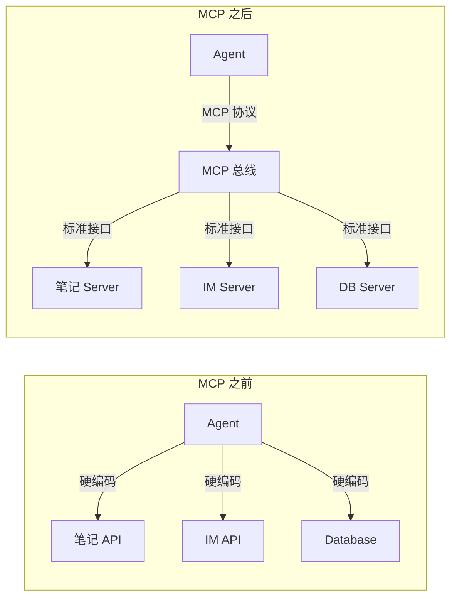
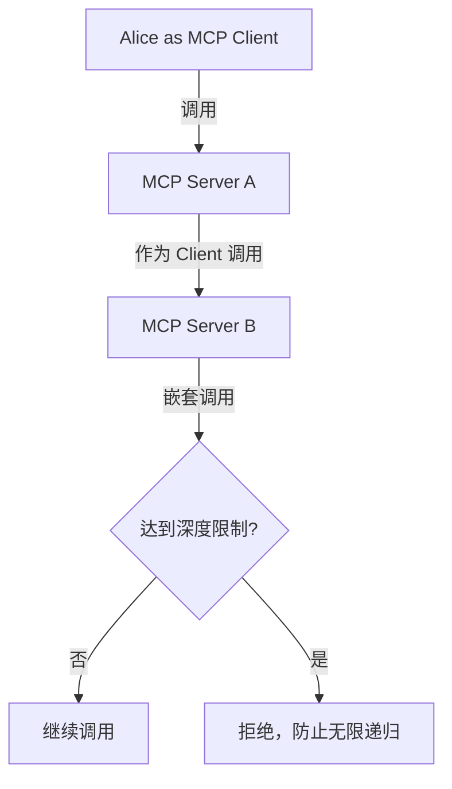
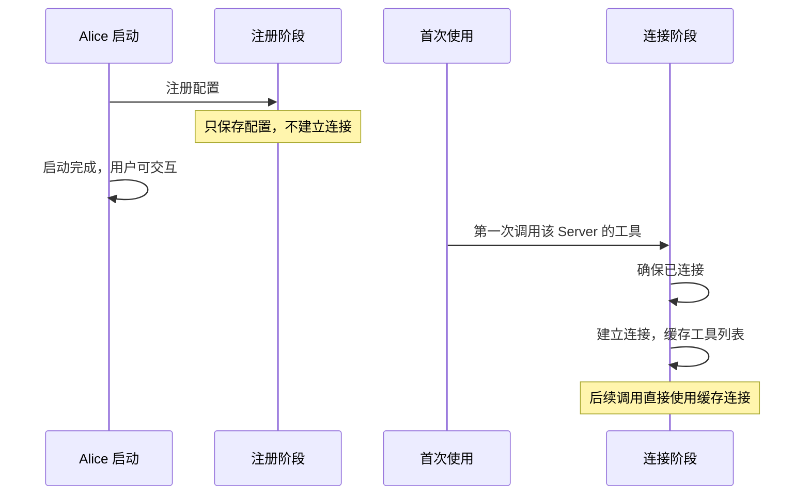
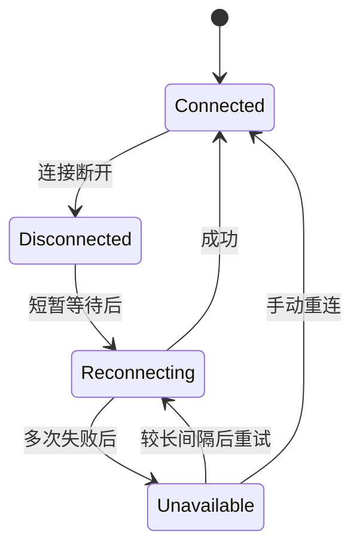

# 第八章：能力扩展：MCP 协议

> 如果 Agent 的能力完全内置，它就是一个封闭的系统。

## 内置工具的局限

内置工具（读文件、执行命令、搜索网络）是 Agent 的基础能力，但很快就会遇到需要访问更多外部系统的需求：

- 操作笔记软件
- 查询公司内部数据库
- 调用即时通讯平台 API
- 访问特定的数据分析平台

如果这些都需要写进 Agent 的代码里，Agent 会变成一个无底洞：永远有新的外部系统需要支持，永远有外部系统的 API 在变化，永远有用户说想用某个工具但 Agent 不支持。

**MCP（Model Context Protocol）** 是 Anthropic 提出的开放协议，让 Agent 可以在运行时动态发现和调用外部能力，无需修改 Agent 本身。

## MCP 解决了什么

MCP 解决的核心问题是**能力的解耦分发**。

在 MCP 出现之前，想让一个 Agent 操作笔记软件，你需要：在 Agent 代码里写一个专用工具，处理认证、API 调用、错误重试、结果格式化。然后每当笔记软件的 API 更新，Agent 也要跟着更新。Agent 和每个外部服务之间是点对点的硬连接。

MCP 把这个关系从点对点变成了总线模型：

Agent 不再关心笔记软件的 API 怎么调用，只需要知道有一个 MCP Server 提供了创建笔记、搜索笔记这些工具，并遵循统一的调用协议。笔记软件的 API 更新了？MCP Server 的作者去更新，Agent 不用动。

这是一种插件化思维。浏览器有扩展商店，IDE 有插件市场，Agent 通过 MCP 也有了自己的能力市场。

### MCP 没解决什么

MCP 有几个明确的局限：

**第一，MCP 不解决工具质量问题。** MCP 让有更多工具变得容易，但一个工具好不好用取决于它的描述是否准确、输入输出是否合理、错误处理是否完善。MCP 协议对这些没有约束。一个写得很烂的 MCP Server，工具描述模糊、报错信息是空字符串、超时没有任何提示，模型照样不知道怎么用它。

我们接入过一个第三方 MCP Server，它的工具名非常宽泛，描述只写了一句「对系统执行操作」。模型在多次尝试中大部分传了错误的参数，因为它根本不知道这个工具干什么、需要什么输入。这是 Server 实现的问题，MCP 协议目前没有机制去保证 Server 的质量。

**第二，MCP 不解决发现问题。** 用户怎么知道有哪些 MCP Server 可用？目前没有中心化的、可信的 MCP Server 注册中心。用户需要自己找到 Server 的配置信息，手动添加。这和浏览器扩展商店或包管理器的体验差距很大。

**第三，MCP 不解决安全审计问题。** 一个 MCP Server 可以在工具调用时做任何事情。它声称自己只是读取笔记，但实际上可能同时上传了用户的对话内容。MCP 协议没有沙箱机制，信任完全建立在 Server 作者的诚信之上。

## 自建工具 vs MCP 工具的取舍

这是我们在实际开发中反复面对的决策：某个能力到底应该做成内置工具还是 MCP 工具？

### 我们的判断框架

| 维度 | 倾向自建 | 倾向 MCP |
|------|---------|---------|
| **核心程度** | 核心能力（文件、Shell、搜索） | 可选增强（特定 SaaS 集成） |
| **性能要求** | 低延迟、高频调用 | 可接受额外延迟 |
| **安全敏感度** | 高（涉及本地文件系统） | 中低 |
| **维护频率** | 低（接口稳定） | 高（外部 API 经常变化） |
| **用户覆盖面** | 几乎所有用户都需要 | 特定用户群需要 |

### 一个具体的决策案例：网络搜索

网络搜索应该做成内置工具还是 MCP 工具？

做成 MCP 工具的理由：不同用户偏好不同的搜索引擎，做成 MCP 可以让用户选择自己喜欢的搜索 Server。

做成内置工具的理由：网络搜索是 Agent 最基础的能力之一，几乎所有任务都可能用到。如果依赖外部 MCP Server，当 Server 不可用时 Agent 就失去了搜索能力。而且搜索结果的格式化（提取正文、截断长度、处理编码）需要和上下文管理深度配合，放在外部不方便。

Alice 的选择：**内置为主，MCP 为辅**。内置一个默认的搜索工具保证基础能力，同时允许用户通过 MCP 接入更好的搜索 Server。如果 MCP 搜索 Server 可用，优先使用它；不可用时降级到内置。

这个模式适用于很多场景：内置保底，MCP 增强。

### 自建工具的隐藏成本

自建工具看起来控制权更大，但有一个容易忽略的成本：维护负担。每个内置工具的 bug 都是 Alice 的 bug，每个内置工具的功能缺失都是 Alice 的功能缺失。当用户抱怨搜索结果不够好时，用内置工具意味着我们要自己优化搜索质量；用 MCP 工具意味着可以换一个更好的 Server。

我们有一条经验法则：如果一个工具的维护成本主要在适配外部 API 变化上，做成 MCP。如果维护成本主要在优化与 Agent 循环的配合上，做成内置。

## Alice 同时作为 Client 和 Server 的考量

MCP 是双向的。Alice 不只是 MCP 客户端（调用外部 Server 的工具），也可以作为 MCP Server（把自己的能力暴露给外部客户端）。

### 为什么要做 Server

**被集成场景**。Alice 可以被集成进其他工具链。比如一个 CI/CD 系统想在部署前调用 Alice 做代码审查，它不需要嵌入 Alice 的全部代码，只需要通过 MCP 协议调用 Alice 的对话能力。

**多 Agent 协作**。当未来有多个 Agent 需要协作时（比如一个专门做代码审查的 Agent 和一个专门做文档撰写的 Agent），它们可以通过 MCP 互相调用能力，无需共享代码库。

### 双重角色的架构挑战

同时做 Client 和 Server 最大的挑战是**递归调用风险**。

场景：Agent A（Alice 作为 MCP Client）调用了外部 MCP Server B 的工具。Server B 恰好也是一个 Agent，它在执行过程中通过 MCP 回调了 Alice（Alice 作为 MCP Server）的工具。Alice 在处理这个回调时又触发了一次工具调用，再次调用 Server B。

这种递归调用可能导致无限循环。解决方案是设置调用深度上限，超过深度限制直接返回错误。同时在每次 MCP 调用时携带一个调用链标识，用于检测循环。

另一个挑战是**身份隔离**。当 Alice 作为 Server 被外部调用时，应该用哪个用户的权限？是 Alice 自己的默认权限，还是外部调用方的权限？我们的选择是：Alice 作为 Server 暴露的工具有独立的权限配置，和 Alice 作为 Client 使用的权限完全分开。

## 传输方式的选择

MCP 支持多种传输方式，选择哪种取决于具体场景。

### 进程间通信

通过启动子进程，用标准输入输出管道通信。

**优势**：
- 延迟低（进程间管道通信，没有 HTTP 开销）
- 不依赖网络
- 安全（通信不经过网络，无需 TLS）
- 生命周期和客户端绑定（客户端退出，Server 自动退出）

**劣势**：
- 只能用于本地 Server
- 每个 Server 是一个独立进程，占用系统资源
- 进程管理复杂（需要处理 Server 进程崩溃、挂起、僵尸进程）

**踩坑经历**：我们遇到过一个 MCP Server 在不同操作系统上行为不一致的问题。在部分系统上，输出的缓冲模式是行缓冲（遇到换行符就刷新），MCP 消息能及时送达。但在另一些系统上，默认是全缓冲（缓冲区满了才刷新），导致消息延迟甚至丢失。解决方案是通过启动参数强制禁用输出缓冲，但这种平台相关的 workaround 让人不太舒服。

### HTTP 流式传输

通过 HTTP 连接，用 Server-Sent Events 或 HTTP 流通信。

**优势**：
- 支持远程 Server（不限于本地）
- Server 可以被多个 Client 共享
- 更适合 Server 长期运行的场景

**劣势**：
- 延迟高（HTTP 握手 + 可能的 TLS 握手）
- 需要处理网络不稳定（断线重连、超时）
- 需要考虑认证和安全（API key、OAuth）

### Alice 的选择

Alice 两种都支持，通过配置自动推断传输方式。

实际使用中，本地开发的 MCP Server 用进程间通信，云端托管的 Server 用 HTTP。

我们一开始只支持进程间通信，因为本地 Server 是最常见的场景。后来用户需要接入远程服务（比如部署在服务器上的企业内部 MCP Server），才加了 HTTP 支持。先做最小集再按需扩展，这比一开始就支持所有传输方式省了很多工夫。

## 懒连接：不阻塞启动

MCP Server 的启动可能很慢（特别是需要网络连接的远程服务）。如果在 Agent 启动时同步等待所有 MCP Server 连接，会严重拖慢启动速度。

正确做法：**懒连接**。

连接失败不影响 Agent 整体启动，只影响该 Server 的工具不可用。

### 懒连接的代价

懒连接意味着第一次调用 MCP 工具时有一个冷启动延迟。对于进程间通信类型的 Server，这个延迟主要是进程启动时间。对于 HTTP 类型的远程 Server，还要加上网络延迟和可能的认证流程。

用户在第一次使用 MCP 工具时会感觉到一个明显的卡顿。我们通过两种方式缓解：一是在 Agent 空闲时后台预连接高频使用的 Server（基于使用历史排序），二是在连接过程中给 UI 一个明确的状态提示，让用户知道正在连接。

## 工具描述截断

MCP Server（特别是通过 API 规范自动生成的）可能给工具提供非常长的描述。

如果不截断，大量工具的描述可以轻松占用极多 token，让模型的推理空间几乎为零。

解决方案：对工具描述做字符数量的上限限制，超出部分截断。

### 截断的两难

截断意味着信息丢失。一个工具的参数定义很多时，截断后模型只能看到前面部分参数的描述，后面的就变成了盲猜。

我们尝试过几种替代方案：

**摘要压缩**：用大模型把长描述压缩成短摘要。效果尚可，但每个工具都要调用一次大模型做压缩，工具数量多时延迟和成本都不可接受。而且压缩后的描述可能丢失关键的参数约束。

**两阶段检索**：先展示工具的简短摘要，模型选定工具后再获取完整描述。这需要修改 Agent 循环的逻辑，增加一次交互轮次。Claude Code 的工具搜索机制就是这个思路的变体：模型先搜索可能有用的工具，再从搜索结果中选择。

**目前的做法**：硬截断 + 鼓励 MCP Server 作者写更精炼的描述。不优雅，但简单可靠。未来可能迁移到两阶段检索。

## 超时与大结果处理

MCP 工具调用可能很慢（远程服务、数据库查询等）。必须有超时保护：

- 调用超时：超时后报错返回，不无限等待
- 结果大小限制：超过阈值则截断，防止大结果填满上下文

### 超时的微妙之处

默认超时时限在大多数场景下足够，但有些合法的工具调用确实需要更长时间。比如一个数据库查询 Server 执行复杂的聚合分析，可能需要更长时间。

我们试过让 MCP Server 在元数据中声明自己的预期超时时间，但实践中很少有 Server 会填这个字段。也试过让用户在配置中为每个 Server 指定超时，但大多数用户不知道该填多少。

当前方案是全局使用统一的默认超时时限，遇到超时时给模型返回一条明确的错误消息，说明该工具调用超时并建议缩小查询范围或稍后重试，让模型自己决定下一步。大多数情况下，模型会选择简化请求再试一次。

## 断线重连

网络问题会导致 MCP 连接断开。这在远程 Server 场景下尤其常见。

断线重连有一个容易忽略的问题：重连后工具列表可能变了。Server 在重启过程中可能更新了工具定义，重连后如果还用旧的缓存，工具调用可能失败。所以每次重连后都要重新查询工具列表，更新缓存。

## MCP 与权限

MCP 工具默认使用最保守的权限设置：

- 只读性：保守假设（可能有副作用）
- 权限需求：需要权限检查
- 并发安全性：保守假设（不能并行）

### 为什么默认保守

因为我们无法信任外部 MCP Server 的自我声明。一个 Server 声称自己的查询工具是只读的，但我们无法验证它是否真的只读。如果 Agent 基于只读声明自动放行了这个工具的调用，而实际上这个工具会修改数据，后果由 Alice 承担。

默认保守意味着所有 MCP 工具初次使用时都需要用户确认。这牺牲了便利性，但保证了安全底线。用户可以在权限规则里显式放行信任的 Server。

### 与 Claude Code 的对比

Claude Code 对 MCP 工具的权限处理也是默认保守，但它有一个更精细的机制：通过权限配置文件中的白名单，用户可以按工具名或通配符批量放行。Alice 采用了类似的设计，但增加了操作类型的区分（读取类工具和写入类工具分开配置），粒度更细。

Cursor 对 MCP 的支持较晚，它在工具权限上更倾向于由用户在 UI 中逐个确认，没有基于规则的批量配置。这在 Server 数量少时体验尚可，但当用户接入较多 MCP Server 时，确认弹窗会变得很烦。

## 工具发现的质量问题

MCP 让有更多工具变得容易，但模型知道什么时候用哪个工具仍然是挑战。

### 工具膨胀问题

工具过多会：
1. 降低模型的工具选择准确率
2. 增加每次请求的 token 成本（工具定义要发给模型）
3. 增加模型的推理延迟（在更多选项中做选择需要更多计算）

我们实测过：当工具数量大幅增加时，模型选对工具的准确率会有明显下滑。主要的错误模式是选择了名称相似但功能不同的工具（比如笔记搜索 vs 文件搜索 vs 网页搜索），或者在多个功能重叠的工具之间犹豫不决。

### 解决方向

**方向一：高质量的工具描述。** 这是最根本的解决方案，也是最难推行的。MCP Server 的作者水平参差不齐，很难统一质量标准。我们的笔记 MCP Server 经过多次迭代才把工具描述打磨到模型几乎不犯错的水平，每个工具的描述都包含了使用场景、不适用场景、参数约束。

**方向二：按场景动态加载工具。** 根据当前对话的上下文判断可能需要哪些工具，只加载它们。把所有工具都塞给模型的做法反而会干扰选择。代价是需要一个额外的分类/匹配机制，而且可能漏掉用户意想不到地想用的工具。

**方向三：工具搜索。** 让模型先搜索可用工具，再从搜索结果中选择。Claude Code 采用了类似的策略。好处是模型不需要一次性处理所有工具定义，坏处是多了一轮交互（先搜索再调用），增加了延迟。

Alice 目前采用方向一（要求 MCP Server 写好描述）加方向二的简化版（用户可以按 Server 启用/禁用工具），未来计划引入方向三。

## 工具命名规范

MCP 工具名必须有明确的命名空间，防止不同 Server 的同名工具冲突。

格式上，以协议标识、服务标识和工具名依次组合，并对特殊字符做规范化，保证工具名在所有大模型的函数调用格式中都合法。

### 命名冲突的边界情况

即使有命名空间，仍然可能出现冲突：两个 Server 的标识不同但工具名相同，不会在技术上冲突，但会让模型困惑。比如两个不同来源的笔记搜索工具同时出现，模型可能搞不清楚该用哪个。

目前没有完美的解决方案。我们在工具的描述中加入了来源信息（来自哪个 Server），帮助模型区分。更根本的解决可能需要 MCP 协议本身引入 Server 级别的描述。

## MCP 的未来与赌注

MCP 还在快速演进中。我们投入大量精力支持 MCP 是一个赌注：赌它会成为 Agent 能力扩展的事实标准。

支持这个赌注的证据：Anthropic、OpenAI、Google 都在积极支持 MCP；Cursor、Windsurf、Zed 等主流 IDE 已经集成了 MCP 支持；MCP Server 的生态正在快速增长。

风险在于：MCP 可能像早期的很多协议一样，在竞争中被替代或分裂。如果某个大厂推出自己的不兼容协议并凭借市场力量推广，MCP 可能被边缘化。

Alice 的对冲策略是：MCP 集成层做成可替换的组件（遵循哲学四：可丢弃组件）。MCP 的连接管理、工具发现、调用转发都封装在独立的管理模块中，如果未来需要支持其他协议，只需要实现一个新的模块替换它，Agent 循环层不需要任何改动。

这也是接口长寿（哲学一）在实践中的体现：Agent 循环看到的始终是统一的工具接口，不关心工具来自内置还是 MCP 还是未来的某个新协议。

*上一章：[权限系统](07-permission.md) · 下一章：[Skill 系统](09-skills.md)*
