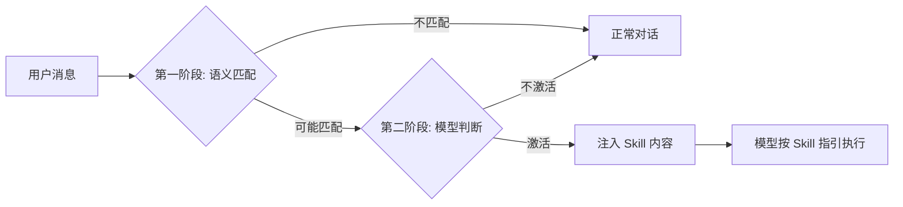
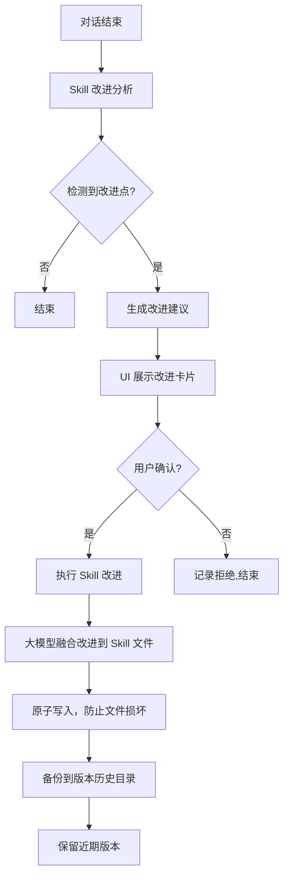

# 第九章：Skill 系统

> Skill 让用户定制 AI 行为，无需写代码。但设计一个好的 Skill 系统，比表面看起来复杂得多。

## 设计动机：在工具和 Prompt 之间的空白地带

做 Agent 产品时，用户有两类需求：

1. **帮我做 X 这件具体的事**（工具）：有明确输入输出，可以封装成函数
2. **帮我按 Y 这个流程做事**（工作方式）：是一套操作步骤和判断逻辑，很难变成函数

第二类需求，传统的解法是 Fine-tuning（让模型记住这套流程）或 Prompt Engineering（在 System Prompt 里写进去）。这两种方式的问题是：**用户无法自己修改**，改了需要重新部署。

Skill 系统是一个中间层：**用 Markdown 文件描述工作流程，让大模型在运行时读取并遵循，同时允许用户随时修改**。

这个定位看起来清晰，但 Skill 和它相邻的三个概念之间的边界，是我们在设计过程中花了最多时间厘清的问题。

## 三重边界：Skill 与工具、System Prompt 指令、MCP 的区分

表面上，Skill、工具、System Prompt 指令、MCP 都在做同一件事：告诉 AI 该怎么做。但它们各自占据了不同的语义层次，混淆任何两个都会导致架构混乱。

### Skill vs 工具

工具是原子能力，Skill 是编排策略。

| 维度 | 工具 | Skill |
|------|------|-------|
| 本质 | 代码实现的能力 | 给 AI 的操作手册 |
| 创建者 | 开发者 | 任何用户（写 Markdown 即可）|
| 执行方式 | 代码直接执行 | AI 阅读后自行执行 |
| 工具调用 | 本身是工具 | 激活后，AI 调用其他工具 |
| 适合场景 | 原子能力 | 多步流程、最佳实践 |

区分的关键在于：工具回答的是「系统能做什么」，Skill 回答的是「该怎么做」。一个文件搜索工具告诉 AI 它可以搜索文件，但 Skill 告诉 AI 在做代码审查时应该先搜索哪些文件、按什么顺序检查、遇到什么模式该如何判断。

我们在早期犯过一个错误：把一个复杂的公众号写作流程做成了工具，工具内部硬编码了步骤逻辑。结果是每次用户想微调流程（比如跳过风格分析直接写），都需要改代码重新部署。改成 Skill 后，用户自己编辑 Markdown 文件就能调整流程，用户满意度差距明显。

### Skill vs System Prompt 指令

System Prompt 指令是全局生效的，Skill 是按需激活的。

这个区别的工程后果比看起来严重得多。如果把所有 Skill 的内容都写进 System Prompt，按照我们实际的 Skill 数量（数十个，每个平均几百 token），System Prompt 会膨胀到几万 token，占据上下文窗口的很大比例。更严重的是，这些指令之间可能互相矛盾：写作 Skill 要求详细展开，代码审查 Skill 要求精简扼要，同时存在于 System Prompt 中时，模型的行为变得不可预测。

Skill 的按需激活解决了这两个问题：只有当任务匹配时，才把这个 Skill 的内容注入上下文。每个 Skill 可以写得足够详细，不用担心 token 预算。

**但这引入了一个新问题：激活判断本身的准确性。** 如果 Skill 该激活的时候没激活，用户体验降级；不该激活的时候激活了，AI 会按错误的流程执行。这个激活准确率取决于触发条件描述的质量，后面会详细讨论。

### Skill vs MCP

MCP 提供的是系统间的连接能力，Skill 提供的是任务执行的流程知识。

| 场景 | 推荐方案 | 原因 |
|------|---------|------|
| 需要访问新的外部系统 | MCP Server | 解决的是连通性问题 |
| 需要规范化某类工作流程 | Skill | 解决的是执行策略问题 |
| 需要新的原子能力（无法通过现有工具组合实现）| 内置工具 | 解决的是基础能力问题 |
| 需要领域专家的最佳实践 | Skill | 解决的是知识沉淀问题 |
| 需要可重复的多步任务 | Skill | 解决的是流程复用问题 |

一个具体的例子帮助理解这三者的协作：用户说「帮我把这篇文章发到公众号」。MCP 提供了与微信公众号平台的连接能力（调用发布 API）；Skill 定义了发布流程（先排版、再预览、确认后发布）；工具实现了排版渲染的具体计算（HTML 转换、样式注入）。三者各司其职，缺一不可。

**原则：能用 Skill 解决的，不要做成工具；能用工具组合解决的，不要做成内置工具。** 判断依据是：这个需求是否涉及领域知识和流程判断？如果是，用 Skill；如果只是确定性的计算或 IO 操作，用工具。

## 业内类似方案对比

| 方案 | 代表实现 | 定义方式 | 触发机制 | 用户可修改 | 自动优化 |
|------|---------|---------|---------|---------|---------|
| **System Prompt 扩展** | 大多数 chatbot | 直接写进 System Prompt | 始终激活 | 需要开发介入 | 无 |
| **Custom Instructions** | ChatGPT Custom Instructions | 用户填写文本框 | 始终注入 | 可以 | 无 |
| **Plugin / 工具** | OpenAI Plugin、LangChain Tool | 代码函数 | 模型调用 | 需要开发技能 | 无 |
| **Workflow 模板** | n8n、Zapier | 可视化流程图 | 触发器 | 可以，但需要图形界面 | 无 |
| **Hermes Skills** | Hermes Agent | Markdown 文件 | 模型自行决定 | 可以 | 无自动闭环 |
| **Claude Code Skills** | Claude Code | Markdown 文件 | 语义匹配 | 可以 | 无 |
| **Alice Skills** | Alice | Markdown + 结构化元数据 | 语义匹配 + 模型决策 | 可以 | 自动微调闭环 |

**各方案的根本差距：**

Custom Instructions 是最接近 Skill 的方案，但它是全局激活的：无论什么任务，那几行指令都在上下文里。Skill 的核心价值是按需激活。

Hermes 的 Skill 系统和 Alice 的最接近，但有一个关键缺失：**没有自动微调闭环**。用户用了一个 Skill，Alice 会在对话结束后分析这次执行效果，如果发现有可以改进的步骤，自动更新 Skill 文件并备份旧版本。Hermes 靠模型自觉保存改进，依赖性很强。

Claude Code 在 2025 年中加入了 Skill 系统，采用了类似的 Markdown 文件方案，触发机制也是语义匹配。但 Claude Code 的 Skill 目前没有自动改进闭环，也没有工具白名单机制。它的优势是与 Claude 模型深度集成，Skill 的格式更简单（纯 Markdown，没有结构化元数据头），降低了用户创建 Skill 的心理门槛。

这个对比揭示了一个设计取舍：**结构化元数据 vs 纯文本简洁性**。Alice 选择了结构化元数据，代价是用户创建 Skill 时需要理解格式约定，收益是系统可以精确地做触发判断、工具限制、版本管理。Claude Code 选择了纯文本，代价是系统对 Skill 的元信息（何时触发、允许哪些工具）只能从正文推断，收益是用户上手更快。两种选择都是合理的，取决于你的用户群体更看重「简单」还是「精确控制」。

## Skill 的格式设计

Skill 是 Markdown 文件，带有结构化的元数据头。格式设计的核心思考是：哪些信息应该结构化（让系统解析），哪些应该自由文本（让模型理解）。

结构化的部分（元数据头）包含触发条件、工具白名单、主动性控制、版本号等声明性字段。这些字段由系统代码直接读取和处理。

自由文本的部分（Markdown 正文）：具体的操作指南、流程步骤、判断逻辑。这些内容由模型在运行时阅读和遵循。

## 关键字段的设计思辨

### 触发条件：激活准确率的关键

触发条件是最重要的元数据。模型通过它判断当前对话是否应该激活这个 Skill。

写得好的触发条件需要同时定义正向触发条件和反向排除条件。我们在实际运行中发现，只写正向条件的 Skill 误触发率相当高，加上反向排除后大幅下降。

好的写法：明确列出触发词，同时写清不适用场景。比如：当用户明确说帮我写公众号、写篇文章、写个文案时使用。不适用于：用户只是在询问写作技巧、修改已有文章。

差的写法：写作相关。这种模糊的描述会导致用户问「怎么写好文章」这种知识性问题时也激活写作 Skill，但用户只是想聊聊，不是要 AI 帮他写。

我们测试过另一种方案：不用触发条件字段，而是在每轮对话前把所有 Skill 的描述信息发给模型，让模型自己判断是否激活。这种方案的准确率更高（模型对语义的理解比规则匹配更灵活），但代价是每轮对话都要消耗一次 Skill 列表的 token（Skill 数量多时积少成多），在长对话中累积成本显著。最终选择了触发条件字段作为初筛，模型做最终决策的两阶段方案。

### 工具白名单

工具白名单是最小权限原则的实现。当 Skill 激活时，工具列表被限制为白名单。这防止了 Skill 误用其他工具（比如一个写作 Skill 意外调用了文件删除工具）。

工具白名单是可选的。不设置时，Skill 可以使用所有工具。我们在设计时讨论过是否应该强制要求每个 Skill 都声明工具白名单，最终决定不强制。原因是：对于简单的 Skill（比如一个回答格式偏好），强制声明工具白名单会增加不必要的创建成本。但对于涉及文件操作、网络请求的 Skill，强烈建议设置，这是防御性设计。

### 主动性控制

主动性控制字段控制 AI 是否可以主动激活 Skill。

- 默认开启：模型可以主动决定激活这个 Skill
- 关闭：只能被显式调用（比如通过特定命令或 UI 按钮），模型不会自动触发

设计这个字段的动机来自一个真实的事故。我们有一个内部 Skill 会批量重命名文件，某次用户在讨论文件命名规范时，模型自动激活了这个 Skill 并开始执行重命名操作。用户的原意只是讨论，不是执行。

这个事故暴露了一个根本性问题：**模型对用户意图的判断不是百分百可靠的**。对于高权限操作（批量文件修改、数据库操作、外部 API 调用），哪怕误触发概率很低，后果也可能很严重。主动性控制就是为这类 Skill 设计的安全阀：明确告诉系统，这个 Skill 只在用户显式要求时才能运行。

这个字段的存在也意味着 Skill 系统承认了一个事实：**有些流程，自动化的价值在于触发后按照标准流程执行，不在于自动触发本身**。

## 加载优先级与两级目录的取舍

Skill 从两个位置加载：

用户全局目录（用户主目录下的专属文件夹）和项目专属目录（当前工作目录下的配置文件夹）。同名时，项目 Skill 覆盖用户 Skill。

这个两级目录的设计看起来自然，但背后有一个我们反复权衡的问题：**要不要支持更多层级？**

我们考虑过三级目录：系统内置、用户全局、项目专属。最终放弃了系统内置层级，原因是内置 Skill 和代码强耦合（它们引用了内部 API 和数据结构），不适合放在一个用户可以覆盖的目录里。内置 Skill（如子 Agent 的角色定义）直接硬编码在代码中，不参与目录加载。

我们也考虑过支持嵌套子目录，最终只支持了一级子目录。嵌套目录的好处是组织更清晰，但坏处是：Skill 的名称需要包含路径信息，触发匹配逻辑更复杂，用户在心智模型上需要理解目录层级与 Skill 优先级的关系。对于大多数用户来说，一级子目录够用。如果将来用户的 Skill 数量增长到更大规模，这个决策可能需要重新审视。

## Skill 激活的运行时机制

当模型决定激活某个 Skill，会调用对应的激活工具（每个 Skill 自动生成一个对应工具）。

工具执行时：
1. 把 Skill 的正文内容注入为系统级消息
2. 如果有工具白名单，把工具列表限制为白名单
3. 后续的对话轮次都在这个约束下进行

**Skill 的正文如何影响 AI 行为**：Skill 正文出现在系统消息里，模型会把它当作当前任务的操作指南。我们的经验是，Skill 正文的质量直接决定执行质量。写得足够详细（每步该做什么、该调什么工具、遇到什么情况该如何判断）的 Skill，模型执行的一致性很高。写得模糊的 Skill（只列了几个大步骤，没有判断逻辑），模型的行为会在不同次执行间有较大差异。

这里有一个微妙的平衡：Skill 写得太详细，会限制模型的灵活性，用户的需求有变化时，模型可能死板地遵循流程不做灵活调整；写得太粗，模型的行为不可预测。我们的经验法则是：**流程步骤要详细，但每步的判断逻辑要给模型留出裁量空间**。

## Skill 自动改进：让 AI 改自己的指令

每次对话使用了某个 Skill 后，Alice 会异步分析执行效果：

这实现了 Skill 越用越好 的闭环。但这个设计有一个严肃的风险需要正视：**让 AI 改自己的指令，怎么防止越改越差？**

### 退化风险：自动改进的四种失败模式

**过度特化**：某个 Skill 在一次特殊场景中被改进，改进后的版本在常见场景中表现反而变差。比如一个通用写作 Skill，因为用户某次写了一篇技术文档，AI 建议加入先搜索技术资料的步骤，结果之后写散文时也会先去搜索技术资料。

**语义漂移**：经过多轮改进后，Skill 的核心意图被逐渐稀释。每次改进都是合理的局部优化，但累积起来，Skill 已经偏离了最初的设计目标。这和机器学习中的灾难性遗忘有相似之处。

**指令膨胀**：每次改进只添加新规则，从不删除旧规则，Skill 越来越长。一个原本精炼的 Skill 经过多次改进后变得臃肿，其中大量规则互相冲突或冗余。

**反馈循环偏差**：用户更可能在 AI 表现不好时确认改进建议（有改进动机），在表现好时不提供反馈（没有确认动机）。这导致改进系统只看到失败案例，可能矫枉过正。

### 防退化的设计

我们用了三个机制来对抗退化：

**用户确认门控**：改进不自动生效，必须经过用户确认。这是最重要的一道防线。用户比 AI 更清楚这个 Skill 的核心目标是什么，可以判断建议的改进是否偏离了方向。

**版本备份与回滚**：每次改进前，旧版本自动备份到专属的版本历史目录，保留若干近期版本。这让退化可以被发现后恢复。

**改进幅度约束**：Skill 改进分析的提示词明确要求只做小幅增量改进，不做大范围重写。这限制了单次改进可能造成的最大偏移量。

坦率地说，这三个机制不能完全消除退化风险。它们能做到的是：**把退化的影响范围控制在可恢复的范围内**。如果用户发现某个 Skill 最近表现变差了，可以比较当前版本和历史版本，找到问题引入的时间点，回滚到之前的版本。

### 版本备份的回滚场景

版本备份看起来是一个不起眼的功能，但在实际使用中，我们遇到过多种需要回滚的场景：

**自动改进引入的退化**：如上所述，某次自动改进后 Skill 表现变差。

**用户手动编辑出错**：用户在修改 Skill 文件时不小心删掉了关键的判断逻辑，导致 Skill 行为异常。没有版本备份的话，用户只能凭记忆恢复。

**模型升级导致的不兼容**：某次模型升级后，原来写得好好的 Skill 突然不按预期执行了。这时候需要调整 Skill 的措辞来适配新模型，但调整过程中可能需要多次试错，版本备份让每次试错都可以安全回退。

**多人协作冲突**：在团队项目中，两个人同时修改了同一个 Skill，一个人的修改覆盖了另一个人的。版本历史可以帮助合并两个人的修改。

## 子 Agent 的角色 Skill

子 Agent 的角色系统也是通过 Skill 实现的。

每个角色对应一个内置 Skill（如研究员角色、开发者角色等），定义了该角色的操作规范：优先使用哪些工具、如何组织输出格式、遇到某类问题如何处理。

创建子 Agent 时，角色对应的 Skill 自动激活，规范子 Agent 的行为。

这个设计的一个重要含义是：**角色是可以被用户扩展的，不是固定的类型枚举**。用户可以创建自己的角色 Skill，定义一个全新的 Agent 角色，赋予它特定的行为规范和工具权限。系统不需要为此改代码。

## 踩坑经历

### Skill 正文长度与模型遵循度的非线性关系

我们最初以为 Skill 写得越详细越好，因此有些 Skill 写到了相当长。实测发现，当 Skill 正文超过一定长度时，模型对后半部分指令的遵循率明显下降。原因在于：当指令之间存在微妙的优先级冲突时，模型倾向于遵循先出现的指令。

我们的应对策略是：**把最重要的规则放在 Skill 正文的最前面**，后面的补充规则可以更简洁。如果一个 Skill 的内容确实很多，考虑拆分成多个 Skill，通过 Skill 之间的引用实现组合。

### 触发条件的否定描述比肯定描述更重要

直觉上，触发条件应该着重描述「什么时候用」。但 Alice 的实际经验是，误激活造成的问题远比漏激活严重。漏激活时用户会再说一次或换个说法，成本很低。误激活时 AI 会按错误的流程执行一大堆操作，用户需要理解发生了什么、撤销操作、重新开始，成本很高。

因此我们的建议是：**在触发条件中，大量篇幅用来写不适用的场景**。

### Skill 之间的冲突检测

当两个 Skill 的触发条件范围重叠时，哪个优先？目前的实现是让模型自己选择最匹配的一个。大多数情况下模型的选择是合理的，但在边界情况下（两个 Skill 都看起来匹配），模型的选择会在不同次对话中不一致。

这是一个已知的局限。更健壮的方案是引入 Skill 优先级或互斥组的概念，但这会增加用户管理 Skill 的复杂度。目前我们的判断是：对大多数用户来说，合理数量的 Skill 很少出现严重冲突，用触发条件的否定描述就能避免大部分问题。

*上一章：[MCP 协议](08-mcp.md) · 下一章：[自进化架构](10-self-evolution.md)*
