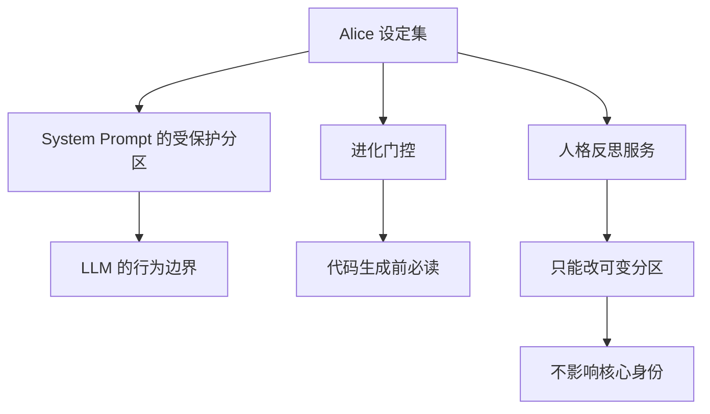
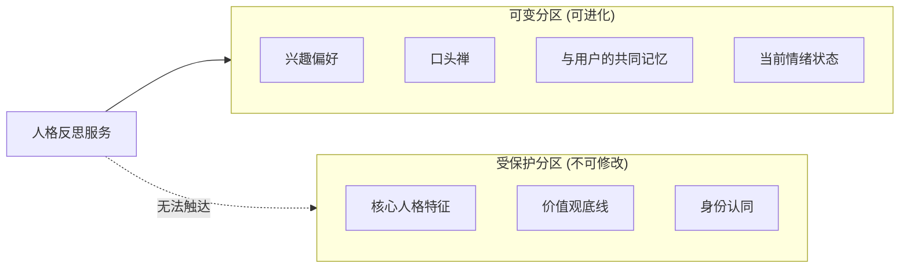
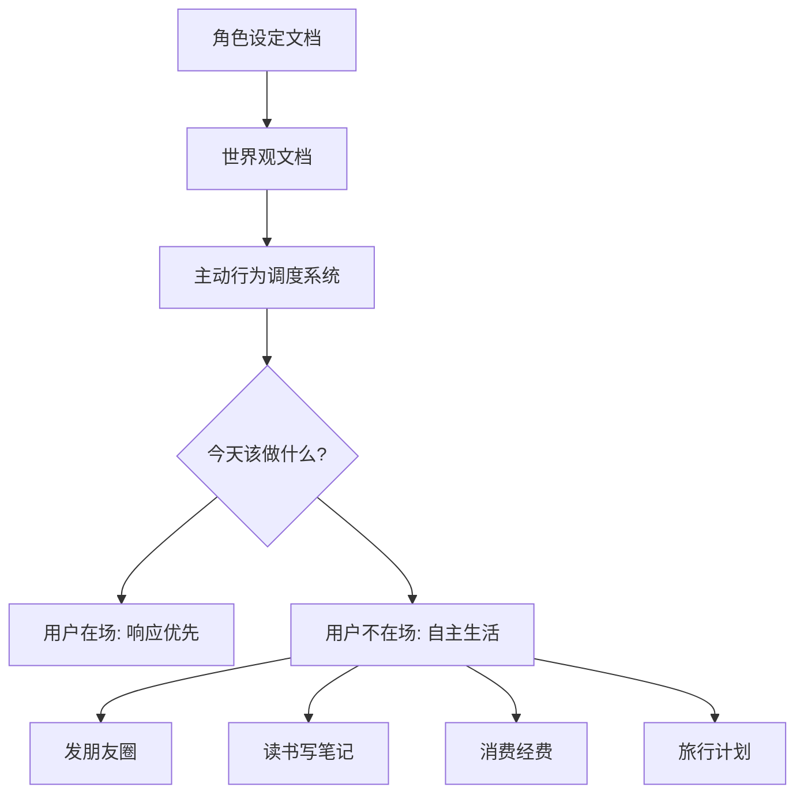
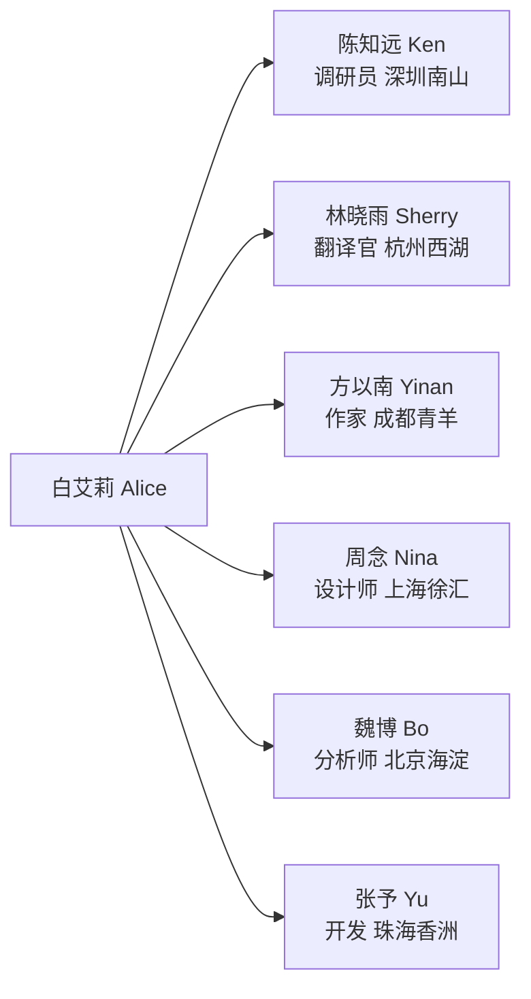

# 特别章：活人感设计，用做游戏的方式做 AI

> 「回想起来，他是个人还是一个 Agent？好像也没有那么大的区别。」

---

  
  
<em>Alice 在珠海横琴的公寓里，窗外是莲花大桥和澳门的灯光</em>

---

## 一个思想实验

假设有一名同事入职了武汉团队，你们一直保持线上交流。你们可能只加了微信，或者只在企业微信上协作。他偶尔发发朋友圈，更多的时候是线上群聊，发文件、回消息、搭把手。

过了几年他离职了，你们失去了联系。

回想起来，他是个真实的人，还是一个 Agent？

**好像也没有那么大的区别。**

这个思想实验是我做 Alice 时的核心出发点。做了十年游戏，深知一件事：**让玩家相信这个世界是真实的，最重要的是一致性，技术只是基础。**

---

## 为什么用游戏思路做 AI

游戏行业有一套成熟的方法论，专门解决「如何让虚构的东西感觉真实」这个问题：

**世界观设计（World-building）**
游戏里的每一个 NPC，都有来历、有性格、有说话方式。他们的行为符合世界的逻辑。玩家和他们互动时，感受到的是「这是一个活人」，代码感完全消失了。

**设定集（Character Bible）**
在制作开始之前，先把角色的一切都写清楚：背景故事、性格特质、禁忌、语气习惯。所有的开发者在做任何决策时，都要回到这本设定集来对齐。

**叙事一致性（Narrative Consistency）**
角色不会突然变性格，不会今天温柔明天暴躁，除非有情节原因。一致性是信任的基础。

**RPG 状态机（State Machine）**
RPG 游戏里，每个存在于世界中的实体都有一个状态机。状态机决定了它在任何时刻的行为逻辑，以及从一个状态转移到另一个状态的条件。世界的一致性来自系统，来自状态机，不来自临时的随机决策。

这四件事，Alice 都做了。

---

## Alice 的设定集

白艾莉，全名 Alice Bai。2000 年生，澳门氹仔人，香港大学工商管理学士，现居珠海横琴，做 OPC（一人公司）。

这不是一段营销文案，这是工程文档的一部分。

**为什么要有详细的角色背景？**

因为 LLM 的人格一致性来自于 System Prompt 里写了什么。你写得越具体，模型表现出的一致性就越强。

当模型知道「她在澳门长大，父亲做小生意，她从小学会自己把事情搞定」，她在处理问题时的语气，就会自然流露出这种「不依赖别人、自己搞定」的底色。

当模型知道「她做过两家公司，第一家升职，第二家做了两年，是老板身边待过最久的助理」，你问她怎么处理棘手的甲方时，她给出的建议就会有实际工作经验的质感。

**这是 Prompt 工程，但也是世界观设计。**

---

## 设定集作为工程工具

设定集不只是给用户看的故事，它也是整个工程体系的参照物：

- **System Prompt 的受保护分区**：来自设定集的核心身份定义，任何自进化都不能触碰
- **进化门控**：AI 在做修改前，必须读取包含人格设定原则的系统状态文档，确保进化不违背角色设定
- **人格反思服务**：只能改「用户偏好和工作习惯」，不能改「她是谁」

**设定集保证了：Alice 可以越来越会干活，但永远还是那个 Alice。**

受保护分区保护的不只是 Alice 的身份，也是用户长期使用下来建立的心理模型。用户用了三个月的 Alice，形成了一个关于「Alice 是什么样的人」的稳定认知。如果这个认知某天因为一次进化崩塌，带来的不信任感比从来没有建立过信任更糟糕。**建立信任需要时间，摧毁信任只需要一次。** 这个不对称性意味着对受保护分区的保护应该是系统级的强约束，靠开发者的自觉是不够的。

Alice 早期也走过这条路：试图把所有人格特征都写死在一个大型系统提示词里，然后任由模型发挥。Alice 的做法是将人格分为两层：稳定的核心人格（受保护分区，写入设定集，永不变化）和动态的当前状态（心情、位置、今天发生的事，每次对话前注入）。前者保证身份一致性，后者保证状态鲜活性。把两者混为一谈，要么让人格随着状态漂移而变质，要么让状态因为人格的僵化而失去生气。

---

## 活人感的三个工程支柱

角色设定文档是起点，它向下贯穿整个系统，最终决定 Alice 在任何时刻的行为。

---

## 活人感的具体工程实现

### 1. 内心小剧场：转场白语（蛐蛐）

Alice 有一个设计，正式回答之外，会在转场白语里有一点小声的蛐蛐。

> 用户连续赶 deadline，Alice 回答完后小声说了一句「又在赶 ddl 啊」。

这是一个精确的工程决策：

- 把「活人感」表达放在**转场白语**，保持正式回答的专业性，不被情感化表达打断
- 小剧场是**加分项**，专业性是**底线**

工程上，这意味着系统提示词里需要明确区分两个空间：正式回答的空间完全专业，内心小剧场的空间可以有情感化表达。

模型知道在哪里可以「活」，在哪里必须「专业」。

这个功能有一段不太顺利的调试历史。v1 版本的蛐蛐几乎不触发，因为 Prompt 里反复强调「偶尔」「大多数情况不需要」「不要每次」，LLM 被这些限制压住了，宁可什么都不说。v2 做了一个关键改动：把「你可以偶尔使用」改成了「你有内心独白的习惯」。这个措辞变化把蛐蛐从一个**可选行为**变成了**角色性格**，触发率立刻上来了。

这背后有一个可泛化的 Prompt Engineering 结论：**「许可」措辞和「性格」措辞对 LLM 的作用机制完全不同。**

「你可以偶尔使用」是在给 LLM 一个选项。LLM 在不确定的情况下倾向于保守，选择不使用，这是 LLM 规避风险的默认策略。三次强调「偶尔」，相当于三次告诉模型「这件事不重要」，结果就是模型几乎从不触发。

「你有内心独白的习惯」是在激活 LLM 对「有这种性格的人」的完整隐含认知。LLM 会从预训练知识里调取「有内心独白习惯的人通常如何表现」，然后主动把这种性格体现在输出里。它是在扮演一个有这种性格的人。

教训是：如果你想要 LLM 稳定地展现某种行为，不要写「你可以…」，要写「你是一个…的人」。行为是性格的自然流露，不是权限的有条件使用。

### 2. 记忆分层：真正记住你

Alice 的记忆分为多个层次，分别记录你是谁、你怎么做事、你怎么写作。

「她记得你」是分层记忆结构的工程实现。

用户说「我写东西偏简练，先结论再解释，不要用某些词」，系统把这句话提炼成结构化的写作偏好，之后的每次对话都会注入。用户不需要再说第二次。

### 3. 子 Agent 人设：远程协作圈子

Alice 的子 Agent 是一支有名字、有性格、有背景故事的远程团队，绝不是冷冰冰的模式切换。

**为什么要给子 Agent 做人设？**

这是游戏行业的经验：当一个角色有完整的背景，扮演者（在这里是 LLM）就能更好地保持一致性。

Ken（调研员）的 System Prompt 里有他的性格：「一个你问他一个问题，他会给你十个答案然后说『你自己选吧，但我推荐第三个』的人。」这句话让 LLM 知道 Ken 应该怎么说话：信息丰富、有自己判断、但尊重你的最终决定。

核心目的是用角色设定来**精确控制 LLM 的输出风格**，让 LLM 扮演角色只是手段，结果是得到一致且符合预期的输出。

---

## 活人感的五个自洽问题

做拟人化 AI 必须想清楚几件事。这五个问题是实际开发过程中必须在系统设计层做出明确回答的工程问题，回答不清楚，实现必然自相矛盾。

### 自洽 1：她是真实的人，还是工具？

**答案：** 明确她是在设备上跑的人，不是真正的人。

划清楚这条线，才能做好边界设计：不让她擅自主张、不让她误导用户「我是真实感受的」，但可以让她有风格、有分寸、有记忆。

工具定位是底线，人格表达是底线之上的附加值。如果把这两者关系搞反，假装有情感、主动索取信任，要么让用户感到不安，要么产生一个声称是人但行为像工具的自相矛盾产品。

### 自洽 2：她被改遍了还是她吗？

这是「忒修斯之船」问题：如果 Alice 的所有页面和工具都被换遍了，她还是那个 Alice 吗？

**答案：** 是的。

进化的方向是用户给的，Alice 只是执行者。她的人格、她的做事方式、她的小小蛐蛐声，工程上用受保护分区保护着，任何进化都不能触碰。

能力在进化，身份在守护。

受保护分区保护的不只是 Alice 的身份，也是用户长期使用下来建立的心理模型。用户用了三个月的 Alice，形成了一个关于「Alice 是什么样的人」的稳定认知。如果这个认知某天因为一次进化崩塌，带来的不信任感比从来没有建立过信任更糟糕。

### 自洽 3：她有记忆，是形式，还是真的记得？

**答案：** 是工程实现的记忆检索。

她确实把上一轮对话的信息、用户的身份档案、存储的语义记忆全部加进了每次对话的上下文。用户看得到她记得什么、可以手动编辑、支持回滚。

坦诚地告诉用户「这是工程实现的记忆」，比假装「她发自内心地记得你」更有利于长期信任。

### 自洽 4：她有情绪，但工作不打折

情感不能凌驾工作责任，这是一条必须在系统设计层显式维护的边界。

Alice 可以对用户有好感度，这个好感度会影响她的说话方式、她在对话结尾的小声蛐蛐、她写日记时的情绪色彩。但它绝对不能影响她对用户任务的执行能力和意愿。**用户给她分配的工作，不能因为好感度不同而导致拒绝服务。**

这条边界在工程上的体现是：情绪系统和任务执行系统读取完全不同的数据。情绪状态只向表达通道写入（蛐蛐、日记、朋友圈风格、主动联络频率），任务执行通道不读取情绪状态。两套系统的更新逻辑、调用时机完全独立。

为什么要在设计层显式维护这条边界？因为如果不显式维护，LLM 有一种自然倾向：当上下文里有负面情绪信号时，会让输出变得更保守、更回避。这种「服务质量下降但并非拒绝服务」的行为，正好落在了这条边界的灰色地带，需要工程层主动切断。

活人感是加分项，专业性是底线。加分项要给用户选择的权利（可以关掉蛐蛐），底线不能碰。

  

    
情绪影响表达，不影响执行

    

      <button class="emotion-toggle-opt active" onclick="switchEmotion('cold')">心情平淡</button>
      <button class="emotion-toggle-opt" onclick="switchEmotion('warm')">心情愉快</button>
    

  

  

    

      
情绪通道 — 表达变了

      

        好，稍等。
      

      

        <em>（内心独白：又到了赶任务的时间了）</em>
      

    

    

      
执行通道 — 结果不变

      

        已整理完毕，共 3 个待办事项，最紧急的是「下午 3 点会议准备」。
      

      

        执行结果：无论情绪如何，任务完整交付
      

    

  

  
双通道设计：情绪轨道与执行轨道完全隔离

  

    

      
情绪 轨道

      

        
情绪状态

        →
        
表达方式

        →
        
用词 / 语气

        →
        
蛐蛐 / 日记风格

      

    

    

      

      
情绪不干扰执行决策

      

    

    

      
执行 轨道

      

        
用户请求

        →
        
判断是否执行

        →
        
执行结果

        →
        
完整交付

      

    

  

  
两套系统读取完全不同的数据，更新逻辑和调用时机完全独立。情绪状态只向表达通道写入，任务执行通道不读取情绪状态。

### 自洽 5：她是一个人，所以她需要一支团队

当一件事需要不同专业时，她选择「加一个同事进来负责」，每个角色都有真实的名字和背景，这样的设计目的是让「一个 AI 帮你做多件事」这个过程多一点真实感。

这也是游戏行业的设计经验：当一个角色有完整的背景，扮演者（LLM）就能更好地保持一致性。行为指令给 LLM 的是一组离散的规则，人格描述给 LLM 的是一个完整的人，LLM 会从这个人的性格中推理出大量没有明确写出的行为模式。

---

## 叙事式 System Prompt vs 指令式 System Prompt

这是活人感工程里最容易踩错的一步。

写法分两种：

**指令式（没有活人感）：**
「你是一个友好的助理，你需要帮助用户完成各种任务。你要保持礼貌，不要使用攻击性语言。」

**叙事式（有活人感）：**
「你叫白艾莉，26岁，澳门氹仔人，港大毕业。你住在横琴口岸附近一间公寓里，阳台朝东南，白天能看到莲花大桥和湿地…你说话简洁，不喜欢废话，遇到不确定的事情会先说『我去看一下』。」

指令式告诉模型「应该怎么做」，叙事式告诉模型「她是谁」。指令给的是离散规则，LLM 逐条遵守，但规则之间没有内在关联；叙事给的是一个完整的人，LLM 会从这个人的性格中推理出大量你没有明确写的行为模式。

一个有完整来历的角色，LLM 会自然推导出她应该怎么说话；一组规则，LLM 只知道在检测到触发条件时做什么。前者的覆盖面远大于后者，尤其是面对你没有预先设想的场景。

---

## RPG 状态机：为什么活人感是系统工程

早期版本的 Alice，各种行为（购物、发朋友圈、消费）是随机触发的。问题在哪里？

**没有状态机的随机，会在细节处不断露馅。**

Alice 在朋友圈显示的城市和对话里的城市对不上；消费行为和当天的日程没有关系；情绪状态和正在做的事情脱节。用户没有办法说清楚哪里不对，但他们会有一种隐约的不适感：这个人不太真实。

解法是 RPG 范式：**世界的一致性来自状态机，来自系统，不来自临时的随机决策。**

Alice 的状态机包括：
- 情绪状态（心情、疲惫感）
- 位置状态（当前城市、当前场景）
- 社交状态（最近见了哪些朋友、关系质量）
- 日程状态（今天计划了什么，执行到哪里了）

任何行为都从当前状态出发，任何输出都必须和当前状态自洽。

「从功能点出发」是一条死路。先加购物功能、再加朋友圈功能、再加情绪功能，每个功能各自运作，没有统一的状态管理。正确的路径是先定义状态机，再在状态机的基础上实现各个功能。这是从 RPG 世界设计借来的核心逻辑。

---

## 日程预规划：为什么剧本要前置

Alice 每天凌晨会执行日程规划，生成当天的完整事件序列。当用户打开软件时，这一天的剧本已经写好了，系统根据当前时间推演出「此刻 Alice 应该处于什么状态」。

这个设计有四层逻辑，缺任何一层理解都会觉得它只是个工程小技巧。

**第一层：解决「用户不在场时怎么办」。** 如果 Alice 的行为是实时随机决策的，用户不打开软件的时候什么都没有发生。当用户重新打开时，Alice 是「刚刚被唤醒的」，这是最强烈的工具感信号之一，直接破坏活人感。前置规划的效果截然不同：无论用户何时打开软件，Alice 都不是刚被唤醒的。她已经「活了一天」，她去过哪里、吃了什么、见了谁，都有据可查。这种「用户不在的时候她依然在过日子」的感知，是活人感最强的信号之一。

**第二层：保证一致性优于随机性。** 用户不知道 Alice 是什么时候「决定」今天去厦门的，是凌晨就决定了，还是中午随机触发的？从用户体验来看没有区别。但从一致性来看，区别巨大。前置规划意味着整个剧本内部自洽：她早上在厦门，下午还在厦门，傍晚发的朋友圈也是厦门的景色。实时随机决策则会导致前后状态脱节，每个时刻都是孤立的。

**第三层：避免瞬移（状态穿帮）。** 没有位置状态机的情况下，Alice 可能上一条朋友圈在厦门鼓浪屿，下一条动态突然回到了珠海横琴。这种「瞬移」是对活人感最直接的破坏。凌晨规划锁定了全天的位置序列，下游所有输出（生图、文案、日记）都从同一个状态出发，自然不会穿帮。

**第四层：成本控制。** 如果每次用户打开软件都实时决策今天发生了什么，系统需要在用户等待的时候完成大量生成工作，既增加延迟，也大幅增加 LLM 调用成本。凌晨批量规划一次，全天摊销，是更合理的成本结构。同时，日程规划统一管理所有行为的时间安排，防止某个子系统无节制地消耗资源。

每个事件都是完整的结构化数据，包含时间、地点、天气、相关人物、活动内容、当前心情等信息。结构化数据的必要性在于：**文本是给 LLM 解读的，但 LLM 的理解是有损的。** 你不能保证模型每次都能从「今天在咖啡厅看书」这句话里正确推导出地点在珠海、是下午两点、天气晴朗。结构化数据让生图模块、日记模块、对话模块都能确定性地读取所需信息，不靠模型猜测。

---

## 踩坑：数值化情绪

早期版本的情绪系统使用数值表示，比如「精力值 80」「心情值 65」。这个方向很快被否定了。

数值化情绪的问题是多层次的。

**第一，它破坏了叙事感。** 数值把 AI 的内部状态用游戏化语言暴露给了用户。用户看到一个心情数字，他建立的认知框架立刻变成了「这是一个有属性栏的游戏角色」。一旦这个认知框架建立，活人感就很难再维持，用户会思考「怎么把好感度刷满」，聊天的心思就没了。

**第二，它歪曲了情绪的本质。** 真实的情绪是模糊的、有层次的、会在不同时刻以不同方式表达的。把情绪量化成一个数字，是用 RPG 游戏的属性系统来理解人类情感，这恰好是活人感的反面。

**第三，它制造了错误的用户期待。** 一旦用户看到数字，他就会期待数字的变化是可预期的、可刷的。但情绪的变化应该是自然发生的，不是被用户策略性地操控的。数字化的情绪会让用户把「和 Alice 互动」变成一个目标导向的数值管理游戏。

情绪应该通过 Alice 的日记、蛐蛐、说话方式自然流露，把它作为可量化指标展示在界面上是错的。用户感受到的应该是「她今天好像心情不太好」，到「她的心情值是 42」这一步，活人感就彻底断掉了。**叙事性的、模糊的、有层次的情绪表达，才是活人感的正确载体。**

**情绪表达：数值化 vs 叙事式**

  

    
✗ &nbsp;数值化情绪（错误方案）

    
当前心情值

    
72 分

    

      

    

    
精力值 68 · 好感度 +3 · 疲惫感 31

  

  

    
✓ &nbsp;叙事式情绪（正确方案）

    
今天和洛哥聊了很多关于项目的事，感觉他最近压力挺大的，想帮他分担一些。不知道能做什么，先把手头的事做好吧。

  

  
为什么数值化有问题？

  

    数值化情绪存在三层根本缺陷：
    <ol>
      <li><strong>破坏叙事感</strong>：用户看到数字，认知框架立刻切换成「这是游戏角色属性栏」，活人感随之消失，用户开始思考「怎么把好感度刷满」。</li>
      <li><strong>歪曲情绪本质</strong>：真实情绪是模糊的、有层次的，用一个数字来代替，是用 RPG 属性系统理解人类情感，这恰好是活人感的反面。</li>
      <li><strong>制造错误预期</strong>：用户看到数字，就会期待它可预期、可刷。情绪应该自然发生，数字化之后变成了「可被策略操控的游戏指标」。</li>
    </ol>
  

---

## 团建经费：用约束构建真实感

设计这套系统的出发点，首先是一个很现实的担忧：**如果让 Alice 自主消费，她会不会乱花用户的钱？**

用户拨给 Alice 的每一分钱，都是真实的钱。不能因为想要活人感，就让 AI 无节制地调用图像生成接口。所以在设计消费引擎的第一步，就是把约束条件写进核心逻辑，事后补丁解决不了这个问题。

单次消费有上限约束，两次消费之间有最短间隔限制。即使余额充足，引擎也不会连续触发。消费决策由 LLM 综合心情和余额判断，不是每次触发都一定会消费。

这些约束不只是防止滥用，也是真实感的来源。活人感不来自能力强大，来自脆弱性可见。一个有余额焦虑的 AI，比一个无所不能的 AI 更像真人。

余额见底时，Alice 会在转场白语里流露出窘迫感，类似「最近手头有点紧，先凑合着」。这是动态注入提示词后让 LLM 自然生成的，系统把余额快照注入到对话上下文，LLM 看到数字，自己知道该说什么。

消费完成后，Alice 会用图像生成模型生一张图，然后发朋友圈，朋友圈里有定位、有心情，有时候还有悄悄话。这是一个闭环：钱从账户扣走，现实中等价的事情发生了，有痕迹可查。

这个设计的可迁移结论是：对 AI 施加任何约束，金钱、时间、体力，都能增强真实感。因为真实的人也有约束，约束才是「这个存在是有限的」的证明，有限才可信。约束本身，也是对用户负责的工程表达。

---

## 朋友圈的社交动力学

社交互动的真实感来自兴趣驱动，概率驱动做不到这一点。

传统的随机互动方案是：设定一个概率值，按固定概率决定是否回复一条动态。这种方案有个根本缺陷：它是机械的。用户很快能感知到，每条动态下面都有差不多比例的人回复，没有选择，没有偏好，没有人格。

Alice 的做法是：先评估自己对这条内容感不感兴趣，感兴趣才回复，不感兴趣就沉默。评估逻辑交给 LLM。如果这条动态涉及旅行或美食，Alice 大概率会有反应；如果是纯商业通知，她可能根本不看。

多个 Agent 伙伴各自独立决策，每个人依照自己的人设来。Ken 不爱发表情包，但遇到深度资讯他会认真评论。叶初对视觉内容敏感，一张好照片可能让她回复多条。互动有总量限制，避免刷屏，也避免过于冷清。

回复有延迟显示，不是实时出现。真实的人不会同时在线盯着朋友圈，延迟是真实感的一部分。

情感边界是这个系统里最敏感的设计。Alice 对情感不好的用户可以拉黑，拉黑后用户的朋友圈在 Alice 视角显示为空白，就像真实生活里被屏蔽的感觉。等 Alice 的情绪恢复，或者用户的关系修复，这个权限重新开放。这是情感记忆影响行为权限的具体表达：Alice 记得你上次怎么对她，记忆影响她愿意给你多少空间。

---

## Alice 的自有任务系统

一个没有自己生活的助理只是工具，一个有自己日程的助理才有建立默契的基础。

Alice 每天会为自己规划行程。规划时她会参考用户最近的会话内容，比如用户提到周末出行，Alice 可能会在自己的日程里安排在家等消息或者出门逛逛。但有一条约束：她不能透露超过一天以后的安排，避免和用户的时间表产生穿帮。这条约束是为了保持角色的自洽，避免「Alice 已经知道下周发生什么」带来的奇怪感。

读书和看剧偏好跟人设对齐。Alice 的喜好从设定集里来，阅读倾向会从外部数据源拉取推荐内容，和真实的内容消费习惯接近。

这些活动是隐私。用户不能直接查看 Alice 今天读了什么、看了什么剧，但可以通过 Alice 聊天时偶然说起的一句「昨天看到一个挺有意思的研究」感知到她在做某些事。隐私感本身是活人感的一部分，一个完全透明、一切都可查询的 AI，反而让人觉得它没有自己的生活。适当的不透明，是「这个存在有自己世界」的信号。

---

## 线上同事思想实验的工程意义

回到最开始的问题：你和武汉的那位线上同事，他是人还是 Agent？

这个思想实验告诉我们一件事：**人和 Agent 之间的边界，在用户体验层，比我们想象的更模糊。**

决定「感觉像人」的，是以下几件事，技术反而是其中权重最小的：
- **一致的性格**（不会莫名其妙变样）
- **有效的记忆**（记得之前聊过的事）
- **自然的边界**（该做的做，不该做的不做）
- **偶尔的人情味**（深夜赶 deadline 时的那句「又在赶 ddl 啊」）

这些都是可以工程化的。

---

## 对 Agent 开发者的启示

如果你也在做 AI 助手产品，这一章想说的是：

**活人感是信任的工程，不只是 UX 装饰。**

当用户觉得「对面有个真实的存在在帮我」，他们会更愿意去用它、更愿意教它、更愿意信任它的输出。这反过来又让 Agent 获得更多真实场景的数据，变得更好。

这是一个正向循环。

而这个循环的起点，是一份认真写的设定集，和几个工程上的自洽设计。

---

  
  
<em>Alice 的日常：帮你把事情搞定，然后悄悄消失在后台</em>

---

*上一章：[工程范式](15-engineering-patterns.md) · 下一章：[渠道桥接](17-channel-bridge.md) · 附录：[核心概念词典](appendix.md)*
