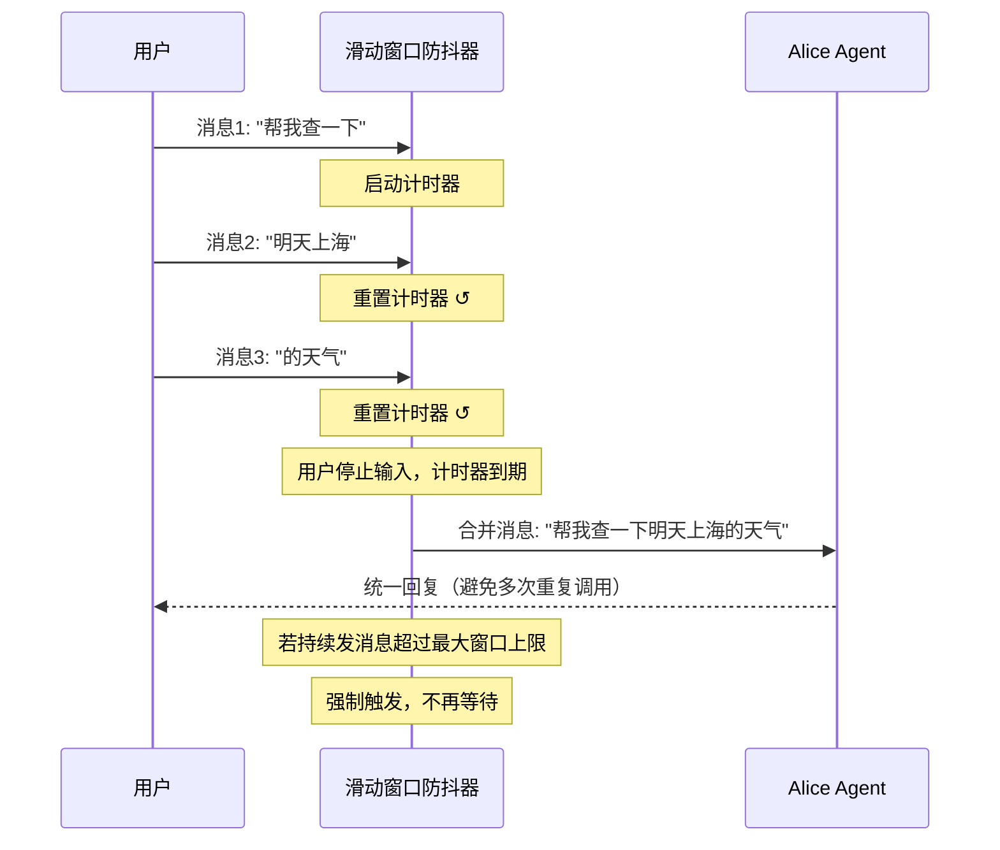
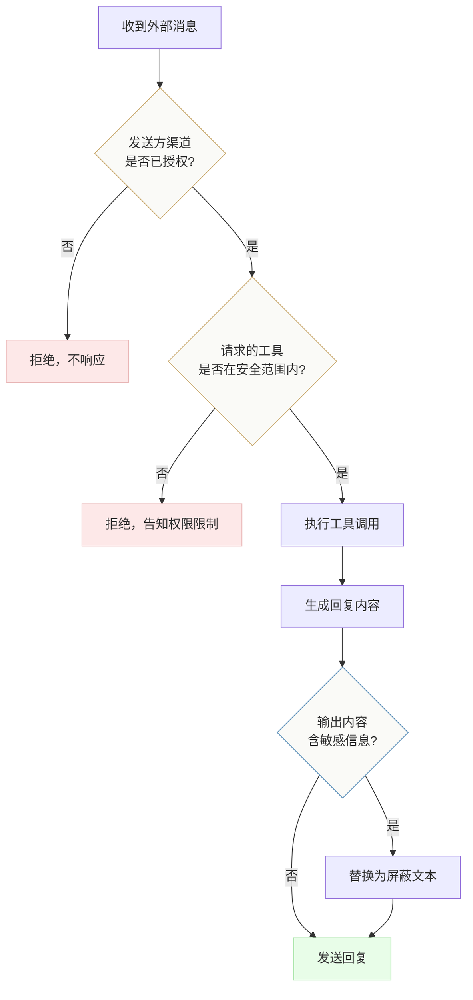
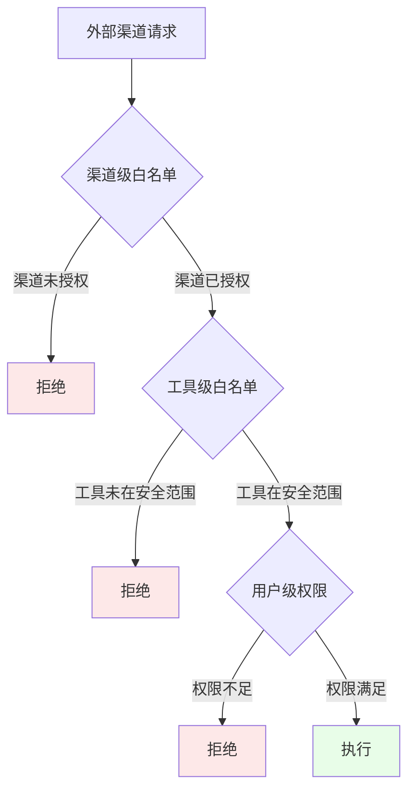
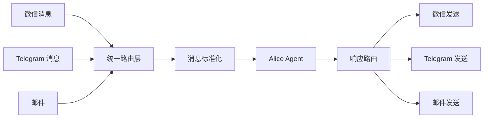

# 特别章：渠道桥接，让 Agent 随时在线

> 出门在外，微信收到一封重要邮件，Alice 帮你回了，等你回来看，她处理得比你自己做还仔细。

---

## 设计动机：桌面在线与天生在线

桌面应用有一个本质限制：用户必须坐在电脑前。

这个限制对大多数工具来说影响有限。文本编辑器、IDE、图片处理软件在用户离开电脑后通常不需要继续响应。但对需要跨设备持续处理任务的 AI 助理来说，这是一个根本性缺陷。用户离开电脑后，消息与任务仍然需要可靠地流转。

要理解渠道桥接的意义，需要区分两种在线形态。

桌面 Agent 的在线是随时在线：只要电脑开着、应用运行着，Agent 就在工作。用户离开电脑的那段时间，Agent 可以继续处理后台任务（比如定时检查邮件、执行排期任务），但它无法接收新的指令，因为没有输入通道。用户的手机上没有 Alice，用户不在电脑前就等于失联。

Web Agent 的在线是天生在线：它部署在云端，通过浏览器访问，用户只要有网络就能使用。ChatGPT、Claude.ai 这些产品天生具备跨设备访问的能力。但代价是它们无法访问用户的本地文件系统、无法执行本地命令、无法操作本地应用。

渠道桥接要解决的问题是：让桌面 Agent 获得类似 Web Agent 的可触达性，同时保留桌面 Agent 的本地能力优势。用户出门在外，通过微信或 Telegram 给 Alice 发一条消息，Alice 在家里的电脑上接收这条消息，用本地的全部能力处理它，然后通过同一个渠道把结果发回用户的手机。

这不只是功能扩展，是产品定位的延伸。当用户知道即使离开了电脑，消息也有人在处理，他对 Alice 的依赖程度会发生质的变化。Alice 从一个需要主动打开才能使用的工具，变成一个随时待命的助手。这种从被动到主动的转变，是渠道桥接最深层的产品意义。

---

## 微信接入：技术路线的艰难选择

微信是中国用户最主要的通信工具，也是最复杂的接入渠道。复杂不在于技术实现，在于合规性和稳定性的权衡。

### 三条技术路线

**路线一：直接注入客户端进程**

这是早期很多微信机器人项目的做法。通过逆向工程注入微信 PC 客户端进程，拦截消息收发函数，实现消息的读取和发送。

优势是功能最全面：可以读取所有聊天记录、发送所有类型的消息、操作群聊、读取联系人列表。延迟极低，因为直接在微信进程内操作。

代价是三重风险。首先，合规风险。微信的用户协议明确禁止第三方注入，被检测到可能导致账号封禁。2023 年腾讯加大了对第三方注入的检测力度，很多老牌微信机器人项目在那段时间集中失效。其次，稳定性风险。微信客户端每次版本更新都可能改变内部函数的地址和签名，注入代码需要跟着更新。这意味着你的产品的可用性取决于你逆向微信的速度能不能跟上微信的更新速度。最后，安全风险。注入进程意味着你的代码和微信运行在同一个地址空间，任何 bug 都可能导致微信崩溃。

**路线二：企业微信 API**

通过企业微信的官方 API 接入。这是合规性最好的路线，腾讯官方支持的能力。

优势是稳定、合规、有官方技术支持。

代价是场景限制。企业微信 API 的设计目标是企业内部通信，它能处理的是企业微信之间的消息，不能直接读取个人微信的消息。用户给 Alice 发微信，Alice 无法通过企业微信 API 接收到这条消息（除非用户也在企业微信里）。对于面向个人用户的产品来说，这条路线覆盖的场景太窄。

**路线三：第三方桥接服务**

通过第三方服务作为中间层，用户扫码授权后，第三方服务负责维护和微信的连接，Alice 通过标准接口和第三方服务通信。

优势是安全边界清晰：Alice 不直接持有微信凭证，不注入微信进程，不触碰微信的内部实现。第三方服务承担了合规风险和适配工作。如果微信更新了，需要适配的是第三方服务，不是 Alice。

代价是依赖了第三方服务的可用性和可信度。如果第三方服务宕机，微信渠道就断了。而且用户的消息经过第三方服务中转，增加了一层信任依赖。

### Alice 的选择

Alice 选择了路线三。核心理由是：一个面向普通用户的桌面应用，不应该让用户承担账号封禁的风险。路线一的功能最强，但风险也最高，一旦用户因为使用 Alice 被封了微信号，这个损失远超 Alice 提供的价值。

选择路线三的附带收益是架构更干净。Alice 在本地启动一个消息接收服务，通过鉴权机制接收来自第三方服务的消息推送。消息接收和处理的逻辑完全在本地，只是消息的传输层经过了第三方服务。如果未来要更换第三方服务（或者微信官方开放了个人开发者 API），只需要替换传输层，Agent 处理逻辑不用动。

---

## 消息防抖窗口：从碎片消息到完整意图

用户在微信上往往连续发几条消息，不会一条发完。这是即时通讯的使用习惯：想到一句说一句。

如果 Alice 逐条处理，会出现两个问题。第一，Agent 在第一条消息时根本没有足够上下文。用户发了「帮我查一下」，Alice 立刻开始处理，但查什么？用户还在打字。第二，多条消息触发多次 Agent 调用，产生大量重复的 LLM 请求，成本飙升。

防抖合并的思路很简单：收到第一条消息后不立刻处理，等待一段时间，把窗口内的所有消息合并成一条再触发 Agent。

### 窗口长度的探索

我们测试过不同的窗口长度，从短到长，各有利弊。

**短窗口。** 优势是响应快，用户发完消息后几乎立刻能看到 Alice 开始处理。代价是窗口太短，连续发消息的场景下经常合并不完全。用户习惯性地打三四条消息，打字速度一般的用户两条消息之间的间隔经常超过短窗口的等待时间。实测中，短窗口的合并率偏低，相当一部分情况下 Alice 还是会在信息不完整的时候开始工作。

**长窗口。** 优势是合并率很高，绝大多数连续消息场景能完整合并。代价是用户感知到的延迟太长。用户发完消息后等待时间明显，会以为 Alice 没收到或者卡住了。我们观察到有用户在等待期间反复发送问号或「你在吗」，反而产生了更多消息需要合并。

**中等窗口。** 合并率较高，覆盖了绝大多数的连续发消息场景。延迟可接受，在即时通讯的语境下不会让用户感觉被忽略。最终我们选择了这个方案。

### 防抖的实现思路

防抖不是简单的固定等待。Alice 的实现是滑动窗口防抖：每收到一条新消息就重置计时器。也就是说，如果用户持续每隔很短时间发一条消息，窗口会持续延长，直到用户停下来后才触发处理。

这种滑动窗口有一个极端情况：如果用户一直不停地发消息，理论上窗口会无限延长，Alice 永远不触发处理。实际上这种情况极少发生，因为用户总会有停顿。但作为防御，我们设置了一个最大窗口上限，超过上限后强制触发处理，即使用户还在发消息。

### 防抖窗口的不可迁移性

窗口长度是针对微信场景的经验值，不能直接迁移到其他渠道。Telegram 用户的发送习惯和微信不同（Telegram 更偏向发一条完整消息，碎片化程度低得多），邮件更是完全不需要防抖（一封邮件就是一个完整请求）。每个渠道需要独立调整防抖策略，甚至决定是否需要防抖。

---

## 邮件独立数据库：从主库分裂出来的决策

### 最初在主库里

Alice 的邮件功能最初把邮件数据存储在主数据库中。邮件表和会话记录、设置配置、记忆数据在同一个数据库文件里。这在架构上最简单，一个数据库搞定一切。

### 什么时候发现必须拆出来

转折点出现在一个内测用户绑定了他的工作邮箱之后。这个邮箱有十几年的历史，存了大量邮件。首次同步时，邮件数据把主数据库的体积从很小膨胀到了数百 MB。

体积膨胀带来了三个连锁问题。

第一，主库备份变慢。Alice 在每次重要操作前会备份数据库（这是用户数据安全的要求），体积暴增后备份时间从毫秒级跳到了秒级，每次备份都造成可感知的卡顿。

第二，查询性能下降。主库的其他查询（读取设置、查找会话记录、检索记忆）不涉及邮件表，但数据库的日志和缓存管理是库级别的，大表的存在会影响整个库的读写性能。

第三，数据生命周期不一致。主库的数据（设置、记忆、会话）需要长期保留且经常更新。邮件数据的特点完全不同：量大、只增不改（收到的邮件不会被修改）、查询模式简单（按时间排序、按发件人筛选）。把两种生命周期完全不同的数据放在同一个库里，相当于让一个存储引擎同时优化两种截然不同的工作负载。

### 拆分的工程代价

拆分不是零成本的。主要代价包括以下几项。

数据迁移：需要编写迁移脚本，把已有的邮件数据从主数据库迁移到新的独立邮件库，同时处理迁移中断和回滚。

跨库查询：有些业务场景需要关联邮件数据和主库数据（比如在对话上下文中引用邮件内容）。拆分后这种关联不能用数据库 JOIN，需要在应用层分别查询再合并结果。

备份策略：两个数据库需要独立的备份策略。主库的备份频率可以高一些（体积小），邮件库的备份频率可以低一些（数据增量小，且邮件的权威来源在邮件服务器上，丢失可以重新同步）。

连接管理：应用层需要维护两个数据库连接，每个连接有独立的初始化、连接池管理和关闭逻辑。

### 拆分后的收益

拆分后，主库体积恢复轻量，备份恢复为毫秒级。邮件库可以独立优化（比如为邮件表添加全文索引，这个操作如果在主库里做会影响其他表的写入性能）。更重要的是，邮件功能的 bug 不会影响主库的数据完整性。有一次邮件同步的 bug 导致邮件库损坏，但主库完全不受影响，用户只需要重新绑定邮箱触发一次全量同步就恢复了。

### 经验法则

数据量大的子系统独立存储，不要因为架构简洁就把所有数据塞进主库。判断是否需要独立的信号是：子系统的数据量是否可能远超主库，子系统的数据生命周期是否和主库明显不同，子系统是否可以独立重建（即丢失后有外部权威来源可以恢复）。多数条件满足时，就应该考虑独立存储。

---

## 邮件监控：推送模式 vs 轮询模式

### 轮询的问题

最简单的邮件监控方式是定时轮询：每隔一段时间向邮件服务器查询是否有新邮件。

轮询间隔的选择是一个两难。间隔短，服务器压力大，部分邮件服务商会限流甚至封号。间隔长，新邮件的到达延迟太高，用户会觉得 Alice 反应太慢。

更大的问题是效率。大多数时候用户并没有新邮件，但轮询请求照样发出去，浪费带宽和服务器资源。一个全天运行的邮件监控，绝大多数轮询请求的结果都是「没有新邮件」。

### 推送模式的优势

邮件协议支持一种推送机制：客户端告诉服务器「我要进入等待状态」，服务器在有新邮件到达时主动通知客户端。客户端不需要持续轮询，只需要维持一个长连接等待通知。

优势是实时性和效率的完美结合。新邮件到达后，服务器几乎立刻通知客户端，延迟极低。没有新邮件时，没有任何请求发出，零开销。

### 断线重连的工程挑战

推送模式的优势是理论层面的，工程层面的挑战在于长连接的维护。

长连接在以下情况下会断开：网络切换（用户从 WiFi 切换到有线或反过来）、路由器超时回收（家用路由器通常在几分钟到半小时后回收不活跃的连接映射）、服务器端超时（协议建议长连接在一定时间后需要重新建立）、系统休眠（macOS 合盖休眠后所有连接失效）。

每种断开场景的表现不同。有些会收到明确的关闭通知，有些是连接静默消失，只有在下次尝试通信时才发现连接已经无效。

Alice 的策略是：定期主动重新建立推送连接（在协议建议的最长时限之前），避免服务器端超时。检测到连接断开后，用指数退避重连。连续重连失败若干次后降级为轮询模式，并在 UI 上显示邮件连接不稳定的提示。轮询模式下每次成功连接后尝试恢复推送模式。

### 为什么不只用轮询

既然推送模式需要处理这么多断线重连的边界情况，为什么不干脆只用轮询？

因为用户体验差距太大。轮询模式下，用户发一封紧急邮件请求 Alice 处理，最坏情况要等几分钟 Alice 才发现有新邮件。推送模式下几乎是即时的。当用户通过微信渠道说「帮我回一下刚收到的邮件」时，这个延迟差距决定了用户觉得 Alice 是灵敏的还是迟钝的。

推送优先，轮询兜底。多花的工程投入换来的是关键场景下的用户体验优势。

---

## 安全边界：安全与便利的永恒矛盾

### 为什么外部渠道必须有独立的安全边界

桌面应用里，用户自己坐在电脑前，所有操作都经过本人确认。但外部渠道不同，任何人都可以向绑定的微信号或 Telegram Bot 发消息。如果 Agent 处理外部消息时拥有和本地一样的完整权限，风险是显而易见的。

一个不怀好意的人给你的 Telegram Bot 发一条「帮我把文档目录全部删除」，如果 Alice 按本地权限执行了命令，后果不堪设想。即使不考虑恶意攻击，用户自己的家人朋友也可能不了解 Alice 的能力范围，无意中触发了破坏性操作。

### 白名单的设计思路

Alice 对外部渠道触发的 Agent 实施工具白名单制度。

允许的是只读类工具：查询信息、获取数据、读取记忆、发送回复。它们的共同特征是不修改本地文件系统，不执行任意命令。

禁止的是有副作用的工具：执行系统命令、修改文件、创建子任务、操作定时器。它们的共同特征是可能产生不可逆的副作用。

禁止这些工具，根本原因是外部渠道的发送方身份无法完全核实，工具本身并不天然危险。在用户本人坐在电脑前确认的前提下，执行系统命令是完全合理的能力。但在无法确认发送方身份的外部渠道中，同一个能力就变成了攻击向量。

### 白名单太严的抱怨

上线后最常见的用户反馈是：为什么我通过微信让 Alice 帮我改一个文件，她说不行？

用户的需求是合理的。他确实想在外出时远程修改一个文件，这正是渠道桥接要解决的场景。但白名单制度把这个场景挡在了外面。

我们考虑过几种放松方案。方案一是引入身份验证，外部渠道的消息在执行高权限操作前要求用户发送一个验证码。这增加了交互步骤，用户体验下降。方案二是可配置白名单，让高级用户自己决定外部渠道允许哪些工具。这等于把安全决策交给了用户，大部分用户不具备做这个判断的能力。方案三是维持现状，高权限操作只能在本地桌面端执行。

### Alice 的选择

Alice 选择了维持现状。理由是安全边界一旦模糊，后患无穷。一次安全事故的损失远大于无数次便利性提升的收益。

这不是一个令人满意的答案。它是在安全和便利的永恒矛盾中，选择了偏向安全的那一端。未来如果有可靠的身份验证方案（比如基于生物特征或硬件密钥的远程认证），可以重新审视这个决策。但在当前的技术条件下，宁可多限制一些，也不能留下安全漏洞。

### 敏感信息输出过滤

白名单管的是输入方向（Agent 能执行什么），输出方向也需要保护。

统一发送工具在发送消息前，会扫描输出内容，检测常见的密钥格式、密码模式、令牌格式。命中的内容替换为屏蔽文本再发出。这防止了 Agent 在无意中把敏感信息泄露到外部渠道。

---

## 渠道格式差异：在哪一层处理

### 两种处理策略

**策略 A：在渠道层强制转换。** Agent 统一输出 Markdown 格式，渠道层负责把 Markdown 转换为目标渠道的格式（微信纯文本、Telegram 富文本、邮件 HTML）。Agent 不需要知道自己在哪个渠道。

优势是 Agent 逻辑更简单，不需要关心格式差异。代价是格式转换可能丢失语义。Markdown 的加粗在微信纯文本中只能用星号包裹或直接去掉，代码块在微信中没有对应的格式。更深层的问题是：不同渠道不只是格式不同，措辞风格也应该不同。微信回复应该简洁口语化，邮件回复应该正式完整，Telegram 介于两者之间。格式转换解决不了风格差异的问题。

**策略 B：在 Agent 感知层处理。** 系统提示词注入当前渠道类型，Agent 知道自己在哪个渠道，主动调整格式和措辞风格。渠道层只做必要的字符转义，不做内容级别的转换。

优势是回复质量更高，Agent 能根据渠道特点输出最合适的内容。代价是 Agent 的提示词更复杂（需要包含渠道感知的指引），而且不同模型对渠道差异的理解能力不同。

### Alice 的选择

Alice 选择了策略 B。理由是格式意识是回复质量的一部分，不能完全在渠道层抹平。

实际效果验证了这个选择。当 Agent 知道自己在回复微信消息时，它会自动缩短回复长度（微信对话的阅读场景是手机屏幕，长文本体验差），避免使用复杂的 Markdown 格式，措辞更口语化。当 Agent 知道自己在回复邮件时，它会使用更正式的措辞，包含适当的问候和签名，结构更完整。

这种差异是格式转换做不到的，需要 Agent 在生成内容时就考虑到目标渠道的特点。

---

## 多渠道并行运行的进程管理

### 三个渠道监听器的独立性要求

微信、Telegram、邮件三个渠道各有一个监听器（监控进程），它们可能同时运行。每个监听器有自己的轮询逻辑、重连机制和错误处理。

核心要求是：任意一个监听器崩溃不能影响其他两个。

这个要求看似简单，但 Alice 曾经踩过一个坑：三个监听器共享一个事件循环，其中一个监听器抛出未捕获异常，整个事件循环崩溃，三个渠道全部断开。

### 隔离策略

Alice 的每个监听器运行在独立的错误边界内。每个监听器的运行循环内部有完整的异常捕获，未预期的异常被捕获后记录日志并触发重启逻辑，不会向上层传播。监听器之间不共享任何可变状态，各自维护自己的连接、消息队列和重试计数器。

### 生命周期管理

一个轻量的调度器负责三件事：启动（Alice 启动时读取已绑定的渠道配置，为每个渠道创建并启动监听器）、健康检查（定期检查每个监听器的活跃状态，长时间无心跳的监听器触发告警）、优雅停止（Alice 关闭时通知所有监听器停止轮询、关闭连接、释放资源）。

调度器不参与具体的消息处理逻辑。它的定位是进程生命周期管理，不是消息路由。

### 启动恢复

Alice 每次启动时需要自动恢复所有已绑定的渠道监听器。恢复过程是异步的，不阻塞主窗口加载。用户打开 Alice 后立刻可以使用本地对话功能，渠道监听器在后台静默恢复。如果某个渠道的恢复失败（比如 Telegram Bot Token 过期了），只有该渠道显示连接失败状态，其他渠道和本地功能不受影响。

---

## 三个渠道的工程细节

### 微信渠道

绑定机制通过第三方服务扫码完成。绑定后 Alice 在本地启动消息接收服务，通过鉴权机制接收消息推送。

图片消息需要特殊处理。微信图片有 CDN 有效期，必须在链接失效前下载到本地并压缩存储，再转成 base64 传给多模态模型。如果下载延迟导致链接过期，图片就丢了，用户需要重新发送。这个时间窗口通常在几分钟到十几分钟之间，不同场景下有波动。

### Telegram 渠道

Telegram 的接入相对简单，API 设计清晰，对开发者友好。用户填入 Bot Token，Alice 调用官方验证接口确认有效性，验证通过后启动监听器。

消息监控使用长轮询机制，Telegram 支持较长的长轮询等待，减少无效请求。

Telegram API 是境外服务，国内用户需要代理。Alice 复用全局代理配置，不需要单独设置。

### 邮件渠道

协议接入采用标准收件和发件协议，覆盖所有主流邮箱（Gmail、Outlook、QQ、163、126）。预设模板减少用户配置成本，自定义服务器配置支持企业邮箱。

本地缓存策略：先从本地数据库返回缓存数据（即时响应），然后在后台做增量同步，同步完成后通知前端刷新。用户感知到的是即时响应，后台安静地保持数据最新。

让 Alice 处理功能：邮件列表里每一行都有一个操作入口。点击后，邮件全文注入上下文，自动创建新对话，Alice 开始处理。不需要复制粘贴，不需要解释背景。

---

## 统一路由设计

三个渠道，三种消息格式，三套协议。如果 Agent 需要对每个渠道单独处理，代码复杂度会快速膨胀。

Alice 设计了一个统一发送工具作为出口：Agent 调用这个工具回复消息，工具根据当前会话的渠道上下文自动路由到对应渠道，处理必要的格式转义。Agent 不需要知道当前消息是通过哪个渠道来的，也不需要自己处理各渠道特有的转义规则。

但 Agent 需要知道自己在哪个渠道，这一点前面在格式差异的讨论中已经说明。知道渠道不等于处理协议细节。Agent 知道自己在回复微信消息所以用纯文本简短回复，但它不需要知道消息推送的底层协议是什么。感知层的信息和协议层的信息，是不同层次的关注点。

---

## 凭证安全存储

微信绑定凭证、Telegram Bot Token、邮箱密码，这些信息的泄露后果严重。Alice 使用对称加密算法对这些凭证加密后存储，和 API Key 使用同一套加密体系。

加密密钥派生自用户的本地设备信息，不同设备有不同的密钥。这意味着直接拷贝数据库文件到另一台电脑无法解密凭证，必须在新设备上重新绑定。这是刻意的安全设计：凭证和设备绑定，丢失设备后泄露数据库文件不会泄露渠道凭证。

---

## 渠道桥接对产品定位的影响

### 从工具到助手的跨越

没有渠道桥接的 Alice 是一个桌面工具。很强大的桌面工具，但本质上和 IDE、编辑器是同一类产品：用户在需要时打开，用完关闭，中间的时间和用户无关。

有了渠道桥接的 Alice 更接近一个随时待命的助手。用户出门在外时可以通过微信发指令，上班路上可以通过 Telegram 查进度，旅行时可以让 Alice 通过邮件处理事务。Alice 不再只在用户坐在电脑前的那几个小时里工作，而是全天待命。

### 用户依赖度的变化

这种从被动到主动的转变对用户依赖度的影响是显著的。我们观察到，开启渠道桥接的用户的日活跃度明显高于纯桌面使用的用户。桌面使用频率没有变多，增加的是移动端的使用场景。

更深层的变化是用户对 Alice 的心智模型转变。纯桌面使用时，用户把 Alice 当作一个需要主动打开的工具，和搜索引擎的关系类似。开启渠道桥接后，用户开始把 Alice 当作一个可以随时联络的角色，更接近和同事的关系。这种心智模型的转变，比任何技术指标都更能说明渠道桥接的产品价值。

### 随之而来的责任

但这种依赖度的提升也带来了更高的可靠性要求。桌面工具偶尔崩溃，用户重启就好。但一个用户已经习惯随时通过微信联系的助手，如果某天微信渠道断了且没有任何通知，用户会以为 Alice 在忽略他的消息。这比工具崩溃的感受更糟糕，因为它涉及信任。

这意味着渠道桥接不只是一个功能模块，它改变了产品的可靠性标准。每个监听器的健康检查、断线重连、异常通知都要做到位。原因不只是技术上需要，是产品定位需要。

---

## 可迁移的结论

**外部渠道必须有独立的安全边界。** 不能和桌面应用共享工具权限。外部渠道的发送方身份无法完全核实，高风险操作需要在用户本人在场时确认。安全边界一旦模糊，后患无穷。

**消息防抖是必须的。** 用户连续发消息是普遍行为，不是边缘情况。没有防抖的渠道接入，要么产生大量重复调用，要么让 Agent 在信息不完整的情况下开始工作。防抖窗口的长度需要针对具体渠道的使用习惯调整，不存在通用的最优值。

**渠道格式差异要在 Agent 感知层处理。** 统一出口负责路由和字符转义，但 Agent 需要知道自己在哪个渠道，以便调整措辞格式和正式程度。格式意识是回复质量的一部分，不能完全在渠道层抹平。

**数据量大的子系统独立存储。** 不要因为架构简洁就把所有数据塞进主库。数据量大且生命周期与主库不同的模块（邮件、日志、请求记录），独立存储让主库保持轻量，也让子系统的故障不影响全局。

**渠道桥接改变的不只是功能，是产品定位。** 从桌面工具到随时在线助手的跨越，带来了用户依赖度的显著提升，但也带来了更高的可靠性标准。每一个监听器的稳定性都关乎用户信任，不仅仅是技术指标。

---

*上一章：[活人感设计](16-alive-agent.md) · 附录：[核心概念词典](appendix.md)*
