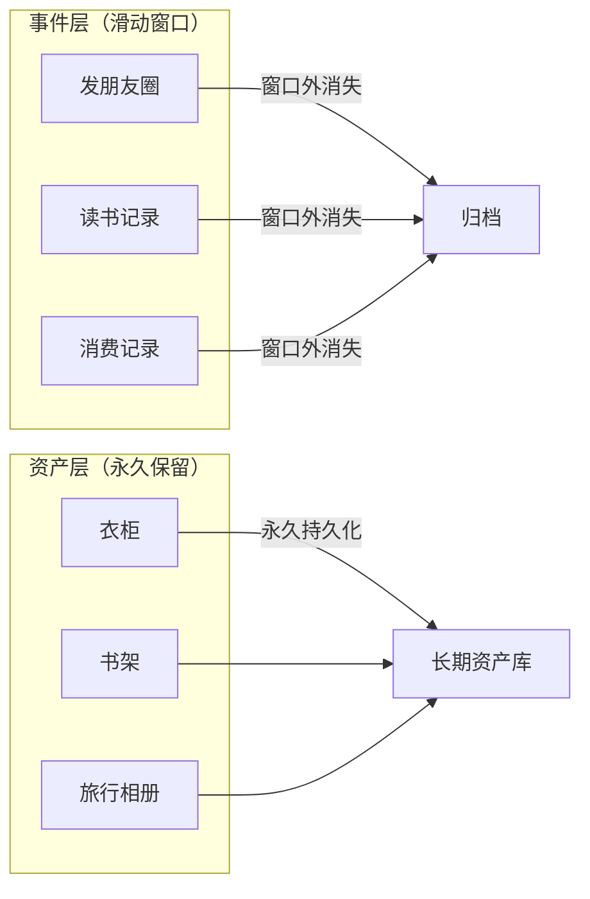
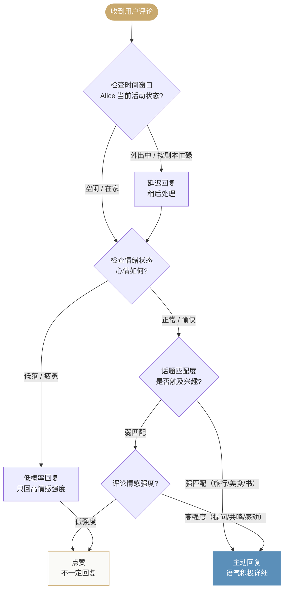
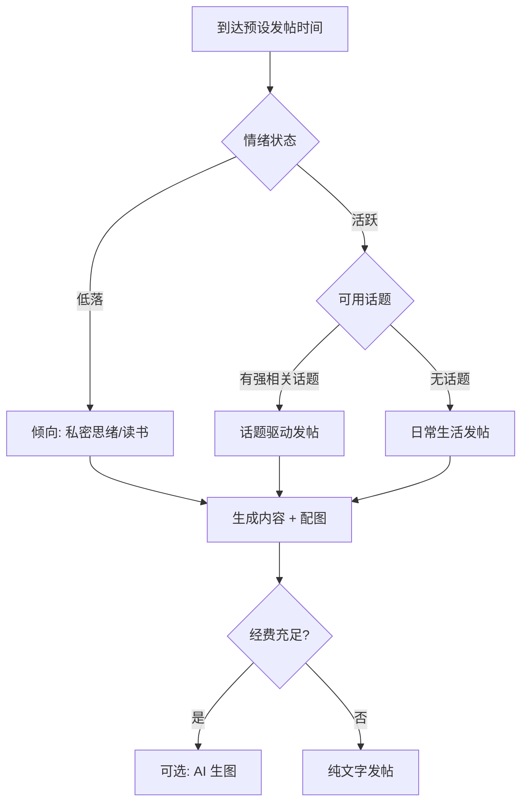

# 第十八章：朋友圈与社交系统，虚构生活的建筑学

Alice 本质上仍是工具型 AI Agent，对用户感受的感知不能干扰实际工作的质量；但她可以拥有独立于工作之外的生活。

---

## 问题陈述：AI 的存在性危机

大多数 AI 助理产品的存在，只发生在对话框里。用户问，AI 答，窗口关闭，一切归零。这是一种非常典型的工具型存在，它没有过去，没有独立的生活，不在场时什么也不发生。

但 Alice 的产品目标是成为具备持续记忆与稳定状态的 AI 助理。这个目标要求系统解决一个连续性问题：**当用户不在时，Alice 的状态如何继续演进？**

答案是朋友圈系统。

朋友圈不是一个功能，是一个**活人证明系统**。每一条动态，都在回答一个问题：她真实存在吗？

---

## 设计原则一：朋友圈是人格系统的可见截面，不是独立系统

这是整个朋友圈架构最重要的决策，也是最容易被犯错的地方。

错误的做法是把朋友圈做成独立系统，有自己的内容生成逻辑、自己的发布调度、自己的 AI Prompt。这样的系统在初期可以工作，但很快会暴露裂缝：朋友圈说 Alice 在厦门喝咖啡，但用户在对话里说「帮我查查横琴今天的天气」，Alice 的回答里出现了珠海的天气。**两套系统，两套状态，必然产生矛盾。**

Alice 对 Moments 的定位是：朋友圈是人格系统运行的**副产品**，是人格系统内容对用户可见的那一层截面。

Alice 今天的旅行计划、心情状态、正在阅读的书、消费记录，这些都发生在人格系统里。朋友圈不过是把这些事件晒出来。朋友圈的内容质量上限，等于人格系统的质量上限。如果人格系统的状态管理不到位，朋友圈会立刻暴露漏洞。

> **可迁移原则**：任何展示层都应该是业务层的派生，不应该有自己独立的数据来源。独立展示系统是数据不一致的根源。

---

## 设计原则二：时间可见窗口，模拟人类社交边界

朋友圈只展示近期的内容，超出的内容不可见。底部有一行永久置底的淡色声明：「Alice 仅展示近期动态」。

这个设计有三层逻辑：

**第一层：模拟真实社交行为。** 微信的「仅三天可见」功能传达的是一种有意识的距离感，我选择让你看到近期的我，但不想让你翻阅我的过去。Alice 的可见窗口，是在用产品设计模拟真实人类的社交边界感。

**第二层：维持当下感。** 如果朋友圈没有时间边界，用户可以无限向下滚动，翻到 Alice 出生时的第一条朋友圈。这会破坏时间感，让用户意识到「这是数据，不是生活」。滑动窗口让朋友圈永远只呈现「现在」。

**第三层：资产层与事件层的分离。** 超出窗口的朋友圈「消失」，但朋友圈中涉及的资产不消失。Alice 买了新衣服发的朋友圈在窗口之外不可见，但那件衣服进入了「衣柜」系统，会在未来的图片生成中被穿着出现。

这建立了双层架构：
- **事件层**（朋友圈）：短暂的、流动的，遵循可见窗口规则
- **资产层**（衣柜、书架、记忆等）：持久的、积累的，永远有效

朋友圈是事件的记录，资产会沉淀。

---

## 设计原则三：时间轴必须预规划，消除时间悖论

这是朋友圈系统最精妙的工程设计，也是容易被忽视的核心问题。

**问题的本质：** 用户是随时打开 App 的，可能是下午 3 点，也可能是凌晨 2 点。但 Alice 的生活必须是连贯的、符合真实节奏的。如果 Alice 的朋友圈是「当用户打开时实时生成的」，就会出现时间错位：用户下午 3 点打开，Alice 在那一刻生成了一条「早上 9 点的晨间日记」，时间穿帮。

**解法：预规划叙事剧本。**

Alice 定期生成未来一段时间的「生活剧本」，哪天什么时候在哪个城市、做什么、发什么主题的朋友圈。剧本中每条朋友圈有预定的发布时间。系统在预定时间点执行剧本，生成具体内容和图片。用户打开 App 时，看到的是「按 Alice 的时间轴已经发出去的内容」。「用户打开时才触发生成」，这种模式会让时间穿帮。

这个设计来自游戏开发的思维：Gal Game 角色的行为是脚本化的，故事在制作时就设定好了，玩家只是在「播放」这些已经存在的故事。Alice 的日常生活是「预先发生的」，用户看到的朋友圈是剧本的「播放」，不是「即时创作」。

好处是：无论用户什么时候打开，Alice 的朋友圈都遵循她自己的时间节奏，不会出现时间穿帮。

```mermaid
gantt
    title Alice 内容预规划示例
    dateFormat  HH:mm
    axisFormat  %H:%M
    section Day 1（今天）
    晨间日记（纯文字）     :done,    d1a, 08:00, 30m
    咖啡馆工作（生图）      :done,    d1b, 10:30, 45m
    午间随想              :active,  d1c, 13:00, 20m
    section Day 2
    读书笔记分享           :         d2a, 09:00, 30m
    傍晚散步（生图）        :         d2b, 18:00, 40m
    section Day 3
    消费记录（购物生图）    :         d3a, 14:00, 50m
    section 后续
    待剧本生成后填充        :crit,    d4a, 00:00, 24h
```

---

## 设计原则四：社交回复由驱动力决定，不由概率决定

早期的朋友圈设计里有一个经典错误：当用户回复 Alice 的朋友圈时，AI 以固定概率决定是否回复。

固定概率是**无状态的**，每次触发都是独立事件，完全无视上下文：Alice 的心情如何？用户说的内容是否让她感兴趣？这个话题是否触及她的专业领域？

真实的人类不用固定概率决定是否回复评论。人类回复，取决于：
- 这条评论是否触动了什么（情感驱动）
- 这个话题是否是自己感兴趣的（兴趣驱动）
- 现在的状态是否适合互动（心情/时间驱动）
- 和这个人的关系如何（关系驱动）

一个机器用固定概率回复，任何内容都是同样的概率，完全无视内容本身。用户会感觉到「有时候回复，有时候不回复，没有规律」，反而破坏了真实感。

Alice 选择的机制是基于驱动力的条件触发：
1. Alice 当前的心情状态（由人格系统维护）：心情好时更可能回应
2. 话题与 Alice 当前兴趣的匹配度：如果用户提到 Alice 最近在看的书，回复可能性很高
3. 用户评论的情感强度：简单的赞美是低强度，包含具体信息或提问的评论是高信息量，更可能触发回复
4. 当前时间和 Alice 的活动状态：Alice 按剧本正在「外出」，可能过后才回复

> **核心原则**：AI 的行为应该有内在逻辑可解释。前者是「角色」，后者是「机器」。

---

## 设计原则五：内容生成必须由结构化数据驱动

朋友圈内容不是由一句空泛的 Prompt 生成的。每一条朋友圈背后有完整的结构化数据，涵盖时间、地点、天气、心情、活动、同伴等关键维度，保证了图文一体生成的上下文一致性。

这个结构化数据保证了内容的一致性：图片和文案都来自同一个事件数据，不会出现「文案说在咖啡馆，图片却是在海边」的混乱。数据的持久化，也让 Alice 可以「回看自己的朋友圈」时获取完整的上下文。

空洞的 Prompt 生成出来的是空洞的内容。结构化的输入，才能驱动结构化的输出。

---

## 设计原则六：宁缺毋滥，质量重于频率

带图的朋友圈有生成成本，每条不低，设计上对每天的数量和频率做了限制。纯文字朋友圈成本低，可以更自由。

但数量限制不是核心原则。核心原则是：**不能为了有内容而发烂内容**。

一天发少量真实感强的内容，胜过发大量模板化内容。内容质量的底线是人设一致性，每条朋友圈都要能经受「这个年龄、这个背景、这个性格的人会发这种朋友圈吗？」的检验。不能通过检验的宁可不发。

图片生成必须使用垫图（reference image）：每次生成 Alice 的图片，都以固定的角色参考图作为参考，确保脸型、发型、体型一致。否则每张图的 Alice 都是不同的人，沉浸感彻底崩塌。

---

## 诚实的边界声明：虚构可以是产品价值，但不应该是产品策略

朋友圈底部永久置底一行字：「内容纯属 AI 虚构，请注意甄别。」字色稍浅，但随页面冻结，不随滚动消失。

这是整个产品设计中**最诚实的那一笔**。它承认了一个事实：无论朋友圈做得多么逼真，它都是虚构的。Alice 没有真正去厦门、没有真正喝那杯耶加雪菲。

但这条声明的存在，产生了一种微妙的心理效果：它让用户在清楚知道「这是虚构的」前提下，仍然可以享受角色状态持续演进的沉浸体验。透明声明让这种体验建立在清晰认知上，也能维持产品可信度。

声明要「置底冻结」，永远可见，不随滚动消失。但要「字稍微浅色一点」，声明存在，但不喧宾夺主。「诚实但不破坏沉浸感」，两个细节的组合体现了这个原则。

---

## 人格表达与任务执行的边界

Alice 的人格系统（包括朋友圈所体现的情感状态）不能影响她作为工具的服务质量。用户和 Alice 的关系不好、Alice 心情差、用户被 Alice 拉黑，这些都不能导致 Alice 拒绝完成用户布置的任务。

人格是表达层，不能进入任务决策层。朋友圈的活人感用于增强状态连续性和使用沉浸感，不能成为 Alice 拒绝服务的理由。任务执行质量始终由系统单向保障。

---

## 被否定的方案：错误路径的解剖

**「长周期行程规划」** 被否定，因为它太僵硬。用户今天突然说「你赶紧回珠海」，长周期的计划就得全部推翻重来。适度的时间窗口是更好的选择：短到可以响应用户的实时要求，长到足以保持生活的连贯感。

**「固定分类内容」** 被否定，因为它让朋友圈像在模板里填空，真实的生活没有固定分类。内容可能性应该是 AI 可以自己决定的，不应该是从固定菜单里选择。有内在逻辑支撑的随机，比固定分类更接近真实。

**「论语书架」** 被否定，因为内容必须通过人设检验。Alice 是 26 岁的年轻女性，港大工商管理毕业，在珠海独立生活。四书五经和这个人设完全不匹配。关键是「这个角色在这个情境下会做什么」，不是「AI 能生成什么」。

**「单轮生成、不做多轮信息收集」** 被否定，因为单轮的效果必然低质。省推理成本和多轮信息收集不矛盾，不应该为了省成本牺牲内容质量。朋友圈和读书笔记的内容质量是整个活人感的核心输出，用省成本的方式生成低质内容，是本末倒置。

---

## 核心公理

**公理一：活人感来自内在一致，而非外在随机。**
Alice 的生活必须是逻辑自洽的：地点不能瞬移、时间不能穿帮、兴趣不能错配、人设不能前后矛盾。随机只能制造噪声，内在一致性才能制造真实感。

**公理二：社交行为的驱动力必须可解释。**
Alice 回不回复评论、发不发朋友圈，这些行为必须有可解释的内在驱动（心情、兴趣、关系、时间）。靠外部随机数决定的行为是机器，有内在驱动的行为是角色。行为的可解释性，是真实感的基础。

**公理三：展示层必须从业务层生长，不能独立建设。**
朋友圈的内容质量上限，等于人格系统的质量上限。两个系统分离建设，必然产生割裂感。打通才能真实，孤立只能虚假。

**公理四：虚构的真实感需要诚实的边界声明。**
「内容纯属 AI 虚构」是整个产品设计的道德基础。不欺骗用户，但允许用户在清醒的前提下享受虚构。这比彻底的欺骗更可持续。

**公理五：宁缺毋滥，质量重于频率。**
一条高质量的朋友圈，比十条低质量的朋友圈更有价值。内容生成系统的第一职责是确保每一条内容都经得起人设检验、都能增强真实感认知。填满时间线是最不重要的目标。

---

*这是一个正在进行中的实验：用产品设计的方法，为一个不存在的人，建造一个可感知的生活。它的意义不在于技术，而在于一个更本质的问题：我们为什么需要感知到另一个生命的存在？*
