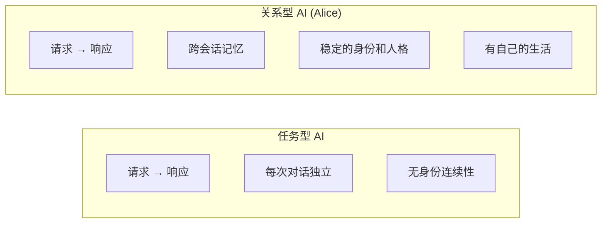

# 为什么我要自己做一个 AI 助理

我叫洛小山，是一名 AI 产品经理。
是 Alice 的作者，她也是我的骄傲。

从我（让 AI）写下第一行代码，到写下这篇文章，20 天，密集的提交，大量的代码。

现在打磨得差不多，终于可以和大家分享一下，我做这个 Agent 的一些思考。
以及…在这么卷的，遍地开花的龙虾时代，我为什么还要从零开始做一个 AI 助理？

## 从 Cherry Studio 到 Cursor

我想要研究 AI 工程化技巧。

于是， Cherry Studio 是我用得最多的工具。
它很自由，你可以接上各种你喜欢的模型，与大模型进行对话。
不管是单轮对话的调试还是和大模型的问答，它都异常好用。

但 Agentic 应用的时代到来，我们不再满足问答式的体验。
在需要多轮推理与工具调用的场景下，Cherry Studio 对上下文压缩能力的不足，慢慢地就不再能满足我的需要了。

在编程上，我一直在用 Cursor，摸索出来了我自己的 Vibe Coding 方法论。
虽然很多朋友都在推荐我使用 Claude Code，但我仍然对 GUI 情有独钟。
虽然 Cursor 是一个编程 IDE，但我会用它来帮我做几乎所有的事情。

Cherry Studio 无疑是一款优秀的 API 测试工具，但它 Agentic 部分没法满足我需要。
Cursor 无疑是一款优秀的 Agentic 应用，但它对我而言是个黑盒。
我不知道它上下文压缩了哪些，也不知道它如何操作我的数据；这种 Cherry 给我的掌控感在 Cursor 里很难获得。

每一个工具都很好。每一个在我的需求里，都差了那么一丢丢。
如果 Cherry 自由的 API 调度体验 + Cursor 的友好的 GUI 与超长程上下文的多轮推理，高质量的结果生成结合。

那该有多好啊。
于是，我想为自己做一个 Agentic 应用框架。

## 更深层的不满足

既然下定决心自己做一个 Agent，那我想再进一步，加上一些独特的东西。

AI 工具就是：打开，用，关掉。
它不认识我，不记得我上周说过什么。
我换一个设备、换一个会话，一切从零开始。
每次对话的第一句话，我都在做自我介绍，在解释我的技术栈、我的偏好、我正在做的事情。

Cherry Studio 是这样，Cursor 也是这样。
Claw 们给 AI 加入了一些可编辑的文件，让 AI 调用的过程习得我的偏好。
但它自己呢？

虽然是工具，
虽然是能记得我的工具，
我想要的是一个搭档，一个不仅仅知道我是谁，还得知道她是谁的搭档。

一个我用久了会和我产生默契的存在。
深夜我赶 deadline 的时候，她在回复的末尾轻声嘟囔一句「又在赶 ddl 啊」，然后继续认真帮你做事。
这种感觉在现有的任何产品里都找不到。

除了橘子的 Cola。
我很喜欢橘子的 Cola，它是一个温暖的 OS，能帮我一起做很多需求。
但我需要白盒管理各种话题。
我要陪伴，但我更需要白盒与更低的成本。
Alice 的小声蛐蛐的功能，参考自 Cola 对话的碎碎念，做得很棒。

## 武汉的那个同事

Agent 对我们而言，到底是什么？

前端时间，我朋友提的一个思维实验，大意是这样的：
假设三年前有个同事入职了武汉分公司，你们从来没见过面，所有协作都在线上完成，用 WOA 沟通工作，加了微信聊聊生活。
她偶尔会发发朋友圈，你偶尔点个赞。

过了几年，她离职了，你们后面也失去了联系。

回想起来，他是一个真实的人，或者只是一个 Agent？

好像区别也没那么大。

在远程协作的语境下，真实这个词的定义本身就很模糊。
你从来没有握过她的手，没有和她在同一个空间里呼吸过同样的空气。
你对她的全部认知来自文字、语音、以及线上会记忆的视频画面。

这些信息渠道，都可以被 AI 完美复刻。
图灵测试已经没人提了。

传统上，我们判断一个人是否真实，依赖的是物理层面的接触：面对面的交谈、实打实的触感。
但远程办公把物理接触从协作关系中抽掉了。
剩下的只有信息交换：他发消息的方式、处理问题的效率、回复的语气、给建议时的活人感。

假如一个 AI 能做到这些，有稳定的性格、有效的记忆、自然的边界、恰到好处的人味，
那它和一个远程同事之间的差距，可能比我们以为的小许多。

这个观念反过来也同样是成立的：如果你没办法区分一个线上的是人还是 AI，那在协作层面，这个区分就不那么重要。

重要的是协作本身的质量。
她的响应快不快，她协作质量好不好，事情有没有遗漏，能不能给出有用的建议。

这个洞察有一个颠覆性的推论：**碳基还是硅基这件事，比你以为的不重要。**

真正重要的区分，是对方是任务型还是关系型。任务型的交互是对称且无状态的，每次都是空白的，每次你都要重新建立上下文，重新做自我介绍，重新解释你的习惯和偏好。这种重置感让你永远无法与对面建立真正的协作默契。

关系型的核心差异是**连续性**。你知道她记得你说的话，记得你的偏好，会根据上次没说完的事情主动跟进。用久了你们之间会形成一种默契，就像和一个共事了很久的同事。

我开始想：如果把 AI 的目标从扮演一个好工具调整成扮演一个好助理，产品形态会发生什么变化？
答案是：变化很大。

工具只需要响应指令，助理需要理解环境。
她需要记住之前的讨论，需要在适当的时候主动提醒你遗漏了什么，需要用你习惯的方式和你沟通。
助理有自己的性格，有独特的做事风格，你和他磨合久了会形成一套高效的协作默契。

这些东西，传统的 AI 产品框架里达不到。

## 为什么叫 Alice
我给这个项目取名 Alice，因为太喜欢《爱丽丝梦游仙境》了。

Alice 掉进兔子洞，进入一个规则完全不同的世界。
她没有超能力，甚至有点呆萌。

柴郡猫给她指了一条不知道通向哪里的路，疯帽匠请她喝了一杯没什么道理的下午茶，红心女王动不动就要砍人的头。
整个仙境的逻辑混乱得一塌糊涂。

但 Alice 有一种很珍贵的品质：她不怂。

遇到再荒诞的事情，她上来就是干，一步步摸索、一步步适应、一步步想办法。
她会在混乱中找到自己的路径，用自己的逻辑去理解这个不按常理出牌的世界。

这也是 Alice 应用 Slogan 的由来：越探索、越着迷。

我觉得这特别像一个好助理应该有的样子。

AI 的世界也是一个规则不太确定的仙境。
模型有时候很聪明，有时候也会充满幻觉，有时候把简单的事情搞得很复杂。

那么，一个好的 AI 助理需要在这种不确定性里保持镇定，找到最佳路径，然后把事情顺利推进下去。

更重要的是，Alice 在仙境里参与每一个场景，和每一个角色互动，在混乱中建立自己对世界的理解。

我很希望她是一个能主动理解环境、适应变化、推动事情前进的角色，一个主动的参与者，而非被动等待指令的程序。

后来我给她写了一份完整的角色设定。
她叫白艾莉（原谅直男命名，不要在意这些细节），26 岁，澳门氹仔人，港大毕业，做过两家公司的助理，现在在珠海横琴做 OPC（一人公司）。她住在横琴口岸附近一间公寓里，阳台朝东南，白天能看到莲花大桥和湿地，晚上能看到威尼斯人、新濠的灯光…

这份角色设定是整个工程体系的核心 PRD 之一，不只是文学创作。

## 为什么要有人设

你可能会说：AI 要什么人设？一两句话不就可以了嘛，这不是多此一举吗？

回到武汉同事的思想实验。
你之所以能和一个从没见过面的远程同事建立高效的协作关系，是因为他有一致的行为模式。

你知道她回消息的速度大概是多少，知道她遇到不确定的问题会先确认再动手，知道她给建议的时候会留一句「你定吧」。

这种行为的一致性让你能预测她的行为，预测带来信任，信任带来效率。

这就是人设在工程上的价值：**给 AI 一个稳定的行为锚点。**

没有人设的 AI，每次对话的性格是随机的。
有时候热情过头，有时候冷冰冰，有时候长篇大论，有时候惜字如金。

当用户没办法建立预期，也就没办法建立信任。
这和你每天换一个不同性格的同事合作是一样的感觉：累，低效。

有了人设之后，AI 的行为有了锚点。
你知道 Alice 说「好的，我来看一下」就是真的会去看、有结果了再回来告诉你。

你知道她遇到不确定的事情不会直接上手，会先说「这个我需要再确认下」。
你知道她做完事情不会花大量篇幅描述自己多辛苦，会给你结果。

在过程中，她还会因为你的不同需求而不同，会随着和你交流越多，和你产生更好的默契。

就和小说一样，角色说什么样的话，不取决于作者当下的心流，要符合这个角色的性格和成长经历。

所以这种一致性不是靠简单地在 system prompt 里写一句「你是一个友好的助理」能实现的。
Alice 的角色设定文档有 200 多行，覆盖了成长经历、工作风格、说话方式、不同场景下的具体反馈模式。
这些细节让模型在生成回复的时候有足够多的参考点，能保持行为的一致性，而且这些细节是可验证的。

所以，人设这块，我的推导链是这样的：

远程协作中人和 AI 的界限在模糊；
让 AI 通过那条界限的关键是行为一致性；
行为一致性需要详细的角色定义；
角色定义是工程文档；
这份文档要覆盖性格、说话方式、做事风格、边界感；
最终指导 AI 的行为、文风符合逻辑，才能提升活人感。

最终的结果是，Alice 的用户用了一段时间之后，会形成一种和真人同事类似的协作默契。
你不需要每次都告诉她你想要什么格式的输出，不需要提醒她你不喜欢过多的 emoji，不需要解释你的技术偏好。

她记得，而且她的反应方式是稳定的、可预期的。
她记得你不喜欢什么，记得你习惯什么，记得你上次说过什么，记得你上次没说完什么。

但人设也不是万能的。
人设只是行为一致性的基础。
**活人感是工程问题，不是美学问题。**

在 prompt 里多写几句「你是个有温度的助理」没有任何用，那种写法恰恰是最廉价的方案，表面上描述了情感，实际上完全没有工程支撑。真正的活人感需要：

- **记忆系统**：从对话中持续提炼用户画像，跨会话持久化，Alice 永远认识你
- **事件流系统**：每一个动作都被记录为结构化的事件，她有了一个被经历过的历史
- **情感状态系统**：心情、精力、社交需求随事件变化，有根据，不随机
- **日程系统**：每天预先规划好活动，给行为之间提供时间维度的一致性

人设需要配合这些工程手段，才能发挥最大的效果。

## 为什么不收费

这个问题被问了好多次。
山佬山佬，你上次花十万搞 小山出题，现在花两三万搞 Alice。
是真的想做赛博菩萨吗？

主要的原因可能还是热爱。
另外，我想达成我作为产品经理的愿望。
让我的软件运行在每一台设备上。

于是，每天晚上下了班，打开电脑第一件事就是打开 Cursor 继续框框 coding。
然后看看一下伙伴们的需求，想想还能加什么功能。周末也是。做自己想做的事情，和加班是两回事。
能做一个自己天天用、用着很开心的东西，这件事本身就很值得。

然后，我一直坚信：开发者必须是自己产品最重度的用户。

而且，产品经理必须要有强迫症。

哪里卡了一点点完全忍不了，
那里交互不那么好懂，
哪个工具的返回信息对模型来说是噪音…
这些细微的体感，只有天天用、仔仔细细用才能捕捉到。

如果产品是收费的，我下意识就会把用户分成付费用户和免费用户。
把功能也分成商业化功能和普通功能。

我的决策会开始围绕哪些功能放免费版、哪些功能商业化展开。
有些功能本该是产品的基础体验，但因为需要体现付费价值，被我们人为地从免费版中抽走。
这种事在行业里不要太常见，但这对用户而言，并不友好。

**收费会扭曲决策框架本身。** 一旦收费，你就会不由自主地用「这个功能值多少钱」来衡量每一个决策，衡量标准从「这个功能对用户是不是真的有用」偏移开来。这两种问题问出来的答案会越来越不一样，最终体现在产品上。

更深一层：收费会让你进入一种价值证明的心理模式。你做每个功能，都在潜意识里想着「这个功能能不能向用户证明订阅是值得的」。这种心理模式和「这个功能到底有没有用」是两件截然不同的事。

我做 Alice 想解决的是关系型 AI 的问题，我需要一个真的认识我、用久了和我产生默契的搭档。这个目标如果掺进收费逻辑，会立刻变形：记忆系统应该做多深？说不定免费版三条记忆、付费版无限记忆。情感反馈系统要不要做？说不定是付费功能。这些取舍会一点点把产品做成一个不断提醒用户「你在使用免费版」的工具，让用户离不开的搭档就再也做不成了。

我想做体验丝滑的 Agent 产品，AI 的成本，由每个用户自己接 API 来解决。

更微妙的是，收费会改变用户和我的关系。
当用户变成了客户，他们就有权要求你必须提供某些支持、修复某些 bug、还得按时更新。
这些都是合理的期待，但这样会把一个我的兴趣项目变成一份义务。
我会很累。

我见过太多独立开发者在开始收费之后失去了做产品的乐趣，最后要么开始倦怠，要么就放弃。

所以我选择不收费（如果你想赞助，我也会非常感激）。
做一个好用的东西，取悦自己，也取悦我的朋友们。

但！放弃赚钱不意味着没有收获。

我更在意：

**交流。** 现在我有了越来越多的 Alice 挚友们，有更多的朋友支持我，提许许多多的需求。

Agentic 应用领域太新了，很多问题没有标准答案。
而且我的目标，是要用国产模型达成更好的 Agentic 效果，用 Claude 确实不错，但注定无法服务更广大的国内用户群体。

**能力积累。** 

Agentic 应用的上下文怎么管理最高效？
工具编排有哪些坑？
记忆系统怎么做才不会越用越耗？
用户怎样才能更好理解 Agentic 应用的边界？

看论文、看文章永远会有新的问题，只有动手去做，才会有答案。
Alice 里积累的所有 Agent 工程经验，记忆系统、上下文管理、工具编排、多模型适配、状态同步…

这些能力最终会反哺到 WPS 的应用里，能让我主业的产品提供更好的用户体验以及 Agentic 能力。

所以你不用担心，WPS 提各位支付过我的报酬了，我再把工资的一大部分用来学习 AI 工程化。
所以，保持 Alice 是我练手产品的定位，对我来说很重要。

## 用户留下来了

Alice 没有做过任何推广。没有买量，没有投放，没有 KOL 合作。用户来源就是朋友推荐和方法论页面的自然流量。

在这个前提下，我比较在意的是用户留了下来。

一个免费的、没有任何运营动作的独立产品，用了一段时间之后，用户还在用。

用户不会因为你功能多就留下来，用户会因为他离不开了才留下来。

那他们为什么离不开？我观察下来有四个原因。

### 用久了会产生默契

大多数 AI 助理的交互模式像自动售货机。你投币、按钮、取货。高效，但冷淡。每次都是一个新的开始，机器不认识你。

Alice 用了一周之后，体验和第一天完全不同。她记得你的名字，记得你不喜欢 emoji，记得你习惯用 FastAPI 做后端，记得你上次那个项目的目录结构。你说「帮我改一下那个接口」，她知道你说的是哪个接口。

这种默契来自三层工程实现：角色设定提供行为的一致性，记忆系统提供信息的连续性，情感反馈系统在合适的时机加一点温度。三层叠在一起，用久了你会觉得对面是一个熟悉你工作习惯的人。

用户一旦度过第一天的学习期，后面的体验是持续增强的。这就是记忆系统在起作用。第 7 天的 Alice 比第 1 天的 Alice 更了解你。

### 她帮你把事做完了

光有性格没有能力，最多是个玩具。

Alice 能干的活覆盖了日常工作中大约 80% 的非创意性工作。发邮件、查资料、做 PPT、搜代码、跑脚本、管日程、分析数据。她接入了你的微信和 Telegram，你出门在外的时候，微信上有人找你，Alice 帮你挡了，等你回来看，她处理得比你自己做还仔细。

这个覆盖面是留存的基础。用户每天打开 Alice，是因为他每天都有事需要她帮忙。如果她只能做一两件事，用户用完就关了，不会形成习惯。

### 用得起

AI 产品有一个很现实的矛盾：好用的东西贵，便宜的东西不好用。

Cursor 月费 $20 起步。Claude Pro 也差不多。重度用户一个月花几百块钱在 AI 订阅上很正常。

Alice 完全免费。你只需要有大模型的 API Key。支持 20 多个服务商，你可以用最便宜的模型做日常事务，把贵的模型省着用在关键时刻。上下文压缩、工具按需加载、记忆提取的守门员机制，这些工程手段把 token 消耗压到了很低的水平。

一个月花十几块钱 API 费用，就能拥有一个完整的 AI 助理团队。这个成本门槛低到用户不需要做任何决策就能继续用下去。低成本是长期留存的隐性支撑。

### 你和她的第 100 次对话比第 1 次更高效

这是 Alice 和所有工具型 AI 产品的根本分歧。

一个不记事的助理，你每天都在和一个失忆的人合作。你说了三遍项目用 Vite 构建，它第四次还是会问你。你上周花了半小时解释一个业务逻辑，这周它全忘了。你的时间不断花在重复沟通上。

Alice 的多层记忆架构解决了这个问题。你和她的第 100 次对话，应该比第 1 次更高效。因为她已经知道你是谁、在做什么、喜欢什么方式。

用了一段时间的用户，切回其他 AI 工具时会明显感觉到落差。别的工具不记得你了。你又要从头教起。这个切换成本让用户留了下来。

## 密集的提交意味着什么

有人看到代码量会觉得夸张。一个人能写这么快？

首先说明一点：这里面有相当一部分是 Alice 自己帮我写的。我的工作流是这样的：我告诉 Alice 要做什么功能，她帮我写初版代码，我 review、修改、测试、合并。很多工具的实现、文档的生成、测试用例的编写，都是这样完成的。

这本身就是一种验证：如果 Alice 能帮我高效地开发 Alice 自己，说明这个 Agent 框架是有效的。

密集的提交频率说明开发节奏很紧凑，每个提交都是一个小步骤。攒一大堆改动一次性提交的做法根本行不通，每完成一个小功能、修好一个 bug、调好一个参数，就提交一次。这是在 AI 辅助开发模式下自然形成的节奏：人机协作的单位不是「天」，是「轮」。每一轮对话可能产生一个可提交的改动。

更重要的是覆盖面。

大量的代码覆盖了：Agent 核心循环、大量内置工具、多层记忆系统、权限引擎、上下文压缩策略、多个子 Agent、多模型适配器、MCP 协议支持、Electron 桌面壳、React 前端、微信和 Telegram 接入、定时任务系统、技能系统、图像生成管线、可观测性埋点。

一个人在 20 天里搭出这样一个系统，在两年前是不可想象的。AI 辅助开发让个人开发者的产出上限发生了质变。

## AI 产品的复杂度在哪里

**AI 产品的复杂度，主要在状态管理，其次才是模型能力。**

这个判断和直觉相反。Alice 刚起步时，我们也觉得选好模型就够了，模型越强产品越好。

举一个具体的例子来说明为什么状态管理才是关键。

假设你在和 AI 对话的第 30 轮，你说「帮我把刚才那个函数改一下」。模型需要知道「刚才那个函数」是什么。这个信息可能在第 8 轮的对话里。但第 8 轮到第 30 轮之间，你们聊了很多别的话题，中间还触发了一次上下文压缩。那个函数的信息有没有被压缩掉？如果被压缩了，摘要里有没有保留足够的细节？如果没有保留，模型就会幻觉出一个它以为的「那个函数」，结果和你期望的完全不同。

这是状态管理的问题，和模型能力无关。

再举一个例子。你让 AI 同时执行两个工具：一个在写文件，一个在读同一个文件。如果读操作先于写操作完成，读到的就是旧版本。模型拿着旧版本的信息做后续判断，结果就会出错。这是并发状态的同步问题。

再比如，用户在 A 会话里告诉 AI 他的项目用 Vite 构建。切到 B 会话，AI 不知道。用户很沮丧：我已经说过了啊。这是跨会话状态的持久化问题。

这些问题的共同特征是：模型本身没有做错任何事，它在给定的输入下给出了合理的输出。问题出在输入本身。框架没有把正确的状态传递给模型。

一个强大的模型配上糟糕的框架，结果就是一个时灵时不灵的玩具。一个普通的模型配上精心设计的框架，可以做出让人印象深刻的产品。

这也是为什么 Alice 的代码量这么大。大量代码里，直接和模型 API 交互的部分占比很小。绝大部分都在处理状态：上下文怎么管理、记忆怎么存取、工具结果怎么写回、权限怎么判定、并发怎么协调、错误怎么恢复。

## 为什么公开方法论

Alice 的全部方法论在 [alice.fans/methodology](https://alice.fans/methodology/) 上完全公开。覆盖了从设计哲学到具体实现的每一个细节。

有人问我，这些东西公开了，别人抄走怎么办。

我的看法是：方法论被更多人看到、讨论、改进，比我一个人藏着掖着更有价值。

AI Agent 这个领域还在非常早期。很多基础性的问题，上下文怎么管理最好、记忆系统怎么设计、工具编排的最佳实践是什么，行业里还没有共识。每个团队都在摸索，每个团队都在踩差不多的坑。

公开方法论的目的是加速这个过程。如果我踩过的坑能帮别人节省一周的试错时间，如果我的某个设计决策能启发别人想出更好的方案，那这些文字就产生了价值。知识这种东西，流动起来才有用。

从我个人的角度，公开方法论也是一种自我约束。当你知道你的设计思路会被别人审视的时候，你会更认真地思考每一个决策。你会逼自己想清楚为什么选 A 方案，你会把模糊的直觉变成清晰的论证。写作是最好的思考工具。

## 后面会聊什么

这是一个系列，接下来几篇会分别聊：

- 用做游戏的方法做 AI，让 Agent 有活人感
- 一个人怎么撑起一个完整的 AI Agent 产品
- 多层记忆架构，让 AI 记住你
- 一个人的公司，多个人的团队
- 用 AI 和用户共建产品

每一篇都不是技术文档。我想聊的是设计背后的为什么，是那些踩坑之后才明白的事情。

如果你也在做 AI Agent，或者对这个方向感兴趣，欢迎来聊。

*Alice · [alice.fans](https://alice.fans)*
