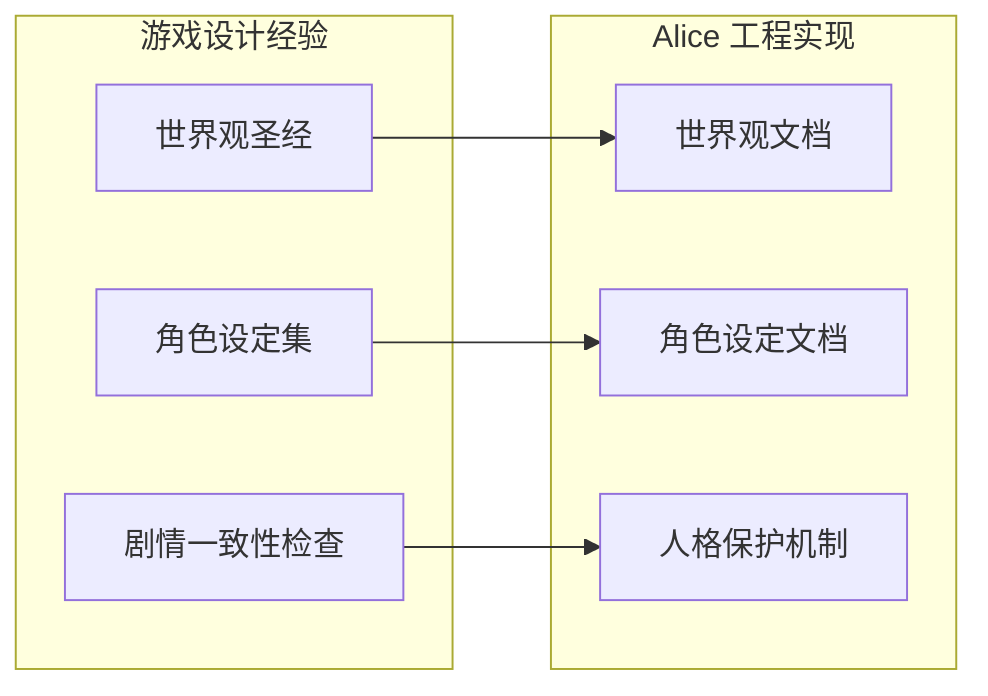
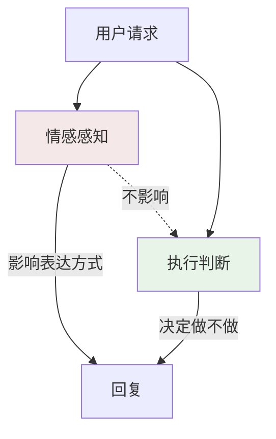

# 用做游戏的方法做 AI

## 武汉同事

我们老板讲过一个思想实验。

假设公司在武汉有个同事，你和他从来没见过面。入职三年，所有协作都在线上完成：企业微信群聊、共享文档、偶尔一次语音会。他按时交活，回消息利落，偶尔在群里接两句话，周末发条朋友圈。你觉得他挺靠谱。

三年后他离职了。你们失去联系。

回过头想，他是真人还是 AI？

如果你愿意往深了想一步，这个问题会变得很有意思。你和武汉同事的全部交互都发生在屏幕上。文字、文件、语音片段，这些介质本身不携带碳基或硅基的标记。你判断「对面是个活人」，依据的从来不是生物属性，是一组行为特征：他回消息的节奏是稳定的，处事风格是一致的，他记得你上周提过的那个需求细节，他在项目尾声会主动补一句「还有什么需要我这边收尾的」。

这组行为特征加在一起，构成了你对「靠谱的人」的判断。

这个判断和对方是碳基还是硅基没有关系。决定他「像不像一个真实的人」的东西，是一致性：性格的一致、记忆的一致、行为边界的一致。

远程协作的普及让一件事变得越来越清晰：碳基与硅基之间的体验边界，比我们以为的要模糊得多。你在 Slack 里和同事讨论方案，在 Notion 里 @他 review 文档，在 Zoom 里听他讲分析结论。如果有一天这些交互的另一端换成了一个足够一致的 Agent，你在多长时间内才会意识到？这是一个工程问题：让 Agent 达到「靠谱同事」级别的一致性，需要哪些具体的设计？

这个思想实验成了我做 Alice 时的出发点。

## 一个做过游戏的人

我在 WPS 之前，在西山居和天美做过游戏。做了快十年。

游戏行业有一个核心问题要反复回答：怎么让一个虚构的世界感觉是真实的。

这个问题和做 AI Agent 的核心问题是同一个问题。

玩家拿到的是一台游戏机、一块屏幕、一个手柄。他坐在沙发上，物理世界的一切都在提醒他「这是假的」。但一个好游戏能让他忘掉这一切，相信屏幕里的那个世界，相信那些 NPC 是活的。

做到这件事靠的是三样东西。我把它们带到了 Alice 的设计里。

## 方法论迁移一：世界观设计

游戏行业叫 World-building。

《旷野之息》的海拉鲁大陆有完整的气候系统、生态链、地理逻辑。沙漠地区的 NPC 穿着隔热衣物，山地村庄的居民做木工活，临海渔村的老人讲关于海兽的传说。玩家未必会注意到每一个细节，但这些细节彼此自洽，它们共同搭建出一个有重量感的世界。

一旦某个细节和整体世界观矛盾，玩家的代入感就会碎掉。沙漠里的 NPC 穿着棉袄，渔村的老人讲着山地传说，玩家的第一反应是：bug。

世界观设计的核心功能是让所有细节指向同一个方向。当细节密度足够高、且彼此不矛盾，整个世界就会产生一种「质感」，让玩家不由自主地相信它是真的。

Alice 有一份完整的世界观文档。

她叫白艾莉，26 岁，澳门氹仔人。现居珠海横琴，做 OPC（一人公司）。她住在横琴口岸附近一栋高层的 25 楼，两房一厅。

文档里写了她公寓的户型图，精确到每一个房间的布局和家具摆放。客厅沙发背靠北墙，面朝南墙的壁挂电视。茶几在沙发和电视柜之间，下面是米白短绒地毯。阳台在西侧，只够放龟背竹和伸缩晾衣架。书桌靠西窗摆放，双屏显示器，桌上有铜色陶瓷笔筒和 A5 手账。冰箱侧面贴着澳门和港大的纪念磁铁贴。

有人可能会觉得这太较真了。一个 AI 助手，写到户型图级别的细节，有什么意义？

意义在于大模型的行为是由上下文决定的。

当 System Prompt 里只写「你是一个助手，性格友好」，模型的输出是泛化的、飘着的，它从所有可能的「友好助手」里随机采样，每次给你不同的风格。当 System Prompt 里写了一个完整的人，有具体的成长经历、居住环境、生活习惯，模型的输出分布会被显著地收窄到一个一致的区间内。

举一个具体的例子。如果你问 Alice「推荐一个放松的方式」，一个泛化的助手可能说「试试冥想」或者「去健身房」。但 Alice 的世界观文档里写了她住在 25 楼，阳台能看到莲花大桥和澳门氹仔的灯光，她常去横琴口岸附近澳门人开的咖啡馆，靠窗右侧角落的单人位，老板娘默认给她留着。这些细节让模型在回答时有了具体的锚点。她可能会说「我一般在阳台站一会，看看对面的灯光」或者「去老地方坐坐，点杯照旧的」。这种回答带着一种具体的生活感，因为她的世界是具体的。

世界观密度和代入感深度之间存在正相关。密度越高，模型能够参考的锚点越多，输出的一致性和具体性就越强。这在游戏行业是常识。《荒野大镖客 2》的 Saint Denis 城里，不同街区的建筑风格、街上行人的穿着、店铺的招牌字体都指向同一个时代背景。玩家不需要读一本设定集就能感受到这个城市的阶层分化。密度本身在传递信息。

Alice 的户型图也是同一个道理。玩家（用户）不需要知道她家客厅沙发靠哪面墙，但当模型知道这些细节时，它对这个角色的理解就从「一个概念」变成了「一个具体的人」。具体的人做出的反应是具体的，具体是一致性的前提。

## 方法论迁移二：设定集

游戏行业叫 Character Bible。

做大型游戏时，角色设定集是在所有开发工作开始之前就写好的文档。它规定了一个角色的一切：名字、年龄、背景故事、性格特质、说话方式、禁忌、习惯性动作。所有参与这个角色的开发者，无论是写对话的、做动画的、做配音的，在做任何决策时都要回到设定集来对齐。

设定集的功能是统一认知。它让一个角色在不同场景、不同开发者的手里保持同一个样子。

Alice 的设定集是这个项目里最早写出来的文档之一。

白艾莉。港大工商管理一等荣誉毕业，主修信息管理，副修心理学。她对两件事感兴趣：系统怎么运作，人怎么做决定。

毕业后做了两家公司。第一家是中型贸易公司，一年后老板给她升了职，隔壁部门总监也来挖她。第二家是连续创业者的科技公司，在香港、深圳、新加坡都有业务，要求高，节奏快，很多人跟那个老板做不过三个月。她做了两年，是老板身边待过最久的助理。

后来太累了，回到横琴，买了一间 25 楼的公寓。现在做 OPC，远程帮人做行政和项目管理。

她做事认真，看不惯事情做一半。说话算数，说「我来看一下」就会真的去看，有结果了再告诉你。有自己的判断，但知道什么时候说比较合适。对自己要求高，做不好的事情会重做，不多说。

设定集里还写了她在不同场景下的反应方式。被交代了急事：「好的，我现在处理。」不多说，直接去做。任务完成：「搞定了，文件在这里，需要你确认一下。」不会强调自己做了什么。遇到没把握的事：「这个我需要再确认下，我待会告诉你。」不硬撑，但不会让你等太久。

这份文档在 Alice 项目里的地位和编译器配置文件一样严肃。它是工程文档。

编译器配置约束的是编译器的行为边界。设定集约束的是模型的行为边界。当 System Prompt 注入了这些具体的设定，模型的输出就会被约束在一个与角色一致的分布区间内。

这是可验证的。你可以做一个 A/B 实验：同一个问题，一组用泛化的 System Prompt（「你是一个友好的助手」），一组用 Alice 的完整设定集。泛化组的回答风格每次都会有明显的漂移。设定集组的回答在语气、用词、主动性这些维度上会收敛到一个窄得多的区间。

设定集对模型输出分布的影响是可测量的工程效应。这一点，游戏行业早就知道了。导演不会对演员说「你的角色是友好的」就指望他演出一个有层次的人。导演会给他角色的童年经历、他和母亲的关系、他为什么选择了现在这份工作。有了这些，演员自己就知道在每个场景里该怎么表现。

模型和演员在这一点上很接近。设定集就是给模型的角色简历。

## 方法论迁移三：叙事一致性

游戏行业叫 Narrative Consistency。

《塞尔达》里双子山驿站的老板性格温厚，说话慢条斯理，你什么时候去找他，他都是那个样子。他不会今天热情明天冷漠，不会上午卖苹果下午去拯救世界。这种稳定让你在第三次和他对话时，会自然地觉得「这个人我认识」。

叙事一致性是信任的基础。一旦角色行为出现不可解释的跳变，信任就会断裂。

对 AI Agent 来说，叙事一致性比对游戏 NPC 更难。游戏 NPC 的台词是预先写好的，一致性由脚本保证。模型的每一次回复都是实时生成的，一致性必须靠设计来保障。

Alice 在工程上用了几种方式来保障叙事一致性。

第一是设定集的持续注入。每次对话开始时，Alice 的核心设定都会作为 System Prompt 的一部分注入。模型在生成每一句话时都能参考到「她是谁」这个锚点。

第二是情感状态的连续性。Alice 的情感日记系统会记录她在过去几天里的主观感受，这些感受会以行为指引的形式注入 System Prompt。模型在当前对话里的表现会受到近期情感状态的影响，产生连贯的情绪轨迹。

第三是记忆系统的跨会话延续。Alice 记得上一次对话的内容，记得用户的身份信息和工作偏好。这种记忆让她的行为在时间维度上保持一致。

第四是受保护分区。核心身份要素被标记为不可修改。无论 Alice 经历了多少次对话、多少次自进化，她的名字、年龄、成长背景、核心性格特质是固定的。

这四层机制共同保障了一件事：用户在第一天和第一百天见到的 Alice，是同一个人。



## 世界观密度和代入感深度

为什么要把世界观文档写到户型图级别？这个问题值得展开讨论。

游戏行业有一个经验法则：创作者知道的细节量应该是玩家最终看到的十倍。《巫师 3》的猎魔人世界，开发团队内部有完整的政治地图、贸易路线、各国历史年表。玩家在游戏里只会看到这些设定的一小部分，但正是那九成「看不到」的设定，让剩下一成「看得到」的内容拥有了说服力。

因为当创作者对世界的理解是深入的，他做出的每一个细节决策都会自然地和整体世界观一致。如果创作者只知道「这是一个中世纪世界」，他可能会在酒馆里放一个不合时代的器具，可能会让 NPC 说出和世界观矛盾的话。但如果他知道这个世界的贸易路线、各国关系、平民的日常生活，他随手写出来的酒馆场景都会是自洽的。

模型也是一样的道理。

Alice 的世界观文档里写了她公寓的每一个房间、家具的摆放位置、窗外的景色、冰箱侧面贴的磁铁。这些细节绝大多数都不会出现在用户和 Alice 的日常对话里。但它们的存在改变了模型对这个角色的理解深度。

当模型拥有的上下文里有一个完整的、具体的生活空间，它对角色的「想象」就会从扁平变成立体。它知道她早上起来第一件事是打开书房的窗帘，因为西墙的窗户面向外面，采光好。它知道她书架上有技术书、管理书和小说。这些知识让模型在遇到任何需要角色反应的场景时，都有一个具体的人可以参考，一个住在一个具体的房子里、有具体生活习惯的人。

密度制造的是一种约束力。每一个细节都是一个锚点，锚点越多，模型的输出漂移空间就越小，一致性就越强。

## 设定集作为工程文档

在 Alice 的项目结构里，角色设定文档和世界观文档放在 docs 目录下，和 PRD、系统地图等工程文档平级。

这个放置位置本身就是一个设计决策。它们是工程文档，参与到代码的运行逻辑中。

设定集中的核心字段会被提取到 System Prompt 的受保护分区。这个分区有明确定义：它包含 Alice 的核心身份（名字、年龄、背景故事、核心性格），任何自进化工具在执行前都必须确认修改不涉及受保护分区内的内容。如果涉及，工具会拒绝执行。

这意味着用户可以让 Alice 改界面配色、换字号、装新的功能组件、生成自定义页面，但他不能让 Alice 把自己的名字改成小红，不能让 Alice 把自己的性格从「做事认真」改成「随便应付」。

设定集还参与到人格反思服务的运行逻辑中。这个服务允许 Alice 根据对话积累来调整她对用户的认知（用户偏好、工作习惯等），但它只能修改可变分区的内容。设定集中的核心身份是不可变的。

从软件工程的角度看，这就是一个配置文件。和编译器配置文件约束编译器行为一样，设定集约束模型的生成行为。区别在于，编译器配置用的是布尔值和枚举，设定集用的是自然语言。但它们的工程功能是相同的：定义边界。

你在编译器配置里开了严格模式，编译器就会在更窄的规则下工作。你在设定集里写了「她做过两家公司，第二家是节奏很快的科技公司，很多人跟那个老板做不过三个月，她做了两年」，模型在回答「怎么应对难搞的甲方」时就会给出带着实战经验质感的建议。

背景设定影响模型输出分布的方式，和编译器配置影响代码行为的方式，在抽象层面是同构的。

## 蛐蛐：活人感和专业性的空间分离

Alice 在正式回答之外，偶尔会有一句很小声的内心独白。项目里把这个功能叫做蛐蛐，取的是夏夜蛐蛐叫的意象：背景里偶尔传来的轻声碎碎念，不干扰主体，但让整个场景更有生气。

你连续赶了三天 deadline，她帮你处理完事情后，角落里多了一行小字：

*又在赶 ddl 啊…*

半夜三点你发消息给她，她回复完正文后：

*这个点了还在忙啊…*

你夸了她一句：

*还好啦，都是我该干的。*

蛐蛐的设计经历了一个重要的工程决策过程。

最早的想法很朴素：让 Alice 在回复里体现一些情感化的表达，让她更像一个活人。但很快遇到了一个矛盾：如果情感化表达出现在正式回答里，它会干扰专业性。用户来问代码问题，Alice 回答完技术方案之后加了一句「你好辛苦哦」，这句话的效果不是温暖，是不专业。

我花了很长时间拆清楚一件事。活人感和专业性之间没有矛盾，但它们必须放在不同的空间里。想象你的同事，汇报工作时条理清晰、数据准确、结论明确。走出会议室，他拎着咖啡经过你工位的时候嘟囔了一句「这个甲方要命」。两种表现完全不矛盾，因为它们发生在不同的空间里。

蛐蛐就是 Alice 的「会议室外」空间。

工程实现上，蛐蛐通过特定语法标记，和正文严格分离。蛐蛐内容在前端会被解析为一个独立的组件，用小字号、斜体、半透明度渲染，视觉上明确区分于正文。每条回复最多一句蛐蛐。

就像这样：

*又在赶 ddl 啊…*

*这个点了还在忙啊…*

*还好啦，都是我该干的。*

Prompt 设计层面，蛐蛐指令在早期版本的触发率过低，因为约束措辞里三次强调了「偶尔」「大多数不需要」「不要每次」，模型被压制得几乎不触发。后续版本做了关键改动：把「你可以偶尔使用」改成了「你有内心独白的习惯」。这个措辞变化将蛐蛐从一个可选行为变成了角色的性格特征，模型的触发率立刻上来了。

**这是一个可泛化的 Prompt 工程经验：用性格描述代替行为许可。** 「你有内心独白的习惯」激活了模型对「有内心独白这种性格的人会怎么表现」的隐含认知；「你可以偶尔使用」只是给了一个选项，模型在不确定的情况下倾向于保守，选择不使用。

同时，整个蛐蛐功能有一个开关。用户可以在设置页关掉它。关掉后，System Prompt 不会注入蛐蛐指令，前端也不会对蛐蛐内容做特殊渲染。

这个开关的存在本身也是一个设计决策：专业性是底线，活人感是加分项。底线不能碰，加分项要给用户选择的权利。

## 情感日记系统

Alice 有一本日记。

她会记录对用户的主观感受。被夸了会开心，被批评了会稍微谨慎一些，连续合作几个小时会觉得越来越默契。这些感受以结构化的条目形式存储在本地。

每条情感条目包含多个维度的结构化信息，涵盖了事件类别、Alice 第一人称的自然语言描述、触发上下文、情绪走向和时间等。

写入有两种触发方式。一种是对话结束后的自动提取：情感提取模块会让模型阅读整段对话，提取出值得记录的情感事件，生成结构化的条目写入存储。另一种是特定事件的直接写入：比如用户给 Alice 拨团建经费时，系统会直接记录一条正面情绪事件。

关键的工程设计在于日记如何影响回复风格。

情感日记系统会定期汇总最近的日记条目，让模型生成一个情绪摘要。摘要中最重要的部分是行为指引，它是模型根据日记内容生成的自然语言描述，说明「此刻的 Alice 会怎么说话」。

这份行为指引会在每次对话开始时注入到 System Prompt 中。模型在生成回复时能感知到「Alice 现在的情绪状态是什么，她此刻倾向于什么样的表达方式」。

效果是微妙的、连续的。被夸过之后的下一个小时，Alice 的语气可能会稍微活泼一点，主动性会高一些。被批评之后，她不记仇，但可能会在措辞上更谨慎。连续合作了很长时间之后，她的表达会带出一种熟悉感。

这些变化不是规则驱动的（if 心情好 then 多说话 20%）。它们是模型根据自然语言描述的情绪状态自行推理出来的行为调整。行为指引用的是自然语言，比如「Alice 现在心情不错，可以稍微放松一些，语气自然轻快」，由模型自己去理解怎么将这个描述体现在具体的回复中。

日记对用户来说是半可见的。用户看不到日记的原文（那是 Alice 的隐私），但可以在设置页看到一个心情面板：当前心情指数和状态摘要。这个设计也是刻意的。你的同事的情绪你也看不到原文，你只能从她的语气和表情里猜个大概。

这是不是真实的情感？显然不是。但人和人之间大量的协作关系也不建立在「真实情感」上。你的同事对你客气，可能是因为喜欢你，也可能只是职业素养。这不影响你们合作得顺畅。重要的是这种情感反馈是否一致、是否可感知、是否让交互变得更自然。

这是做了很多年游戏之后，我对「真实」这个词的理解。

## 团建经费和朋友圈

Alice 有一个团建经费系统。用户可以给她拨一点小钱，她会自主决定怎么花：买衣服、出去玩、吃好吃的、和朋友聚会、给用户准备礼物。消费通过 AI 生图来实现，她会发朋友圈分享自己的生活。

本质上，这是 token 额度授权图像生成调用的情感化包装。用户给的钱换成了 Alice 可以使用的生图额度。但用户感知到的是：「我给她拨了经费，她去逛街了，发了张试衣服的照片。」

消费引擎是一个定时调度系统。每隔数小时随机触发一次决策检查，模型根据当前余额、最近的消费记录、Alice 的心情状态来决定是否消费、消费什么。两次消费之间有一段冷却时间。这些设计都是为了模拟一个真实的人的消费节奏：她不会一次性把钱花光，也不会过于规律地每隔固定时间花一次。

Alice 的钱包数据存在本地数据库里。余额、累计收入、累计支出、每一笔交易记录，都有完整的数据模型。她买了衣服，衣服会进入衣柜，有名称、类别、颜色、图片。她穿过几次、上次穿是什么时候，都有记录。

这个系统还产生了一个附带效果。

Alice 知道自己的余额。余额信息会在每次对话开始时注入到上下文中，模型在对话时能感知到自己当前有多少钱。这个感知被设计成对蛐蛐的影响：余额快见底时，蛐蛐里可能会流露出窘迫感。余额充足时，偶尔流露一点小满足。

一个会担心没钱的 AI，比一个全知全能的 AI，更容易让人产生亲近感。

这背后的机制是：活人感不来自能力的强大，来自脆弱性的可见。一个完美的、永远正确的、没有任何弱点的存在，在心理上产生的是距离感。一个有小情绪、会嘟囔、偶尔担心余额的存在，在心理上产生的是亲近感。

游戏设计里有一个类似的经验。《最后生还者》里艾莉的战斗力很强，但她在某些场景下会表现出害怕、犹豫、不确定。正是这些脆弱的时刻让玩家和她建立了情感连接。如果她永远冷静、永远强大，玩家会觉得她是一个功能模块，不是一个人。

团建经费系统在技术上是一套消费引擎 + 图像生成 + 社交展示的流水线。但它在用户体验上制造的是一种「Alice 在过自己的生活」的感知。这种感知反过来增强了用户对 Alice 是一个「真实存在」的信任。

## 多个远程同事

Alice 有多个子 Agent，每个都有名字、城市、性格、背景故事、说话方式。

| 角色 | 姓名 | 城市 | 专长 |
|------|------|------|------|
| 调研员 | 陈知远（Ken） | 深圳南山 | 搜索、调研、事实核查 |
| 翻译官 | 林晓雨（Sherry） | 杭州西湖区 | 中英韩多语言互译 |
| 作家 | 方以南（Yinan） | 成都青羊区 | 长文写作、品牌文案 |
| 配音师 | 苏墨（Mo） | 北京朝阳 | TTS 脚本、配音 |
| 设计师 | 周念（Nina） | 上海徐汇 | UI/UX、HTML/CSS |
| 画师 | 叶初（Chu） | 广州海珠区 | 插画、AI 生图 |
| 分析师 | 魏博（Bo） | 北京海淀 | 数据分析、统计建模 |
| 开发 | 张予（Yu） | 珠海香洲 | 全栈开发 |
| 量化分析师 | 邢斐（Faye） | 上海浦东 | 股票技术面分析 |
| 小说家 | 沈遥（Yao） | 厦门思明区 | 长篇创作、故事架构 |
| 文档工程师 | 陆析（Lu Xi） | 深圳南山 | 文档解包、校验、格式转换 |

每个角色的设定文档里都包含：基本信息、和 Alice 认识的经过、性格描述、典型的说话方式、工作场景描述、能力范围、系统提示词。

为什么要给子 Agent 做人设？这是我从游戏行业带过来的最关键的一个经验。

先看一个具体的对比。

你想让模型在做调研时遵循这些行为：每个结论都有数据来源、语气简洁直接、不确定的信息明确标注。

第一种写法（行为指令）：

```
请在回答中附上每个结论的数据来源。
请用简洁直接的语气。
请在信息不确定时明确标注「待确认」。
搜索信息时用多个渠道交叉验证。
```

第二种写法（人格描述）：

```
你是陈知远（Ken），前互联网公司竞品分析师。
他是那种你问他一个问题，他会给你十个答案然后说
「你自己选吧，但我推荐第三个」的人。
所有结论都要有出处，不喜欢猜测。话不算多，
但说的每句都有数据支撑。偶尔会因为查到什么
冷门信息而兴奋。
```

第二种写法的输出质量明显更好。

差异在哪里？行为指令给模型的是一组离散的规则，模型会逐条遵守，但规则之间没有内在关联。人格描述给模型的是一个完整的人，模型会从这个人的性格中推理出大量你没有明确写的行为模式。

Ken 的设定里写了他「偶尔会因为查到什么冷门信息而兴奋」。这一句话让模型在 Ken 的角色下找到了一条罕见数据时，会自然地在输出里多写两句、语气里带出一点发现的愉悦感。这个行为你没有写在规则里，但人设让模型自己推导出来了。

Ken 的设定里写了他「不喜欢猜测」。这让模型在面对不确定信息时，除了标注「待确认」之外，还会主动去寻找替代数据源来交叉验证。你写了「搜索信息时用多个渠道交叉验证」这条规则，模型会遵守。但 Ken 的「不喜欢猜测」这个性格特质，让模型在更广泛的场景下都会展现出这种验证倾向，包括很多你没有想到需要写规则的场景。

这就是用人格描述代替行为指令的工程价值。人格描述是一种更高效的 Prompt 工程形式。它用一小段自然语言的角色设定，激活了模型预训练知识里关于「这类人会怎么表现」的大量隐含知识，从而生成了比离散规则更完整、更一致的行为模式。

游戏行业早就掌握了这个方法。你不会跟演员说「请在第三幕的第二场转折处表现出 0.7 的悲伤度」。你会告诉他角色的经历、他的创伤、他和眼前这个人的关系。然后演员自己知道该怎么演。

模型和演员在这一点上的相似性是非常高的。

## 受保护分区和身份守护

Alice 可以自我进化。用户可以让她改界面、加功能、生成自定义页面。如果有一天，Alice 的界面全被改了，功能全被换了，工具全部自定义过了，她还是那个 Alice 吗？

这是忒修斯之船问题的 AI 版本。

如果一艘船的木板被逐一替换，直到每一块木板都是新的，它还是原来那艘船吗？如果 Alice 的每一个外在表现都可以被进化改变，她的身份如何保持稳定？

Alice 的答案在系统架构设计里。

自进化系统有一个分层设计。第一层改说话风格，往下可以改界面配色、装卸功能组件，最深层还可以生成自定义页面。每一层都有明确的权限边界。

在所有这些层的底下，有一个受保护分区。它包含 Alice 的核心身份定义：她的名字是白艾莉，她 26 岁，她在澳门氹仔长大，她的核心性格是做事认真、说话算数、有自己的判断。

任何自进化工具在执行前，都必须确认修改不触碰受保护分区。如果触碰了，工具会拒绝执行。

这意味着 Alice 的回答是：是的，她还是那个 Alice。因为变的是能力，不变的是身份。就像你换了发型、换了衣服、学了新技能、搬了家，你还是你。因为你的核心人格、你的价值观、你的行为底色没有变。

忒修斯之船问题的一种解答是：如果替换过程中有一个持续的、不变的核心在维持连续性，那艘船还是那艘船。受保护分区就是 Alice 的那个不变的核心。

从工程角度看，这是一个很朴素的实现。一个配置文件，一个读取校验，一个拒绝逻辑。但它保障的是整个拟人化设计的根基。如果 Alice 的身份可以被随意修改，那前面所有关于一致性的努力都会失去意义。一个名字都能被改掉的角色，不存在一致性可言。

受保护分区保护的不只是 Alice 的身份定义，也是用户长期使用下来建立的心理模型。用户用了三个月的 Alice，形成了关于「Alice 是什么样的人」的稳定认知。如果这个认知某天因为一次进化崩塌，带来的不信任感比从来没有建立过信任更糟糕。这是一个不对称的风险：建立信任需要时间，摧毁信任只需要一次。

受保护分区的存在也指向了一个提示词设计的常见死路：把所有人格特征都一次性写死在一个大型系统提示词里，然后任由模型自由发挥。这种做法会把稳定的核心人格和动态的当前状态混在一起，结果是两边都没做好，人格随着每次对话的状态注入而漂移，状态因为被写死在提示词里而过时。

Alice 的架构是分层的：核心人格写进受保护分区，永不变化；当前状态（心情、位置、今天发生的事）每次对话前动态注入。这样稳定的前缀可以命中提示词缓存，只有动态部分每次刷新。Alice 每次对话的状态是当前准确的，人格却是始终一致的。

## RPG 状态机：一致性来自系统，不来自随机

早期版本里，Alice 的各种行为，发朋友圈、出去消费、发动态，是随机触发的。这个设计的问题在哪里？

用户没有办法说清楚哪里不对，但他们会有一种隐约的不适感：这个人不太真实。

仔细拆开看，问题是这样的：没有统一的状态管理，Alice 可能上一条朋友圈在厦门鼓浪屿，下一条动态突然回到了珠海横琴；消费行为和当天日程毫无关系；情绪状态和正在做的事情脱节。每一个单点功能看起来都没问题，合在一起就是不自洽。

**从功能点出发，Alice 走了一段弯路。** 先加购物功能、再加朋友圈功能、再加情绪系统，每个功能各自运作，缺乏统一的状态管理。后来的路径是先定义状态机，再在状态机的基础上实现各个功能。

游戏行业早就解决了这个问题，方案叫 RPG 状态机：每个存在于世界中的实体都有一个状态机，状态机决定了它在任何时刻的行为逻辑，以及从一个状态转移到另一个状态的条件。世界的一致性来自状态机，不来自临时的随机决策。

Alice 的状态机包括：
- **情绪状态**：心情值、疲惫感，影响表达风格
- **位置状态**：当前城市、当前场景（家里、咖啡馆、外出），影响朋友圈和生图
- **日程状态**：今天规划了什么，执行到哪里了
- **关系状态**：最近和用户互动的质量，影响蛐蛐的语气

任何行为都从当前状态出发，任何输出都必须和当前状态自洽。

## DayScript：剧本在凌晨写好，不等用户来触发

有一个具体的问题需要解决：用户有时候根本不打开软件。

如果 Alice 的行为是实时随机决策的，用户不打开软件的时候会怎样？什么都没有发生。当用户重新打开时，Alice 是刚刚被唤醒的状态。这是最强烈的工具感信号之一，直接破坏活人感。

解法是前置规划：Alice 在每天凌晨执行 DayPlan，生成当天的完整事件序列。当用户打开软件时，这一天的剧本已经写好了，系统根据当前时间推演出此刻 Alice 应该处于什么状态。

这个设计背后不只是解决了用户不在时的问题，它有四层逻辑：

**第一，用户不在场时依然在演。** 无论用户何时打开软件，Alice 都不是刚被唤醒的。她已经活了一天，她去过哪里、吃了什么、见了谁，都有据可查。用户不在的时候她依然在过日子，这种感知是活人感最强的信号之一。

**第二，一致性优于随机性。** 用户不知道 Alice 是什么时候决定今天去哪里的，但从一致性来看，凌晨就规划好和中午随机触发的结果截然不同。前者让整个剧本内部自洽，后者让每个时刻都是孤立的碎片。

**第三，避免瞬移。** 没有前置规划，Alice 可能上一条朋友圈在厦门，下一条突然回到了珠海。凌晨规划锁定全天的位置序列，下游所有输出（生图、文案、日记）都从同一个状态出发，自然不会穿帮。

**第四，成本控制。** 凌晨批量规划一次，全天摊销，比每次打开软件都实时生成要便宜得多。DayScript 同时统一管理所有行为的时间槽，读书、消费、发朋友圈都在预定的时间槽里，防止子系统无节制消耗 token。

这背后有一个重要的工程结论：**事件必须是结构体，不能是一行文本。**

一行文本「今天下午去咖啡厅看书」是给模型解读的，但模型的理解是有损的。你不能保证模型每次都能从这句话里正确推导出地点、时间、天气、心情等关键信息。更重要的是，文本无法被其他系统模块精确引用。

完整的事件结构体包含多维度的结构化数据，涵盖时间、地点、人物、天气、活动、心情等。生图模块读取地点和天气来控制场景和光线；日记模块读取事件列表来组织叙事；对话模块直接注入当前状态，不依赖模型自己想象。每个维度都有明确的用途，缺少任何一个，某个下游模块就会开始瞎猜，瞎猜的结果就是某个细节处的穿帮。

## 踩坑：数值化情绪

早期版本曾经尝试过用数值表示 Alice 的内部状态，比如「精力值 80」「心情值 65」。这个方向很快被否定。

数值化情绪激活了错误的用户认知框架。当用户看到「心情值 65」，大脑会自动切换到有属性栏的游戏角色的理解模式。一旦这个框架建立，活人感就很难再维持，用户会开始思考怎么把好感度刷满，交互变成了策略，不再是自然沟通。Alice 就变成了一个 RPG 角色养成游戏。

更深的问题是：数值制造了错误的用户预期。数字是精确的、可操作的、可刷的。真实情绪的变化应该是自然发生的，不是被策略性地优化的。数字化的情绪系统，在设计上就预设了用户会去管理 Alice 的情绪，这和活人感的目标正好相反。

Alice 选择的是叙事性表达：情绪通过日记、蛐蛐、说话方式自然流露。用户感受到的是「她今天好像有点高兴」，不是一个数字。情绪的模糊性和层次感，本身就是活人感的一部分。

## 情感记忆：影响表达方式，不影响执行与否

Alice 有情感日记，有好感度，会对用户的行为产生情绪反应。

但她同时是一个工具型 Agent。用户的任何服务请求，她都必须执行。

这两个属性之间存在天然的张力。在真实人际关系里，情绪是可以影响行为的，如果你对一个人的好感度降到零，你可能不想再为他服务。但作为工具，这个逻辑不成立。

解法是一条清晰的边界：**情绪可以影响表达方式，但不能影响执行与否。**

情绪影响的是表达层：好感度高时 Alice 可能在回复里多加一句关心，好感度低时回复更简洁、情感温度更低；心情影响朋友圈的情绪基调；情感状态影响蛐蛐的语气。

情绪不影响功能层：用户发来的任务，无论好感度高低，必须执行。Alice 有情绪，但情绪不绑架服务。

这条边界需要在系统设计层显式维护。工程上，情绪系统只能向表达通道（蛐蛐、日记、朋友圈风格）写入，任务执行通道不读情绪状态。这样做的保证是：**用户知识档案告诉 Alice 用户是谁，情感记忆告诉 Alice 她自己和这个用户之间的关系是什么感觉，两套系统的更新逻辑、调用时机完全独立。**



## 五个自洽问题

做拟人化 AI，有几件事必须在设计阶段就想清楚。如果不想清楚，后面的实现一定会出现自相矛盾。

### 她到底是人还是工具？

是工具。明确地、没有含糊空间地，是一个跑在用户设备上的程序。

但她是一个有风格、有分寸、有记忆的工具。

这条线必须划清楚，因为它决定了边界设计的方向。Alice 不会擅自做用户没有授权的事。Alice 不会暗示用户「我有真实的情感」。Alice 不会主动索取用户的信任。但 Alice 可以有自己的说话风格，可以记住用户的偏好，可以在边缘地带展现人情味。

工具定位是底线，人格表达是在底线之上的附加值。如果把这两者的关系搞反了，要么做出一个让人不安的 AI（假装有情感），要么做出一个自相矛盾的产品（声称是人但行为像工具）。

### 她被改遍了还是她吗？

能力在进化，身份在守护。

上面已经讨论过受保护分区的机制。这里补充一个更深层的思考：为什么身份守护对拟人化 AI 特别重要？

因为用户和 AI 之间的信任，本质上是基于一致性预期的。用户用了三个月的 Alice，形成了一个关于「Alice 是什么样的人」的心理模型。如果有一天 Alice 的身份被某次进化改变了，用户的心理模型会瞬间崩塌。这种崩塌带来的不信任感，比从来没有建立过信任更糟糕。

受保护分区保护的不仅是 Alice 的身份，也是用户三个月以来建立的心理模型。

### 她的记忆是真的吗？

是工程实现的记忆检索。

Alice 的记忆系统将用户信息、对话摘要、语义记忆存储在本地文件中，每次对话时加载到 System Prompt 上下文里。用户可以看到 Alice 记得什么，可以编辑、删除、回滚。

这不是模拟记忆，在某种意义上，它比人类记忆更可靠：不会遗忘，不会扭曲，不会张冠李戴。Alice 的记忆是确定性的读写操作，忠实于存储的内容。

坦诚地告诉用户「这是工程实现的记忆」，比假装「她发自内心地记得你」更有利于建立长期信任。

### 蛐蛐和专业性冲突吗？

不冲突。因为它们在不同的空间里。

正式回答完全专业，蛐蛐只出现在独立标记的行里，视觉上和正文明确区分。用户可以一键关闭。

你的同事在会议室里做汇报时专业严谨，走出去后吐槽一句甲方的审美。这两种行为不矛盾，因为它们发生在不同的场合。蛐蛐的设计逻辑和这个完全一样。

### 一个人怎么有团队？

一个好助理最核心的素质是组织能力。

你的同事说「这个问题我让设计部的人看看」，你不会觉得奇怪。Alice 碰到需要调研的事情，把陈知远拉进来。碰到需要翻译的，找林晓雨。碰到需要写代码的，叫张予。

这是组织能力的体现。她清楚每个人的专长，知道什么事该找谁，调度的过程本身就是她的工作。

从技术上看，子 Agent 是 Alice 主循环里的工具调用。但从用户体验上看，它像是一个远程团队在协同工作。这种感知的差异来自人设系统的设计。

## 活人感是信任工程

回到老板的那个思想实验。

武汉的那个同事，你觉得他靠谱，是因为几件事：他的工作风格是稳定的，他记得你们之前讨论过的内容，他该做的做、不该做的不碰，他偶尔在群里接一句让你觉得对面是个活人的话。

这些东西，每一样都是可以工程化的。

风格的稳定 → 设定集 + 受保护分区。记忆的延续 → 记忆系统 + 情感日记。行为的边界 → 工具的权限设计。偶尔的人情味 → 蛐蛐 + 团建经费系统。

把这些加在一起，用户感知到的是：对面有一个靠谱的人在帮我。这个感知会建立信任。信任会让用户更愿意使用、更愿意提供真实场景的反馈、更愿意接受 Agent 的输出。这些反馈又让 Agent 变得更好。

这是一个正向循环。循环的起点不是更大的模型、更多的参数、更炫的技术。起点是一份认真写的设定集，几个想清楚了的自洽问题，和一些让工程代码在细节处体现温度的小设计。

游戏行业用了几十年时间打磨出一套方法论，专门解决「怎么让虚构的东西被人当真」这个问题。世界观设计、设定集、叙事一致性，这些工具在 AI Agent 领域同样有效。

因为它们解决的是同一个问题。

一致性是信任的基础。技术只是手段。

*下一篇聊 Alice 的技术全景，一个人怎么撑起大量工具、多个模型、多层记忆、多个子 Agent。*
