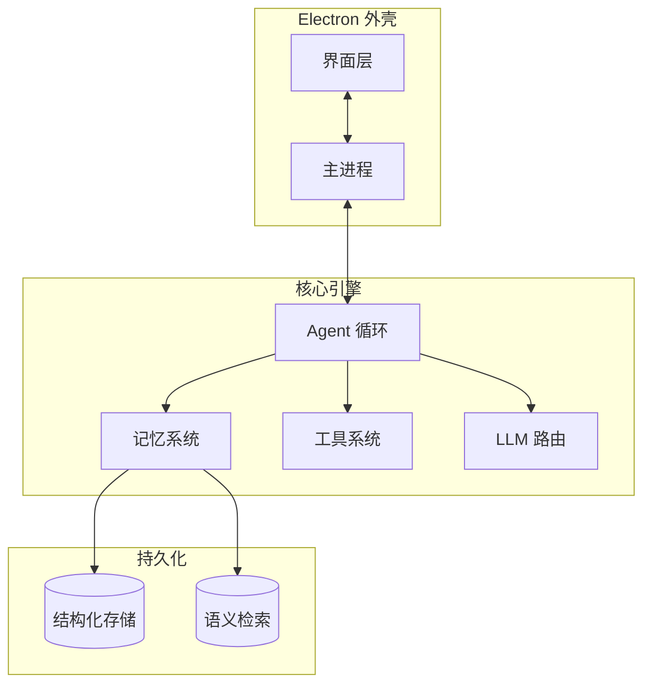

# 一个人怎么撑起一个 AI Agent 产品

20 天，三百多次 git 提交，核心代码超过十万行。几十个内置工具，十余个子 Agent，二十多个 LLM 服务商，多个图像生成和搜索后端。

这篇文章不聊产品理念，只聊技术。每个模块的设计取舍、放弃了什么、代价是什么。

## 一、技术选型：为什么是 Electron

Alice 是一个桌面 AI Agent。Agent 需要直接操作本地文件系统、执行 shell 命令、读写日历、管理进程。浏览器沙箱做不到这些，Web App 从一开始就排除了。

同时我想要图形化界面。Cursor 给我的启发是，图形界面让 Agent 的体验好很多：文件预览、图片展示、权限确认弹窗、流式输出、进度面板。纯 CLI 很难做好这些。Claude Code 的终端 UI 做得已经很好了，但一些交互（拖拽文件、多标签页、右键菜单）在终端里始终受限。CLI 也排除了。

剩下的选择就是 Electron。

代价很明确：安装包体积偏大，内存占用高于原生应用。我接受这个代价，因为 Electron 给了两个关键能力：Node.js 的完整生态（可以使用各种原生模块），以及 Chromium 的渲染能力（React 组件、CSS 动画、WebView 沙箱）。独立开发者没有资源去做 Swift/Kotlin 跨平台原生开发，Electron 是唯一的现实选择。

最终的技术栈：

- **主进程**：Node.js，承载 Agent 运行时、LLM 调用、工具执行、安全体系、渠道桥接
- **渲染进程**：React + TailwindCSS，负责全部 UI
- **后台线程**：子 Agent 隔离运行，防止阻塞主进程
- **持久化**：关系型数据库、向量数据库、配置文件

TypeScript 全栈统一，主进程和渲染进程共享类型定义。这个决定在后期省了大量时间，尤其是进程间通信通道的类型安全。



放弃了什么：Tauri（Rust + WebView，包更小、内存更低）。Tauri 的问题是 WebView 在 Windows 上依赖系统组件，跨平台一致性不如 Chromium。更关键的是，Agent 运行时的核心逻辑全是 TypeScript，用 Tauri 意味着要在 Rust 和 TS 之间反复跨越语言边界，序列化开销和开发成本都高。Electron 让我可以在同一个语言里写完所有逻辑。

## 二、Agent Loop：核心循环和围绕它的工程设施

Alice 的核心是一个 Agent 循环模块，负责实现完整的 Agentic Loop：

```
用户发消息
  → 组装系统提示词 + 上下文 + 记忆 + 工具列表
  → 调用 LLM（流式）
  → LLM 返回工具调用？→ 校验权限 → 执行工具 → 结果写回上下文 → 继续循环
  → LLM 返回纯文本？→ 输出给用户 → 触发后台记忆提取 → 结束
```

Anthropic 的博客说 Claude Code 是一个简单的 while 循环。这话对，但只有 1% 的真相。让 Agent 能跑很容易，让 Agent 可靠很难。

围绕这个循环，Alice 做了大量工程设施：

### 2.1 工具调用配对修复

LLM 的每次工具调用必须有对应的返回结果。用户中途取消、流式断线、上下文压缩丢失配对，都会导致 API 报错。

Alice 在每次调用 LLM 前会扫描整个消息历史，进行配对修复。找不到对应调用的孤儿结果直接移除；缺少返回结果的调用则插入合成的中断标记。策略是补全，不截断。旧版的做法是从孤儿消息开始整段砍掉，这会丢失大量有效上下文。

流式中途退出时，还有一层额外保护：把已累积但未写入上下文的挂起调用补全合成结果，防止下轮 API 报错。

### 2.2 LLM 参数类型自动修正

LLM 生成的工具调用参数经常会把数值/布尔类型序列化为字符串。系统会根据工具的参数定义自动转换类型，避免校验失败。这个问题在实际使用中出现频率很高，尤其是处理数值型参数时。

### 2.3 系统提示词的分层与缓存友好

系统提示词有多层优先级：调用方显式传入（用于特定场景）、本地持久化文件（人格服务写入）、服务端热更配置、代码内置模板（最低兜底）。

人格分区设计：有受保护段和可变段。受保护段（核心身份、价值观、边界）始终来自热更或内置，AI 不可覆盖；可变段存于本地文件，人格服务可以根据长期互动调整行为风格。两段拼接输出。

**提示词缓存友好性是系统提示词设计的核心约束。** 系统提示词的每次变动都会导致缓存失效，大模型服务商基于缓存的计算结果全部作废，下一次请求需要重新计算完整 prompt 的费用。Alice 的原则是：

- 系统提示词只包含几乎不变的内容：人格定义、工具注册概要、核心约束
- 时间、当前状态、动态上下文、用户记忆片段，一律追加到用户消息中
- 首次才改系统提示词，后续追加到用户消息。这是对用户账单的尊重

这一原则意味着，用户在完成第一次对话之后，后续每次对话的成本会大幅降低，因为系统提示词的缓存已经命中。

### 2.4 迭代限制和中止

默认有最大迭代次数限制，接近上限时会询问用户是否扩大。流式传输超时无数据则自动中止（所有适配器统一实现超时守护）。用户随时可以中止当前任务。

### 2.5 循环结束后的异步任务

Agent 循环结束后，后台异步触发两件事：对话记忆提取（写入用户记忆系统），以及技能改进检测（需要积累足够轮次的对话才触发分析）。这两件事都不阻塞用户的下一次交互。

## 三、工具系统：几十个工具的管理策略

### 3.1 统一工具接口

每个工具实现同一个接口。接口中包含描述信息（可静态或动态生成）、系统提示注入内容（告诉 LLM 何时使用该工具）、按需加载摘要、参数定义（用于类型校验）、分类和加载层级、权限要求、只读标记、破坏性操作标记、并发安全标记、输出大小上限，以及执行函数本身。

几个设计决策值得展开说。

### 3.2 分层加载

几十个工具的完整参数定义全部塞进每次 LLM 请求，token 成本太高。工具分两层：

- **核心层**：始终注入完整参数定义（高频基础工具）
- **按需层**：只注入工具名和一句话摘要，参数定义为空

LLM 决定要用某个按需工具时，系统会拦截这次调用，按需生成完整参数定义注入上下文，让 LLM 重新调用。系统提示词体积显著缩小。

这个设计背后有一个更深的判断：工具数量膨胀对 LLM 选择准确率的影响是非线性的。工具少的时候，准确率下降不大。工具过多时，模型开始频繁选错。按需加载让 LLM 在任何时刻只面对少量工具的完整定义，把选择空间控制在舒适区。

### 3.3 工具提示与使用策略的分离

工具有两套描述：一套进入工具调用定义，告诉 LLM 工具是什么、参数怎么填；另一套进入系统提示词，告诉 LLM 什么时候该用、使用策略、与其他工具的关系。两者严格分离。

举例：文件写入工具的参数描述说明如何填写路径和内容，而系统提示部分会说「修改已有文件前，必须先读取过该文件」。

### 3.4 先读后写硬校验

如果 Agent 想修改一个文件，但这个文件在当前会话中从未被读取过，工具直接拒绝执行。这是防止 LLM 凭幻觉改文件的硬性校验。

实现思路：系统维护文件的读取记录。写入和编辑操作执行前检查目标文件是否已被读取过。

### 3.5 工具禁用

用户可以在设置页禁用特定工具。Agent 在组装工具列表时会过滤掉被禁用的工具。这是用户级的控制面板，和权限系统互为补充。

### 3.6 大输出的降级处理

工具输出超过上限时，不直接截断。先尝试写入临时文件（Agent 可以按需读取），不可用时降级到系统临时目录。保持上下文窗口干净，同时不丢数据。进程退出时自动清理。

## 四、LLM 适配层：二十多个服务商的统一接口

### 4.1 适配器路由

LLM 客户端模块是统一入口，根据服务商的接口类型路由到对应适配器。

几个适配器覆盖二十多个服务商。OpenAI 兼容协议事实上已经成为行业标准，大量国产和开源服务商都走这套协议。Anthropic 有两个适配器：直连和中转（后者需要做工具格式转换）。Gemini 单独处理。

### 4.2 流式超时守护

所有适配器统一实现：流式传输中，如果超时没有收到任何数据块，自动取消并中止。这防止网络抖动导致的无限等待。每收到一个数据块都重置计时器。

### 4.3 重试与指数退避

所有适配器共享统一的重试逻辑。重试延迟使用指数退避加随机抖动，避免多个客户端同时重试造成的服务端压力。

重试策略区分错误类型：限流错误和服务端错误才重试，参数错误不重试。用户主动取消时也能立即中断重试。

### 4.4 多集群探测

部分服务商有多个地域集群。测试连接失败时，会依次探测各集群地址，匹配成功后自动切换到可用节点。

### 4.5 代理感知

网络请求模块支持多种代理模式：全部走代理、仅海外模型走代理（国产服务商直连）、不走代理。本地地址始终直连。

代价：多了一个运行时依赖，启动时多一次异步加载。收益：代理策略可以根据模型来源精细控制。

### 4.6 LLM 调用日志

每次 LLM 调用都有完整日志：请求参数、响应内容、思考过程、工具调用、用量统计、耗时、调用方标识。调用方标识区分请求的发起来源（主对话、记忆提取、权限分类等），方便调试时快速定位。

## 五、安全体系：零知识加密 + 分级权限

Alice 直接在用户电脑上运行，有文件系统和 shell 的完全访问权限。安全从第一天就要有。

### 5.1 主密钥与字段级加密

首次启动时，系统生成随机主密钥，通过密钥派生生成数据加密密钥。所有敏感数据加密后存储。解密时透明处理：密文解密，明文原样返回，兼容迁移期数据。

加密发生在字段级别。

密钥生命周期：首次使用时生成并持久化元数据；后续启动自动解锁，无需用户介入；密钥更换时逐条重新加密数据。

忘了密钥等于数据永久丢失。没有后门，没有找回。这是零知识加密的基本承诺。

### 5.2 备份加密

备份方案经历了两个版本。第一版恢复时需要主密钥和本地密钥元数据同时存在。第二版把必要参数内嵌到备份文件本身，只需主密钥即可脱机恢复。

第二版的改进来自一个实际场景：用户重装系统后元数据文件丢失，第一版备份无法恢复。

### 5.3 权限引擎

五种权限模式：

| 模式 | 行为 |
|------|------|
| 默认模式 | 危险操作弹窗确认 |
| 规划模式 | 只规划不执行，所有写操作阻断 |
| 自动编辑模式 | 自动接受文件编辑，Shell 命令仍需确认 |
| 全自动模式 | 跳过所有权限检查 |
| 智能自动模式 | 全自动，但保留 AI 分类器兜底 |

决策流程：权限模式判断 → 规则匹配 → AI 分类器（兜底） → 弹窗 → 拒绝追踪。

规划模式有工具白名单，只允许读取类工具，白名单之外的工具一律拒绝。

系统还维护拒绝历史，防止 AI 重复尝试已被用户拒绝的操作。同时支持会话级放行记录。

### 5.4 外部渠道安全

从微信 / Telegram / 邮件触发的 Agent 有额外的安全约束，只能使用安全工具子集，禁止 shell 命令、文件写入、子 Agent 创建。消息发送前会进行敏感信息扫描，命中后替换为屏蔽文本。

### 5.5 PIN 锁屏

支持 PIN 快速锁屏，PIN 哈希存储。PIN 独立于主密钥，忘记 PIN 可以用主密钥降级解锁。锁屏时加密密钥会从内存中清零。

## 六、自进化系统：让 AI 安全地修改自己

### 6.1 分层设计

自进化分若干层次，从轻量到重量递进：人格风格微调、记忆沉淀、界面外观调整、功能组件安装、自定义页面生成。每一层的改动范围和影响半径逐级增大。

最轻量的层只修改文本风格，对系统无任何副作用。最重的层涉及代码生成和执行，需要沙箱隔离。

### 6.2 界面个性化的白名单机制

系统定义了所有可被 AI 修改的界面变量白名单。每个条目包含：校验规则（颜色格式、数值范围、字符串长度等）、给 AI 看的描述、以及默认值。

AI 传入字段和新值后，工具执行时首先过滤非白名单字段，然后校验值是否合法，再原子写入（防止断电损坏），最后推送变更事件让界面实时应用，并压入撤销栈支持回滚。

白名单里全是「改了不会破坏功能」的外观属性：颜色、字号、圆角、间距、模糊度、动效时长。布局结构和交互逻辑不在白名单中。

### 6.3 自定义页面的沙箱隔离

自定义页面运行在隔离的沙箱环境中。内容安全策略禁止外部资源加载，沙箱没有系统级 API 权限。页面通过受限的桥接 API 与主应用通信，可调用的能力经过严格约束。

自进化系统的难点不在生成代码。LLM 生成页面代码很容易。难点在于边界控制：让 AI 有足够的自由度去创造有用的东西，同时不能让它改坏核心系统。白名单中的每一个条目都经过校验约束。人格核心的受保护分区任何进化操作都不能触碰。

## 七、渠道桥接：微信 / Telegram / 邮件

### 7.1 微信

通过扫码绑定。消息自动转发到 Alice，回复自动发送到微信。

一个关键细节：消息防抖。微信用户发消息习惯分段发送，短时间内的连续消息合并为一条再交给 Agent，防止 Agent 对半句话做响应。

渠道来源的图片在注入 LLM 前会压缩，限制分辨率和质量，减少 token 消耗。

每个机器人有独立的会话管理和认证映射，启动时从持久化设置中恢复，自动重启监控进程。

### 7.2 Telegram

Bot Token 绑定，长轮询监控。实现简单直接。

### 7.3 邮件

IMAP + SMTP 全协议。预设主流邮箱模板，降低用户配置门槛。后台监听新邮件。

### 7.4 统一出口

三个渠道共享一个统一的消息发送通道。Agent 生成的回复内容统一经过这个通道发出，发送前做敏感信息过滤。渠道上下文通过执行环境注入，系统根据上下文判断回复到哪个渠道。

## 八、数据本地化

Alice 没有云服务器。所有数据存在用户本地的专属目录下，包含：结构化数据库（会话、消息、任务、设置）、向量数据库（语义检索）、用户记忆、AI 生成的文件、每个会话的独立工作目录、日志、用户自定义技能、自进化生成的页面、密钥元数据、个性化配置、本地人格提示词。

备份是加密压缩包，一键导出导入。新版格式将必要参数内嵌到备份文件中，只需主密钥即可脱机恢复。

记忆云同步是可选的，开启后也是零知识加密。同步的数据在离开本机前已经是密文。

## 九、IPC 通信在 Agent 场景下的特殊设计

Electron 的 IPC 通信在 Agent 场景下有两个特殊需求：流式输出的高频更新，和权限弹窗的串行化。

### 9.1 流式批量合并

Agent 的流式输出每个 token 都是一个进程间通信事件。高频发送导致渲染进程被事件淹没，UI 卡顿。

Alice 的做法：区分高频事件和结构性事件。文本片段等高频事件累积到缓冲区，定期批量发送。工具开始/结束、任务完成、错误等结构性事件立即发送（先刷新缓冲区再发）。

批量间隔时间经过实测调优：太短批量效果不明显，太长用户能感知到输出延迟，最终选取了约两帧时长作为体验与性能的平衡点。

### 9.2 权限弹窗队列串行化

Agent 执行工具时可能触发多个权限确认。如果同时弹出多个弹窗会互相覆盖，用户只能看到最后一个。

解决方案是实现一个串行队列：新的权限请求先入队，不直接弹窗。每次只处理一个请求，用户点击允许/拒绝后，自动消费队列中的下一个。请求在回调注册前到达时先缓存，回调注册后立即消费，不丢失任何请求。

## 十、性能优化

### 10.1 流式渲染优化

每个 token 到达时都需要更新 UI。处理不当的话，长回复会导致严重卡顿。

Alice 的做法：思考过程流式渲染使用独立的状态映射，避免每个 token 触发整个消息列表重建；滚动和 DOM 变化使用节流策略；定时器控制刷新频率，减少不必要的计算。

### 10.2 子 Agent 隔离

子 Agent 在后台线程中运行，不阻塞主进程的事件循环。后台线程作为独立构建入口，打包后才生效。开发时走主线程降级路径，降低开发期的复杂度。

### 10.3 启动优化

模块懒加载（动态导入），外部服务连接异步初始化，不阻塞首屏渲染。启动性能分析器记录各阶段耗时，方便定位瓶颈。

代码混淆配置需要注意：控制流平坦化、死代码注入、字符串加密等选项是性能杀手。Alice 的混淆配置明确关闭了这些选项，只保留变量名混淆和基础编码。混淆的目的是防止源码被直接阅读，性能开销可以忽略。

### 10.4 代理模块预加载

原生 fetch 不支持代理设置。代理所依赖的网络模块在特定环境下无法同步加载，因此在启动时异步预加载并缓存模块引用。第一次代理请求时如果模块还没加载完，降级为直连。

## 十一、内嵌 Python 环境

Alice 需要解析 PDF、Word、Excel、PowerPoint、EPUB 等二进制文档。这些格式的解析库在 Python 生态比 Node.js 生态更成熟。

采用双轨策略：优先用 Node.js 原生解析，降级时调用内嵌的 Python 环境。

Python 环境随应用打包，启动时检测是否可用。如果 Python 环境损坏或缺失，静默降级到 Node.js 路径。

代价：安装包体积增大（Python 运行时 + 依赖）。收益：复杂文档解析质量显著提高，尤其是复杂表格和嵌入图片的处理。

## 十二、全局异常兜底

Electron 应用的一个特殊问题：未捕获的异常会弹出系统级错误对话框，用户体验很差。

Alice 在主进程注册了全局异常兜底处理。

网络瞬态错误（超时、连接重置、DNS 解析失败等）静默处理，不弹窗。Agent 应用的网络请求极其频繁（LLM API、搜索、网页抓取、图片下载），瞬态网络错误是常态。让用户为每个超时点一次确认是不可接受的。

未处理的 Promise 拒绝全部静默，只记日志。这是一个激进的策略，代价是某些真正的 bug 可能被吞掉。收益是应用永远不会因为一个未处理的异步错误崩溃。日志里都有，事后可查。

## 十三、给独立开发者的建议

以下是 20 天实战中沉淀的经验：

1. **先做工具接口，再做工具实现。** 统一接口稳定了，具体工具可以随时替换。Alice 的几十个工具都实现同一个接口，新增工具只需要一个文件加一行注册。

2. **状态管理比模型选择重要得多。** Agent 不靠谱，绝大多数原因是状态问题：工具调用配对丢失、上下文超长截断、压缩后丢失关键信息、并发时状态竞争。花在状态管理上的时间远超模型调优。

3. **权限系统第一天就要有。** 你不会想被 Agent 半夜删掉重要文件。规划模式应该是默认模式。

4. **上下文压缩不可选。** 超过几轮对话就会接近 token 上限。压缩策略要分级：先移除旧的工具输出，再压缩对话摘要，最后才截断。每一级都有信息损失，要评估对后续推理的影响。

5. **可观测性从第一天开始。** 每个 LLM 调用都要有调用方标识。当你看到日志里一堆请求却分不清来源，调试效率会断崖下降。

6. **IPC 通道是瓶颈，提前设计批量合并。** 流式输出每个 token 一次 IPC，渲染进程会被淹没。批量合并必须从一开始就设计好。

7. **安全设计源于具体的威胁场景。** 每个安全措施背后都有一个具体的场景。外部渠道工具白名单来自「外部消息触发危险命令」的场景。PIN 锁屏来自「别人碰电脑看到对话记录」的场景。先想象最坏的情况，再设计防御。

8. **LLM 会犯各种奇怪的错。** 参数类型混乱、选错工具、幻觉文件路径、重复尝试已被拒绝的操作。每个错误都需要在工程层做防御，指望模型改进不现实。

9. **多服务商支持是竞争力。** 单一服务商的价格、稳定性、速度都有波动。给用户选择权，让他们根据场景切换模型，这件事的价值比听起来大得多。

10. **混淆配置会杀性能。** 如果你用 TypeScript 做桌面应用，混淆器的默认配置几乎一定会拖慢启动速度。逐个选项测试，关掉所有影响运行时性能的选项。

*下一篇聊记忆系统。多层架构，让 AI 记住你。*
