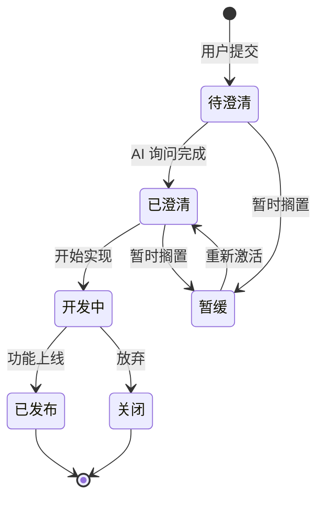
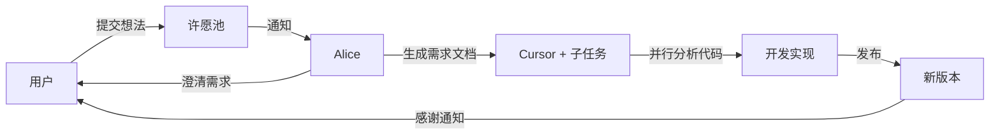

# 用 AI 和用户共建产品

## 独立开发者的反馈困境

做独立项目，最难的环节不是写代码，是知道该写什么。

Alice 最初的功能迭代完全靠我自己的判断。我用得多，所以我觉得自己知道痛点在哪里。但一个人的感知是有盲区的。我习惯了某个交互的怪异之处，反而觉得正常了。真正的痛点往往出现在别人用你产品的第一个小时里。

用户开始多起来之后，反馈渠道的问题暴露了。有人通过微信私聊说想要语音输入，有人在群里提了一句 Windows 支持，有人发了一张截图说某个工具的参数不对。

这些声音散落在各种地方。微信聊天记录没有状态追踪，群消息翻几页就淹没了，截图发完就找不到了。更关键的问题是，我无法回复每一个人说「收到了，排期中」或者「这个已经修了」。一个人的精力就那么多，消息看到了也不一定能及时处理，处理了也不一定记得通知对方。

这形成了一个恶性循环：用户提了反馈没收到回应，下次就不提了。开发者丢失了最有价值的信息来源。

结构化的反馈入口，对独立开发者来说，比多加一个功能更紧迫。

## 许愿池：一个完整的需求共建平台

于是做了许愿池。[alice.fans/ideas](https://alice.fans/ideas)。

表面上看，它就是一个需求看板。但在产品设计层面，它要解决的问题远不止「收集需求」这一件事。它要让用户能表达、能追踪、能互动，同时让开发者能高效处理、能闭环回复。

### 数据模型

许愿池的核心是想法数据表。每条想法包含基础信息、描述、截图、状态跟踪等字段，记录了从提交到上线的完整生命周期。

用户身份的处理做了轻量化设计。Web 端用本地存储保存用户标识，首次提交时由服务端生成。客户端提交时额外携带客户端标识，用于后续的通知精准推送。没有注册登录流程，打开页面就能用。

这个决定的考量是：对一个早期独立产品来说，注册登录是用户流失的最大杀手。用本地标识配合去重机制，足够处理投票防刷和身份关联的需求。

截图上传走云存储。用户拖拽图片后，前端先上传到服务端，服务端做图片压缩处理（限制最大宽度和质量、自动处理透明通道），然后推到云存储，返回 CDN 地址。每条想法最多三张截图，单张有大小限制。

### 状态流转

每条想法有一条清晰的生命线：

```
待澄清 → 已澄清 → 进行中 → 已发布
```

「待澄清」是用户刚提交的状态，说明管理员还没来得及理解这条需求。「已澄清」表示管理员已经写了需求澄清文档，排期中。「进行中」表示正在开发。「已发布」表示功能已上线，需要标记版本号。

另外还有「暂缓」和「已关闭」两个分支状态，分别对应暂时不做和确认不做。暂缓的想法可以重新激活。



状态流转的设计参考了主流项目管理工具的工作流，但做了大幅简化。独立开发者不需要复杂流程，四个核心状态加两个分支足够了。关键是让用户能看到自己的想法正在经历什么阶段。

### 互动机制

投票用 +1 机制，有去重机制防止刷票。排序逻辑固定：先按投票数降序，再按创建时间降序。票高的需求自然浮到顶部，这比开发者自己判断优先级更客观。

评论支持用户和管理员双向互动。管理员评论有特殊标记，前端做区分展示。

需求澄清是管理员最重要的输出。每条想法在「已澄清」之后，会挂一份 Markdown 格式的需求澄清文档，内容通常包含背景分析、问题定位、可行方案、实现复杂度评估。详情页渲染 Markdown，支持表格和任务列表。

### 页面设计

用户端是两个页面：列表页和详情页。

列表页是 Paper 风格，米白色背景，衬线标题字体配无衬线正文字体。顶部固定导航栏带毛玻璃效果，Hero 区域有一个「许一个愿望」的提交按钮。下方是筛选标签（全部/待澄清/已澄清/进行中/已实现/搁置），每个标签带计数角标。想法卡片左侧是投票数，右侧是标题、描述摘要、状态标签、昵称、时间和评论数。

详情页展示想法的完整信息，包括渲染后的描述和澄清文档、截图灯箱、投票按钮、状态和版本号标签、评论区。

管理后台有想法管理页、编辑页和 API Token 管理页。编辑页是左右分栏，左侧放描述、截图、澄清文档的 Markdown 编辑器和评论管理，右侧放基本信息面板、状态下拉、版本号输入、可见性开关和删除按钮。

所有页面做了移动端适配。前端用服务端模板加原生 JS，没上任何框架。对一个需求管理工具来说，原生 JS 的简单性比框架的可维护性更重要，因为这部分代码很少改动。

## Alice 客户端集成：用 AI 提交想法

许愿池有 Web 入口，但更有意思的入口在 Alice 客户端里。

用户跟 Alice 说「帮我提个需求」或「这个功能有 bug」，Alice 就会通过内置工具直接把想法提交到许愿池。

### 想法提交工具

这个工具支持四种操作：

- **提交**：提交新想法。必须一次性传入昵称、标题、描述三个必填参数。
- **列表**：查看已有想法列表，支持按状态筛选和分页。
- **详情**：查看某条想法的详情，包含评论和澄清文档。
- **投票**：为某条想法 +1 投票。

昵称的获取有一个优先级链：先从用户记忆中读取用户的真实姓名或昵称，如果记忆里没有就直接询问，用户不愿透露则使用匿名标识。联系方式是可选字段，先查记忆有就填，没有就跳过，工具不会主动追问。

一个重要的约束是：提交前要求 Alice 先查看已有需求列表，确认没有重复或类似的想法后再提交。这避免了同一个问题被不同用户重复提交。

工具的加载策略设为按需加载，意味着它不会自动注入系统提示词，只在需要时通过提示告诉 Alice 这个工具的存在。这个设计是为了控制上下文开销，一个用户可能连续十次对话都不需要提交想法，没必要每次都占用提示词空间。

还有一个小细节：Alice 自身如果在对话过程中发现产品可以改进的地方，也可以主动提交想法，标注来源为 AI 建议。AI 给 AI 产品提需求，这件事本身就挺有意思。

### 客户端提交的关键：客户端标识

客户端提交想法时，会自动获取客户端标识并附加到请求中。这个标识在后续的反馈闭环中起到精准推送的作用。Web 端提交的想法没有这个标识，只有通过 Alice 客户端提交的才会携带。

这个区分意味着：通过 Alice 提交的想法，后续状态变更时能收到客户端推送通知。通过 Web 端提交的，需要主动回来查看。这给了用户一个动力通过 Alice 来提交，因为体验更好。

## AI 内容审核

用户能提交内容的产品，内容安全是绑不过去的。一个人做产品，不可能人工审核每一条提交。

### 大模型异步审核

许愿池用大模型做自动审核。每条想法和每条评论在提交后，后端异步调用多模态模型审核文本和图片。

审核的维度包括：政治敏感、色情暴力、广告垃圾、人身攻击。文本审核检查昵称、标题、描述和评论。图片审核把截图传入多模态模型。

审核结果决定内容可见性。新提交的内容默认不可见，审核通过后变为可见，前端只展示已通过审核的内容。

### 异步和降级

审核是异步的，不阻塞用户的提交操作。用户提交后立刻收到成功回执，后台审核完成后自动更新可见性。

降级策略也做了设计：审核异常时默认放行。这个决定的逻辑是，宁可偶尔放过一条不当内容（管理员可以手动处理），也不能因为审核服务不稳定而拦截正常用户的提交。对一个独立产品的早期阶段来说，用户体验优先于绝对安全。

### 管理员覆盖

管理员可以在后台手动切换任何内容的可见状态，覆盖 AI 审核结果。这是最后一道保障：AI 误判了，人可以纠正。

整个审核链条的设计原则是自动化优先、人工兜底。AI 处理绝大多数情况，人只处理 AI 拿不准的少数。

## 反馈闭环：让用户知道自己的声音被听到了

收集需求只完成了一半的工作。另一半是告诉用户：你的需求被处理了。

这看起来是个小事，但对用户参与度的影响非常大。一个用户提了需求，等了两周没有任何回应，他大概率不会再提第二次。反过来，如果他的手机上弹出一条通知说「你提的那个功能上线了」，他会觉得自己参与了这个产品的成长。

### 触发条件

当管理员将某条想法的状态更新为已发布时，服务端检查这条想法是否有客户端标识。如果有，写入通知记录，包含目标设备、想法信息和新状态。

设计上只有已发布状态触发通知。中间状态不通知，避免打扰用户。如果后续需要扩展，只需修改触发条件。

通知记录用联合唯一约束，同一条想法的同一个状态不会重复通知。

### 通知下发：复用已有轮询通道

Alice 客户端本来就有一个定时 check-in 机制。启动后首次检查，之后定时轮询，最短间隔有保护。check-in 请求版本检查接口，服务端在响应中附带未读通知列表，通过已有的进程通信机制推送到渲染层。

没有用 WebSocket，没有用推送服务，就是复用已有的轮询通道。对一个独立产品来说，基础设施越少越好。轮询的延迟对需求状态通知这种非即时场景完全可以接受。

### 通知监听和排队

通知监听组件负责监听 check-in 返回的通知数据。它用本地存储记录已展示过的通知，限制最大缓存条数。

同一次 check-in 可能返回多条通知。监听器会过滤掉已展示的，把新通知放入队列，逐条弹出。关闭当前弹窗后才展示下一条。

关闭弹窗时，自动发送确认回执给服务端标记已读。下次 check-in 不再下发这条通知。

### 通知弹窗设计

弹窗是左图右文布局，左侧是 Alice 角色的通知插图，右侧是标题「你的想法有了新进展」、想法标题卡片（含编号和状态角标）、两个操作按钮。

状态角标有颜色映射：已发布是绿色，已澄清是蓝色，进行中是琥珀色，搁置是石色，已关闭是灰色。

两个操作按钮：
- **帮我跟进**：创建一个新的 Alice 会话，预填内容「帮我跟进这个想法的最新进展」，附带详情链接。用户可以继续和 Alice 讨论这个功能的细节。
- **查看详情**：用浏览器打开想法详情页。

遮罩层点击不关闭，只能通过右上角的 × 按钮关闭。这个设计是为了确保用户看到通知内容，避免误触关闭。

### 整条链路

把整个反馈闭环串起来：

1. 用户对 Alice 说「帮我提个需求」
2. Alice 调用想法提交工具，请求体携带客户端标识
3. 服务端存入数据库，AI 异步审核后变为可见
4. 管理员在后台处理这条想法，状态更新为已发布
5. 服务端写入通知记录
6. 用户的 Alice 客户端下次 check-in 时拉到通知
7. 通知监听器接收通知，弹出通知弹窗
8. 用户点击查看或跟进，弹窗关闭时发送已读回执

从提交到通知，整条链路没有引入任何新的基础设施。客户端标识是已有的设备标识，check-in 是已有的轮询机制，进程通信是框架原生通道，已读标记是一个简单的请求。

## 用 Cursor 澄清需求

这是这篇文章里我最想展开的部分。

许愿池上线之后，需求开始涌入。但用户提交的需求大多是模糊的。「希望支持 XX」「某个功能不太好用」「界面有点卡」。这些描述包含了有价值的信息，但直接拿来开发是不行的。

传统做法是开发者一条一条阅读，理解用户意图，对照代码分析问题，判断是 bug 还是新功能，写需求澄清文档。一条需求的澄清可能需要半小时：读用户描述、找到相关代码、理解当前实现、分析可行方案、写成文档。

我的做法是把这个过程交给 Cursor。

### 具体工作流

1. 从许愿池管理后台拉取所有待处理的需求列表
2. 把需求列表和许愿池的管理 API 文档一起贴给 Cursor
3. 给它一条明确的指令：**挨条澄清，一定要看源代码之后再澄清。每条需求都可以开一个子任务。**
4. Cursor 同时开了大量子任务并行处理，每个负责一条需求

每个子任务的工作流程：先读项目源代码理解当前实现，然后分析用户描述的问题到底是 bug 还是功能请求。如果是 bug，定位到具体文件和代码位置，分析根因，直接修复。如果是功能请求，写出结构化的需求澄清文档，包含背景分析、问题定位、可行方案和实现复杂度评估。最后通过许愿池的管理 API，把澄清文档写回对应的想法条目。

一次操作，全部需求处理完。总共十几分钟。

### 关键设计决策

**让 AI 先读源代码，再做澄清。** 如果只给 AI 看用户描述，它写出来的澄清文档往往是结构正确但内容空洞的废话，比如「建议增加对 XX 格式的支持，实现方式可以是 XXX」。这种文档没有结合项目的现状，无法直接指导开发。

让 AI 先读相关的源代码文件再做澄清，它的输出质量完全不同。它会说「这个问题的根因在某个文件的特定位置，某个逻辑没有处理 XX 情况，导致在 XX 场景下走到了默认分支」。这种澄清可以直接指导修复。

**并行处理。** 一条一条处理太慢了。Cursor 支持同时开多个子任务，每个独立运行，互不干扰。大量需求并行处理和串行处理的效率差距是数量级的。

**结构化的输入和输出。** 给 AI 的需求列表是结构化的（API 返回的数据），AI 输出的澄清文档也有统一格式。结构化让我可以快速扫描所有文档的关键信息，判断哪些可以直接采纳，哪些需要调整。

**通过 API 写回。** 澄清文档不是存在本地，是通过许愿池的管理 API 直接写回对应想法的澄清文档字段。用户在 Web 端就能看到澄清进展。这省去了「AI 写文档 → 开发者复制 → 粘贴到后台」的手动环节。

### 处理结果

大量需求里，大约三分之一是 bug，AI 直接定位并修复了。剩下的是功能请求，AI 写出了详细的需求澄清文档。我只需要过一遍，确认分析准确、方案合理，就可以排进开发计划。

以前一条需求的澄清要花半小时。现在所有需求一起处理，我花在审阅上的时间是十几分钟。AI 做了读代码、分析问题、写文档这些重复性高但思维密度低的工作，我做最终的判断和确认。

## AI 在共建循环里出现了三次

回头看整个共建流程，AI 的参与贯穿了三个阶段：

**用户侧：Alice 帮用户提交需求。** 用户不需要打开浏览器，不需要填表单，只要跟 Alice 说一句话，想法就进入了许愿池。Alice 会帮用户整理描述、检查是否重复、自动附加设备信息。

**审核侧：大模型自动审核内容安全。** 每条提交的想法和评论，由多模态大模型异步审核。文本和图片都覆盖。审核异常自动降级，管理员可手动覆盖。

**开发侧：Cursor 帮开发者澄清需求和修 bug。** 大量子任务并行工作，每个都先读源代码再做分析，结果通过 API 写回许愿池。

三个不同的 AI，在同一个产品流程里各自承担一环。用户用 AI 表达需求，AI 保障内容安全，开发者用 AI 理解和处理需求。没有哪一环是冗余的，每一环都在解决一个具体的效率瓶颈。



```
用户有想法
  → 在 Alice 客户端说「帮我提个需求」
  → Alice 通过内置工具提交到许愿池
  → 大模型自动审核通过后对外可见
  → 其他用户可以投票和评论

开发者处理需求
  → 在 Cursor 里一次性拉取所有需求
  → 大量子任务并行澄清（读源代码 → 判断 bug 或功能 → 修复或写文档）
  → 澄清结果通过 API 写回许愿池

反馈闭环
  → 功能上线，状态变为已发布
  → 提交者的 Alice 客户端自动弹出通知
  → 用户点击查看或让 Alice 跟进
```

## 注意力放大器

独立开发者最稀缺的资源是注意力。

技术能力可以通过 AI 放大。不会的技术可以查，不熟的语言可以让 AI 写。但注意力是刚性约束：一天 16 个小时的清醒时间，能分配给需求处理的可能只有两三个小时。

如果每条用户反馈都需要你亲自阅读、理解、评估、写方案、开发、测试、通知用户，你每天能处理的需求数量是个位数。在这个吞吐量下，用户池达到一定规模后，需求积压是必然的。

许愿池加 AI 澄清这个组合，改变了注意力的分配方式。

AI 承担了「读代码 → 分析问题 → 写文档」这条最耗时的链路。我的注意力集中在两个高价值环节：判断优先级（哪些需求先做）和确认方案（AI 的分析是否准确）。这两个环节需要产品直觉和技术判断，是 AI 暂时替代不了的。

结果是，同样的注意力时间，能处理的需求量扩大了一个数量级。独立开发者用这种方式，可以达到接近小团队的反馈处理效率。

但这里有一个容易忽视的前提：**AI 放大注意力的效果，取决于输入的结构化程度。** Alice 的经验是：如果用户反馈还是散落在微信群里，AI 也很难帮上忙，因为它拿不到输入。许愿池提供的结构化入口，是 AI 澄清能高效运转的基础。工具的价值往往在上下游之间。

## 闭环比速度重要

处理需求的速度很重要，但闭环更重要。

速度解决的是开发者侧的效率问题：一天能处理多少条需求。闭环解决的是用户侧的信任问题：我提的需求被听到了吗？

一个产品如果处理需求很快但从不告诉用户结果，用户的感受和需求石沉大海没有区别。反过来，处理得慢一些，但每次都有回应，用户会愿意持续参与。

这是许愿池做反馈闭环通知的核心考量。技术上，这个功能的实现成本很低，就是在状态变更时写一条通知记录，复用已有的轮询通道下发。产品上，它的价值很高，因为它完成了「用户提需求 → 开发者处理 → 用户收到结果」的最后一公里。

从更大的视角看，闭环也是共建的前提条件。用户愿意持续贡献想法，前提是他们相信自己的贡献有人在意。这种信任需要一次一次的正反馈来积累。每一条「你的想法已发布」的通知，都是一次正反馈。

## 几条实操经验

**AI 澄清需求时，让它先读源代码。** 只看用户描述做出的澄清，正确但缺乏上下文。让 AI 先读相关源代码，它能结合当前实现分析问题，输出的质量完全不同。

**并行是关键。** 一条一条处理需求的效率很低。让 AI 同时开多个子任务，每个独立运行。大量需求并行处理，总耗时和处理一条差不多。

**结构化输入输出。** 给 AI 的需求列表要是结构化数据，AI 输出的澄清文档也要有统一模板（背景 / 问题 / 方案 / 复杂度）。结构化让人类审阅效率大幅提升。

**工具链要打通。** AI 澄清完的文档，直接通过 API 写回许愿池。省掉手动复制粘贴的环节。流程中每多一步人工操作，就多一个遗忘和出错的可能。

**审核宁松勿严。** 内容审核异常时默认放行，管理员可以后续人工处理。对早期产品来说，误拦正常用户的成本远高于偶尔放过不当内容的成本。

## 系列回顾

这是 Alice 分享系列的最后一篇。六篇文章写下来，回头看看整条主线。

第一篇，为什么做 Alice。起点是一个不满足：市面上的 AI 产品都像工具，用完就关。我想要一个搭档，一个用久了会产生默契的存在。于是一个人、一台电脑，20 天写了 10 万行代码。

第二篇，用做游戏的方法做 AI。十年游戏开发的经验告诉我，虚构世界的真实感来自一致性。Alice 的角色设定不是装饰，是工程文档的核心组成部分。一致性是信任的基础，活人感是信任的具体工程。

第三篇，一个人怎么撑起一个 AI Agent 产品。Electron 全栈、40+ 工具、20+ 模型、5 个搜索后端。每个技术选型都有明确的取舍，每个放弃的选项都有具体的代价。

第四篇，五层记忆架构。从会话摘要到用户画像，从上下文检索到情感日记，再到跨设备加密同步。让 AI 记住你，需要的是一套分层的状态管理系统。

第五篇，一个人的公司，11 个人的团队。LLM 在角色明确时表现最好。Alice 有 11 个专业角色，每个有独立的系统提示词、工具集和行为约束。多 Agent 的核心问题不是调度，是让每个角色在自己的职责范围内做到最好。

第六篇，也就是这一篇。用户共建。许愿池收集需求，Alice 帮用户提交，大模型自动审核，Cursor 帮开发者澄清，反馈闭环让用户知道结果。三个 AI 在同一个流程里各司其职。

六篇文章的底层逻辑是同一条线：**一个独立开发者如何借助 AI 的杠杆，做出一个有温度的产品。** 从产品理念到角色设计，从技术架构到记忆系统，从团队分工到用户共建，每一步都在回答同一个问题：在资源极度有限的条件下，怎么让产品的体验不打折。

答案不是更聪明的模型，也不是更长时间的工作。是更好的系统设计，加上 AI 对注意力的放大。

Alice 的全部方法论在 [alice.fans/methodology](https://alice.fans/methodology/) 上完全公开。许愿池在 [alice.fans/ideas](https://alice.fans/ideas)。

如果你也在做 AI Agent，欢迎来聊。

*Alice · [alice.fans](https://alice.fans)*
