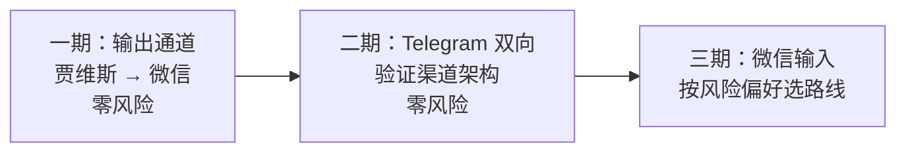

# 微信渠道接入可行性分析

**创建日期**: 2026-08-03
**作者**: Claude
**版本**: v1.0
**状态**: 草稿

> 方法论依据：`docs/alice-methodology/17-channel-bridge.md`（渠道桥接特别章）。
> 外部调研：2026 年微信机器人技术现状（详见文末来源）。

---

## 1. 结论摘要

**可行，但「微信渠道」必须拆成输出、输入两个方向分别决策——两者的风险等级完全不同。**

- **输出方向（贾维斯 → 手机微信）**：有完全合规的通道（Server酱 / 企业微信应用消息），零封号风险，改动小，建议立刻做。
- **输入方向（手机微信 → 贾维斯）**：个人微信没有官方 Bot API，所有方案都在「合规但链路长」（企业微信+内网穿透）和「方便但有封号风险」（第三方协议桥接）之间取舍。建议先用 Telegram 把双向架构验证跑通，再决定微信输入走哪条路线。

本项目架构对渠道桥接的适配度**出乎意料地好**：工具层协议无关、工具集天然满足白名单、凭证加密体系现成。主要缺口是：无 HTTP server 依赖、无防抖器、无渠道路由层。

---

## 2. 架构适配度评估

### 2.1 已有的三块基石

**① 工具层协议无关（tools.rs）——微信通道是第三个消费者，新增成本≈0**

`src-tauri/src/companion/tools.rs` 的设计目标就是「同一份定义服务多个通道」，目前已有两个消费者：

- MCP 通道（mcp.rs）：Claude Code agent 经 stdio JSON-RPC
- 场景模型通道（scene_chat.rs）：OpenAI/Ollama function calling

微信通道接入时直接复用 `tool_definitions()` 和 `execute_tool()`，只需新增一个「渠道监听器 → LLM 调用 → 渠道发送」的循环，工具层一行不用改。

**② 工具集天然满足 Alice #17 的外部渠道白名单标准**

现有 12 个工具全部是只读或软写：

| 类别 | 工具 | 外部渠道放行？ |
|---|---|---|
| 纯只读 | get_activity_summary / search_clipboard / get_habit_patterns / list_memos / get_memory_facts / load_manual | ⚠️ 见下方备注 |
| 软写（可逆/受限） | remember_fact / forget_fact（单次≤5条）/ append_evolution / record_mood / create_suggestion / propose_manual_edit（提案制，需用户确认才生效） | ✅ 可放行 |
| 受限写 | write_note（限制在「陪伴日报」目录前缀） | ✅ 可放行 |

没有任何执行系统命令、写任意文件的工具——Alice #17 最担心的攻击向量在本项目**根本不存在**。chat.rs 的 `ALLOWED_TOOLS = "mcp__companion__*"` 本身就是一次权限收窄实践。

⚠️ 备注：`search_clipboard` 需要重新评估——剪贴板历史可能含密码、验证码、密钥。桌面端用户本人使用没问题，但外部渠道（发送方身份无法完全核实 + 回复会经过第三方服务器）建议**禁用或加输出过滤**。

**③ 凭证加密体系现成（llm_provider/crypto.rs）**

`derive_key(app_data_dir)` + AES-GCM——正是 Alice #17 的方案：密钥派生自本地设备信息，拷贝数据库到别的机器解不开。渠道凭证（桥接 token、企微 secret）直接复用，零新代码。

### 2.2 渠道感知 prompt 的接入点现成

Alice #17 选择「策略 B：Agent 感知层处理格式差异」。`chat.rs::compose_chat_system()` 已有成熟的动态段注入机制（时间/心境/情绪/能力目录都是追加段），新增 `channel` 参数注入渠道规则是小改动：

- 微信 → 简短、口语化、纯文本、**关闭 `<aside>` 蛐蛐**（纯文本渠道里标签会裸奔成乱码）
- Telegram → 可用轻量 Markdown
- 桌面 → 现状

### 2.3 缺口清单

| 缺口 | 说明 | 预估 |
|---|---|---|
| HTTP server | 接收桥接服务推送 / 企微回调需要本地 HTTP 端点；Cargo.toml 目前无任何 HTTP server 依赖（tokio 仅 rt/sync/time）。引入 axum 或 tiny_http | 小 |
| 防抖器 | 滑动窗口 + 最大上限（Alice #17 设计可直接照搬），Rust 用 tokio timer 实现 | 小 |
| 渠道消息表 | flowhub.db 加 `channel_messages` 表（方向、渠道、内容、状态） | 小 |
| 渠道路由/发送层 | 统一出口：按会话渠道上下文路由 + 字符转义 + 敏感信息扫描 | 中 |
| 监听器生命周期管理 | 启动恢复、健康检查、独立错误边界（Rust tokio task 天然隔离，比 Alice 的共享事件循环事故安全） | 中 |

---

## 3. 微信接入路线对比（2026 现状）

> 外部调研结论：个人微信至今**没有官方 Bot API**。所有「直接接入个人微信」的方案本质都是非官方桥接；2024 年起腾讯持续加码检测（设备指纹、行为模型、协议密钥迭代），2026 年 Pad 协议存活但封号率明显高于往年，微信大版本更新后通常需数天至数周恢复期。
>
> ⚠️ 另注意：近期部分文章声称腾讯推出官方个人微信 Bot 通道「iLink/ClawBot」，集中出现在 OpenClaw 推广内容中，未获腾讯官方证实，**可信度存疑**。

| 路线 | 合规 | 封号风险 | 双向 | 成本 | 适合本项目？ |
|---|---|---|---|---|---|
| ① 注入 PC 客户端 | ❌ | 极高（>80%） | ✅ | 免费，但微信每次更新都要跟逆向 | **排除**——本机就是主号 |
| ② 第三方协议桥接（gewe/iPad 协议/Wechaty） | ❌ | 中-高（2026 上升） | ✅ | 桥接服务月费 + **必须用小号** | 谨慎可选 |
| ③ 企业微信自建应用 | ✅ | 无 | ✅（输入需公网回调 → 内网穿透） | 免费 | 合规首选，链路长 |
| ④ Server酱 / PushPlus（公众号模板消息） | ✅ | 无 | ❌ 仅输出 | 免费/低价 | **一期输出首选** |
| ⑤ Telegram Bot（对照组） | ✅ | 无 | ✅ 长轮询无需公网 | 免费（需代理，已有 7892） | **架构验证首选** |

**路线②的实操要点**（若选用）：专用小号（非主号）、暖号≥7天、固定 IP、控制频率、不开大群自动回复、AI 输出过敏感词。消息经第三方服务器中转，隐私上等于把聊天内容给桥接服务商看。

**路线③的实操要点**：个人可注册企业微信（团队形态无需企业认证即可用基础 API）；自建应用消息推送到「微信插件」，个人微信里直接收，无需装企微 App；输入侧需要回调 URL——桌面应用无公网入口，需 frp/cpolar 等内网穿透，或一台轻量云服务器中转。

---

## 4. 分期落地方案

### 一期：输出通道（1-2 天，零风险）

贾维斯的主动消息推送到手机：晨间备忘汇总、日报完成通知、长时工作提醒、建议卡片。

- 出口：Server酱/PushPlus（最简）或企微应用消息（体验更好，微信原生通知）
- 改动点：`suggester::push_suggestion` 现有推送逻辑旁加一个「渠道出口」；凭证走 crypto.rs 加密存 settings
- 不做：任何输入能力

**价值验证点**：一期上线后观察「推送到手机」是否真的改变了陪伴功能的使用感（Alice #17 的核心论点：从被动工具到随时待命助手）。如果推送都没带来感知变化，三期的高风险投入就不值得。

### 二期：Telegram 双向（3-5 天，零风险）

官方 Bot API + 长轮询，桌面应用无需公网入口；LHF 已有代理（7892），复用全局代理配置。

这一期的真正目的不是 Telegram 本身，而是**把渠道架构的每一块都建起来并验证**：

1. 渠道监听器（独立 tokio task，panic 隔离 + 指数退避重启）
2. 滑动窗口防抖 + 最大窗口上限
3. 统一路由 + 渠道消息表
4. 渠道感知 prompt（compose_chat_system 加 channel 参数）
5. 渠道工具白名单（禁 search_clipboard）+ 输出敏感信息扫描
6. 启动恢复 + 渠道健康状态 UI

二期完成后，微信输入只是「再写一个监听器」的事。

### 三期：微信输入（按风险偏好二选一）

- **方案 A：gewe 类桥接 + 专用小号**。体验最好（微信原生对话），接受月费、封号风险（小号损失可控）、消息过第三方。
- **方案 B：企微应用 + 内网穿透**。完全合规，接受链路复杂度（穿透稳定性、企微后台配置）和稍差的体验（消息在「微信插件」服务通知里而非普通会话）。

---

## 5. 从 Alice #17 映射到本项目的设计决策

| Alice 设计 | 本项目落点 |
|---|---|
| 滑动窗口防抖 + 最大上限 | 新模块 `companion/channel/debounce.rs`，tokio timer；微信窗口取文档「中等窗口」经验值，Telegram 更短 |
| 渠道格式差异在 Agent 感知层 | `compose_chat_system` 加 channel 参数；微信渠道关 monologue（aside 在纯文本里裸奔）、限长度、纯文本 |
| 工具白名单（渠道级） | tools.rs 的 `tool_definitions()` 加 channel 过滤参数；微信/TG 通道禁 search_clipboard |
| 输出敏感信息扫描 | 统一发送出口加密钥/密码/令牌正则扫描，命中替换屏蔽文本 |
| 监听器独立错误边界 | 每渠道独立 tokio task + 捕获 + 重启；Rust 任务模型天然优于 Alice 的共享事件循环 |
| 轻量调度器管生命周期 | `companion/channel/mod.rs`：启动恢复（异步不阻塞主窗口）、心跳检查、优雅停止 |
| 凭证加密 + 设备绑定 | 复用 `llm_provider/crypto.rs`，零新代码 |
| 图片消息 CDN 时效 | 三期微信路线②专属问题：收到图片消息立即下载本地再转 base64 |
| 邮件独立库存储 | 本期不涉及；渠道消息量小，直接进 flowhub.db 即可 |

---

## 6. 风险与成本清单

| 项 | 内容 |
|---|---|
| 封号风险 | 仅三期方案 A 存在；小号承受，主号永不接触任何非官方协议 |
| 隐私风险 | 方案 A 消息经第三方桥接服务器；企微/TG 为官方服务器 |
| 资金成本 | Server酱免费额度内；gewe 类桥接约 ¥20-50/月；企微免费；穿透可用免费 frp 或自建 |
| 维护成本 | 方案 A 需跟微信版本更新（桥接服务商负责，但有恢复期）；其余路线零维护 |
| 工程成本 | 一期 1-2 天；二期 3-5 天；三期 A 2-3 天（架构已就绪）/ B 3-4 天 |

---

## 7. 待决策项

1. **一期出口选 Server酱/PushPlus 还是企微应用消息？**（前者最快，后者体验好且为三期方案 B 铺路）
2. **三期微信输入的风险取向**：方案 A（小号+桥接，体验优先）还是方案 B（企微+穿透，合规优先）？
3. **微信渠道是否保留 `<aside>` 蛐蛐？**（纯文本渠道标签会裸奔，建议关闭 monologue 或转成括号口语）

---

## 来源

- [2026 微信机器人开发方案盘点 - WechatApi](https://wechatapi.net/blog/91-2026%E5%BE%AE%E4%BF%A1%E6%9C%BA%E5%99%A8%E4%BA%BA%E6%96%B9%E6%A1%88%E7%9B%98%E7%82%B9.html)
- [hermes-agent-guide：多平台接入实战 - GitHub](https://github.com/jwangkun/hermes-agent-guide/blob/main/10-%E5%A4%9A%E5%B9%B3%E5%8F%B0%E6%8E%A5%E5%85%A5%E5%AE%9E%E6%88%98.md)
- [HuixiangDou 文档（wechaty 魔改版不推荐）](https://huixiangdou.readthedocs.io/en/latest/doc_add_wechat_group.html)
- [微信机器人防封：账号安全策略 - CSDN](https://adg.csdn.net/694cf59e5b9f5f31781aabf0.html)
- [微信接入 AI 机器人指南 - OpenClaw 中文站](https://openclawchina.com/guides/wechat-ai-bot/)
